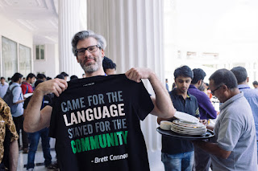
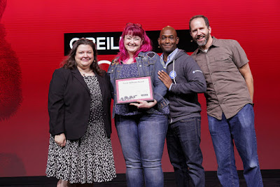

In 2017, Python was both the most popular and the fastest-growing programming language. At least, we can plausibly claim that, [based on statistics recently published on the Stack Overflow blog](https://stackoverflow.blog/2017/09/06/incredible-growth-python/). As David Robinson writes:  

> Python is an unusual case for being both one of the most visited tags on Stack Overflow and one of the fastest-growing ones. (Incidentally, it is also accelerating! Its year-over-year growth has become faster each year since 2013).

Python's versatility, clean syntax, and welcoming community have continued to win people over, and now we have a new advantage: data science is a growth industry and Python is positioned ideally. Who would have thought our 26-year-old language would outrun Javascript, Go, and Swift? Python's rapid growth in 2017, and its bright prospects for 2018, are the community's greatest achievement of the year.  
  
This past year the Python Software Foundation continued to give out grants and support many events all around the world. There are too many events to list in this post, but you can see some of the resolutions we passed in our [monthly minutes](https://www.python.org/psf/records/board/minutes/). Through our awards program, we recognized members within our community for their work and tireless efforts. We made changes to our bylaws to make the PSF more sustainable. Additionally, the PSF board members met in person twice this year to have important discussions about our future goals and direction. We created a process for accepting new Fellow members. Lastly, Mozilla granted the PSF's Packaging Work Group a grant to work on the future PyPI, Warehouse.

## Grants

In 2017, the PSF awarded over 220 grants (40 more than last year) amounting to more than $257,000. Prior to 2017, most grants were reviewed by the Board of Directors. Of the $257,000 approximately 25% of the funds went to requests from Africa, 23% went to Europe, 19% went to Asia, 18% went to North America, 13% went to South America, and 2% went to Australia. In July of this year we transitioned all grant requests to our Grant Work Group. This operational improvement has freed up our Directors to have more discussion about the PSF's direction and future goals. The PSF is grateful for the Grant Work Group volunteers for all of the work they do reviewing requests.  
The Python community had several first time conferences in 2017. Here are a few: **PyCon Pune**  
PyCon Pune was a successful conference. The conference held the first set of Python development sprints in India. The conference had around 550 attendees and a single track. Even though they are unable to host one in 2018, we hope to see one in 2019! Check them out on [Twitter](https://twitter.com/pyconpune?lang=en)!  

<table align="center" cellpadding="0" cellspacing="0"><tbody><tr><td></td></tr><tr><td>Conference t-shirt for PyCon Pune 2017: "“Came for the language, stayed for the community”, by <a href="https://twitter.com/brettsky">Brett Cannon</a>"</td></tr></tbody></table>

**North Bay Python** North Bay Python 2017 was in December in Petaluma, California. They had an amazing turn out of new comers. "Roughly 40% of the 230 attendees" were first time tech-conference attendees says Christy Heaton. You can read more about the conference [here](http://pyfound.blogspot.com/2017/12/community-is-at-its-peak-at-north-bay.html). Follow their [Twitter](https://twitter.com/northbaypython) for future updates.  

> It turns out there's people here at [#nbpy](https://twitter.com/hashtag/nbpy?src=hash&ref_src=twsrc%5Etfw)! Hooray! [pic.twitter.com/IfMqXT3hdE](https://t.co/IfMqXT3hdE) — Christopher Neugebauer 🏳️‍🌈🇦🇺 (@chrisjrn) [December 3, 2017](https://twitter.com/chrisjrn/status/937117332387672064?ref_src=twsrc%5Etfw)

  
**PyCon Pakistan**  
PyCon Pakistan happened in December of 2017 at the FAST University Lahore venue. They had close to 500 attendees, which is a great turn out for a first time conference. [Follow them](https://twitter.com/pyconpk?lang=en) on Twitter for updates on a possible PyCon Pakistan 2018.

> Close to 500 people attended the conference. [#pyconpk](https://twitter.com/hashtag/pyconpk?src=hash&ref_src=twsrc%5Etfw) [@dabeaz](https://twitter.com/dabeaz?ref_src=twsrc%5Etfw) [@ProgrammingWrld](https://twitter.com/ProgrammingWrld?ref_src=twsrc%5Etfw) [@ThePSF](https://twitter.com/ThePSF?ref_src=twsrc%5Etfw) [@arbisoft](https://twitter.com/arbisoft?ref_src=twsrc%5Etfw) [@yasserbashir](https://twitter.com/yasserbashir?ref_src=twsrc%5Etfw) [@WITWomen](https://twitter.com/WITWomen?ref_src=twsrc%5Etfw) [@pyladies](https://twitter.com/pyladies?ref_src=twsrc%5Etfw) [@raymondh](https://twitter.com/raymondh?ref_src=twsrc%5Etfw) [pic.twitter.com/fTF9qIy63h](https://t.co/fTF9qIy63h) — PyCon Pakistan (@PyConPK) [December 26, 2017](https://twitter.com/PyConPK/status/945636353588518912?ref_src=twsrc%5Etfw)

## Awards

####   

#### Distinguished Service Award

Building on the ideals of the Foundation's Community Service Award, the Distinguished Service Award is an offer of recognition for exemplary contributions to the Python community. The Foundation's highest award is given for actions which carry significant impact that shapes the Python world, whether through contributions of code, efforts in community action, or otherwise. We do not award the DSA often, but when we do, we give it out to invaluable, long-time community contributors. In 2017, we voted to award the [DSA to Tim Peters](https://www.python.org/community/awards/psf-distinguished-awards/#id1). Alex Martelli nominated Tim a few years back saying,  

> His technical contributions to Python have been absolutely immense: even just for "timsort" he'd deserve the award, and he's done SO much more than just that, even just on the technical plane! In addition to his enormous number of technical contributions (let's not forget doctest, timeit, etc, etc...!!!), for years, he was the friendliest, funniest, most helpful and technically deep contributor to the Python mailing list; his chapter intro in the Python Cookbook is an absolute gem; and he's ALSO striven to help organizationally. I think he's an outstanding candidate.  
> It's true that most of his contributions were a while ago, but this award is not about "what have you done for me lately"; it's a "lifetime-achievement" award, and, this being the case, nobody deserves it more than Tim.

####   

#### Community Service Awards

This year we awarded [Community Service Awards](https://www.python.org/community/awards/psf-awards/) to six contributors. [Eric Floehr](http://pyfound.blogspot.com/2017/11/eric-floehr-community-service-award-3rd.html) received an award for his involvement and chairing of PyOhio Conference. We recognized [Thomas Kluyver](http://pyfound.blogspot.com/2017/10/thomas-kluyver-community-service-award.html) for his contributions to the Scientific Python Community. [Lynn Roo](http://pyfound.blogspot.com/2017/09/the-pylady-behind-pyladies-lynn-root.html)t also received a community service award for her work as the founder of the San Francisco Chapter of PyLadies, as a member of the Django Software Foundation, and as a tireless volunteer at PyCon. [Glyph Lefkowitz](http://pyfound.blogspot.com/2017/08/the-ethical-maintainer-community.html) was recognized for his work on the Twisted network programming framework. [Brian Costlow](http://pyfound.blogspot.com/2017/04/brian-costlow-quietly-amazing-rock.html) received an award for his work organizing and chairing PyOhio, and for being the head volunteer for PyCon US captioning. [Ian Cordasco](http://pyfound.blogspot.com/2017/04/the-ego-less-developer-community.html) received a community service award for being the PSF elections administrator and for mentoring women in the Python community. We will announce two more awards for Q4 at the end of January.  

####   

#### Frank Willison Memorial Award

Every year the Python Software Foundation awards the Frank Willison Memorial Award to a member(s) of the Python community. The purpose of this award is to recognize the outstanding contributions that Python community members have made having began as an award, “established in memory of Frank Willison, a Python enthusiast and O'Reilly editor-in-chief, who died in July 2001”. The Python Software Foundation award the 2017 Frank Willison Award to Katie Cunningham and Barbara Shaurette in recognition of their continuing work to create and run their Young Coders classes, along with freely distributing their teaching materials. [Read more about their story](http://pyfound.blogspot.com/2017/05/2017-frank-willson-memorial-award-goes.html) in our post from May 2017.  

<table align="center" cellpadding="0" cellspacing="0"><tbody><tr><td></td></tr><tr><td>Barbara Shaurette receiving her award. Unfortunately, Katie Cunningham could not attend to receive her award in person.</td></tr></tbody></table>

###   

## Bylaw changes

During our yearly elections, we made several changes to our bylaws in 2017. We eased the requirement for members needing to certify yearly if they wanted to vote on Foundation matters. Additionally, we instituted a bylaw that would allow a work group to approve new PSF Fellow members. We created staggered board terms so our work is more sustainable and so we have more continuity. We established two Direct Officer positions in an effort to become a more stable and mature board. Lastly, we also updated the way compensation is regulated so the entire board has control of it instead of the President. To read more details about the changes, [please check out our post from July 2017](http://pyfound.blogspot.com/2017/07/2017-bylaw-changes.html).

###   

## Launch of PSF Fellow Work Group

We are happy to report that we now have a way to accept new PSF Fellow Members. With the opening of membership back in 2014, we overlooked a way to accept new Fellow level members so that has been on hold until now. We've announced two rounds of Fellow Members since we launched: [2017 Q3 PSF Fellows](http://pyfound.blogspot.com/2017/10/python-software-foundation-fellow.html)  
[2017 Q4 PSF Fellows](http://pyfound.blogspot.com/2017/12/python-software-foundation-fellow.html)

If you are interested in nominating someone, [check out the info page](https://www.python.org/psf/fellows/).

###   

## MOSS Grant to deploy Warehouse

Python programmers wondered for all of 2017, "When will the new PyPI be done?" In November we announced a breakthrough: Mozilla granted $170,000 to complete PyPI's rewrite and make it the official package index. We finished the year strong by starting work on Warehouse (the improved PyPI) via the grant awarded by Mozilla, through the Foundational Technology track of their Open Source Support Program. The PSF's Packaging Work Group is in full swing for the next six months working on various bug fixes, improvements, and implementations. If you are interested in more details, please [see the grant announcement](http://pyfound.blogspot.com/2017/11/the-psf-awarded-moss-grant-pypi.html).
