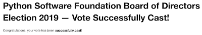

Voting is currently open for the 2019 Python Software Foundation Board of Directors Election. We have a [great list of candidates this year](https://www.python.org/nominations/elections/2019-python-software-foundation-board/nominees/) so if you received a ballot, **please vote**.

### Who should have received a ballot?

If you became a PSF [Supporting](http://psfmember.org/) Member\*, [Contributing](https://forms.gle/vbJvweHW8rimAjYd6) Member, [Managing](https://forms.gle/vbJvweHW8rimAjYd6) Member and/or [Fellow](https://www.python.org/psf/fellows/) by May 31, 2019 you are eligible to vote. You should have received a ballot from Helios with details on how to cast your vote. If you cannot find the email, please search your inbox and also check your spam for the word "helios". Once you login to Helios, be sure to follow the process until you see "Congratulations, your vote has been successfully cast!".  \* Must be a current membership and not expired as of May 31, 2019

### When do I need to vote by?

Voting opened June 7th and will close by the end of June 16 [AoE](https://www.timeanddate.com/time/zones/aoe).

### How do I become a voting member?

If you're currently not a voting member but wish be to a voting member for future elections (2020 and on), here are some options for you to consider:

-   Contribute to the PSF $99 yearly by becoming a Supporting Member. You can sign up via [http://psfmember.org](http://psfmember.org/).
-   If you dedicate at least five hours per month working to support the Python ecosystem you can become a Managing Member. If you dedicate at least five hours per month working on Python-related projects that advance the mission of the PSF you can become a Contributing Member. You can self certify via [https://forms.gle/vbJvweHW8rimAjYd6](https://forms.gle/vbJvweHW8rimAjYd6). You must be a [basic member](http://python.org/) before you apply to be a Contributing/Managing member.
-   If you know of someone that has gone above and beyond in their contributions to the Python community, consider nominating them for the PSF Fellow membership level. Details are available here: [https://www.python.org/psf/fellows/](https://www.python.org/psf/fellows/).

  
If you have any questions about the PSF Election, please contact the PSF staff: psf-staff at python dot org. -------------------------------------------------- *The PSF is currently holding its 2019 Fundraiser. As a non-profit organization, the PSF depends on sponsorships and donations to support the Python community. Check out our Annual Impact Report for more details: [https://www.python.org/psf/annual-report/2019/](https://www.python.org/psf/annual-report/2019/).*  
*Please consider contributing to the PSF's 2019 fundraiser; we can't continue our work without your support! [https://www.python.org/psf/donations/2019-q2-drive/](https://www.python.org/psf/donations/2019-q2-drive/).*
