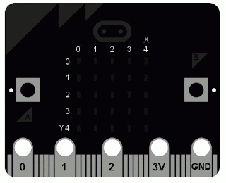

Today, March 22nd, the [British Broadcasting Corporation](http://bbc.co.uk/) (BBC) begin to deliver 1 million small programmable devices to the UK's 11 and 12 year old children. The aim is to inspire a new generation of digital creators. The device is called a [BBC micro:bit](http://microbit.co.uk/) and, among other things, it runs [MicroPython](http://micropython.org/).

  

> Tomorrow's the day when the [#bbcmicrobit](https://twitter.com/hashtag/bbcmicrobit?src=hash) arrives in pupils hands. [pic.twitter.com/XnJVYc4bME](https://t.co/XnJVYc4bME) Get ready to write the future [#microbit](https://twitter.com/hashtag/microbit?src=hash)
> 
> — BBC Make It Digital (@BBCMIDigital) [March 21, 2016](https://twitter.com/BBCMIDigital/status/711946540642902020)

The device is about the size of a credit card, comes in different colours and consists of a couple of buttons, a 5x5 LED matrix, I/O pins, an accelerometer, compass, ARM processor, micro-USB port, battery connector and BLE. Over the coming weeks all the software and hardware plans needed to recreate the project will be released under an open license. If you have the time and money, you could fork this work and make your own.

  

Since the project's inception, the Python Software Foundation has been a member of the partnership tasked to deliver this "moonshot". The partnership consists of almost 30 organisations including big multi-nationals such as [ARM](http://www.arm.com/), [Microsoft](http://microsoft.com/) and [Samsung](http://samsung.com/), academic institutions like [Lancaster University](http://www.lancaster.ac.uk/) and volunteer and community based organisations such as the PSF and [CodeClub](https://codeclub.org.uk/).

  

Originally, the PSF agreed to provide Pythonic educational resources and expertise. The BBC told us they already had a Python solution in the pipeline. However, at the beginning of May the partner who was to deliver this solution dropped out and we were asked to provide an alternative.

  

Thanks to [Damien George](https://github.com/dpgeorge/)'s amazing [MicroPython](http://micropython.org/) project and his collaboration with an international community of Pythonistas the device runs a full re-implementation of Python 3. The version of MicroPython on the micro:bit doesn't include the standard library. However, it contains several easy to use modules for interacting with the device's hardware, making music, digital art and connecting stuff to the device via its I/O pins. All the standard language features are supported including data types, OOP, data structures, exceptions, generators and builtins. All this on a device with 256k of flash memory and 16k of RAM.

  

Special mention should be made of [Mark Shannon](https://github.com/MarkShannon) who did amazing work on the display related capabilities of MicroPython on the BBC micro:bit. Mark also has interesting work-in-progress on improved audio capabilities.

  
  

Members of the community have been busy generating more than just code. Between them they have created:

  

-   An "official" browser based [Python editor](https://www.microbit.co.uk/app/#create:xyelfe) that's part of the BBC's [main website](http://microbit.co.uk/) for the project. Many thanks to [Steve Hawkes](https://twitter.com/hawkz) for his amazing design and Giles and Harry from [Python Anywhere](http://pythonanywhere.com/) for hosting it.
-   An unofficial native editor for beginner programmers called [Mu](http://codewith.mu/). Thanks to [@carlosperate](https://twitter.com/carlosperate), [@inglesp](https://twitter.com/inglesp), [@NDevox](https://twitter.com/NDevox), [@kushaldas](https://twitter.com/kushaldas), [@tjguk](https://twitter.com/tjguk), [@stestagg](https://twitter.com/stestagg) and [@theheadofabroom](https://twitter.com/theheadofabroom) for all their work on the project.
-   An [editor](https://github.com/ntoll/python-native-editor) for [ChromeOS](https://chrome.google.com/webstore/detail/micropython/lhdjeebhcalhgnbigbngiaglmladclbo). Thanks to [Clifford French](https://www.linkedin.com/in/clifford-french-994630102) for the loan of equipment to facilitate this development.
-   [Developer documentation](https://microbit-micropython.readthedocs.org/en/latest/). Kudos to [Carol Willing](https://twitter.com/willingcarol) and [Radomir Dopieralski](https://twitter.com/deshipu) for such a comprehensive and clear resource.
-   [Teacher Tutorials](https://microbit-micropython.readthedocs.org/en/latest/tutorials/introduction.html). Many thanks to our friends at [Computing at School](http://www.computingatschool.org.uk/) who acted as "crash test dummies".
-   [Lesson plans](http://microbit-playground.co.uk/) and a [cheat sheet](http://cheat.microbit-playground.co.uk/) curated by [Jez Dean](https://twitter.com/jezMr).
-   Crazy open-source projects from [around the world](https://microworldtour.github.io/), created by numerous Pythonistas who took part in a micro "world tour".
-   Jupyter integration (coming soon). Thanks to [Fernando Perez](https://github.com/fperez) for pointers that helped us create a new Jupyter kernel for the micro:bit in only an hour.
-   Free to use tools for generating [child-friendly Python resources](https://pycomic.github.io/) and/or simulate the [output of the device](http://pycomic.github.io/microbit.html). Once again, [Steve Hawkes](https://twitter.com/hawkz) is responsible for the magnificent design.
-   Ongoing workshops throughout the UK in association with [Computing at School](http://www.computingatschool.org.uk/) where developers and teachers work together to learn about Python on the BBC micro:bit. Many thanks to [Yvonne Walker](https://twitter.com/epictsuk) for her fantastic organisational skills.

  

> Dead or Alive? Built using MicroPython on [#microbit](https://twitter.com/hashtag/microbit?src=hash) at [#casmicropy](https://twitter.com/hashtag/casmicropy?src=hash). Thanks [@ntoll](https://twitter.com/ntoll), [@cas\_lancaster](https://twitter.com/cas_lancaster) [pic.twitter.com/Vk3yEGdjGL](https://t.co/Vk3yEGdjGL)
> 
> — Alan O'Donohoe (@teknoteacher) [March 16, 2016](https://twitter.com/teknoteacher/status/710155547916509184)

We're incredibly proud that all the Python related work was created by volunteers in their spare time: community minded Pythonistas with a passion for education who want to inspire digital creativity in young people. It's yet more evidence that Python has the world's greatest programming community. A big "thank you" to everyone who contributed.

  

Why is this so important?

  

Asking what sort of education and learning our community supports is how we decide what sort of community we become. For it is through education and learning that we engage with our future colleagues, friends and supporters. Put simply, we're investing time and effort in the future of a diverse Python community.

  

You're probably wondering what you can do with the device. A quick look around the [world-tour website](https://microworldtour.github.io/) will show you how MicroPython on the micro:bit can be adapted to a huge number of educational (and not so educational) uses. Two of our favourites are described below:

  

[Radomir Dopieralski](https://twitter.com/deshipu) only had his device a few days before he'd managed to fry it while connecting it to a robot. Failure is an essential aspect of education - it's how we learn to adjust and improve our behaviour while exploring the world around us. Happily, Radomir learned from his mistake and went on to build several different robots including our favourite called "Bob" (which is wobbly-cute in a menacing "all humans must die" sort of a way):

  

[Martin O'Hanlon](https://twitter.com/martinohanlon) is a regular contributor to the education track at PyCon UK. His lessons in programming Minecraft with Python are genius-level performances that end with a hundred kids and their parents furiously hacking Python so Minecraft does crazy things. It's inspiring to see such a thing unfold. As a result, we were especially looking forward to his contribution (and he didn't disappoint).

  

Mart has managed to tick pretty much all the boxes for many 11 year olds with his X-Wing flying in Minecraft running on a Raspberry Pi controlled via MicroPython running on a BBC micro:bit. Perhaps the only thing missing is that it doesn't come with a side of pizza and fries:

  

Finally, if you're wondering what it feels like to program such a device... the following reaction is typical:

  

> I've been playing with micropython on the BBC micro:bit and it's amazing! <3
> 
> — Guido van Rossum (@gvanrossum) [October 13, 2015](https://twitter.com/gvanrossum/status/653975453691080704)

You'll soon be able to get your own via mail-order when they're released to the general public over the summer.

  

If you're interested in contributing (there is so much yet to be done) then join our [mailing list](https://mail.python.org/mailman/listinfo/microbit) or check out our [source code](https://github.com/bbcmicrobit/micropython). We accept contributions, without prejudice, from anyone. If you're thinking, "but not me", then **we especially mean you**. Good quality content and engagement with respect, humour and intelligence wins every time.

  

Our children's latent talent, joie de vivre and receptiveness to programming in Python is something unambiguously good for us to support, cherish and foster. MicroPython on the BBC micro:bit is one way to do this.

  

Come join in the fun!
