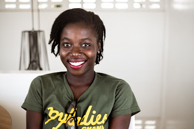

[Abigail Dogbe](https://twitter.com/MesrenyameDogbe), lead organizer [PyLadies Ghana](https://ghana.pyladies.com/) and co-organizer of [Pycon Africa](https://africa.pycon.org/) 2019, has been awarded the Python Software Foundation Q1 2020 Community Service Award.

  

Abigail holds a Bachelor's Degree in Computer Science and Engineering from the prestigious University of Mines and Technology, Ghana.

  

> **RESOLVED, that the Python Software Foundation award the 2020 Q1 Community Service Award to Abigail Dogbe in recognition of her efforts with leading the PyLadies Ghana community, with helping organize PyCon Africa and volunteering for PyLadies global and PyCon US.**

  

### Origin Story - Abigail's Introduction to Programming

  
Abigail was introduced to programming at the University of Mines and Technology, Ghana. taking classes in Java, C++ and Visual Basic under the department of Computer Science and Engineering. In 2017, Abigail attended a Django Girls workshop as a mentee. The goal of the workshop was to teach women how to build web apps using Django and Python.  
It was that Django Girls workshop that introduced Abigail to the [Python](https://www.python.org/) programming language. She was hooked to the simplicity of using Python to build web apps, compared to the other languages she had learnt in school.

###   

### Community Involvement - Teaching Other Women Python

Abigail volunteered to serve as a coach at the next [Django Girl workshop](https://djangogirls.org/ho1/), held in September of 2017. And this heralded the setting up of the [Python Ghana community](https://www.pythonghana.org/), joining together the Pythonistas she met. Together with her team, they travelled across Ghana, teaching women how to code. She was at the time the only woman on the team. This sparked her interests in getting more women as coaches for the Django girls. Working with an amazing and supportive team, Abigail set up six different PyLadies chapters, each chapter working independently. They organize meetups and workshops focused on Python and other professioanl skills like how to speak at conferences. The Python Ghana community evolved beyond workshops and meetups, to sharing of ideas and looking out for each other. And that's what community is all about! Abigail has also played pivotal roles in helping kickstart PyLadies communities in [Ethiopa](https://twitter.com/PyladiesAddis), Liberia, and Zambia. In her words -

> I personnally look forward to helping more Pythonistas kickstart their Python communities.

### Impact Stories

Abigail's active participation in the [Python Ghana Community](https://www.pythonghana.org/home) has helped move the goals and vision of the community forward, says [Crystabell Atutonu](https://twitter.com/CryssyBella), from PyLadies Tema.

> Her vibrant activities in the Python software community in Ghana has helped in the smooth sailing of activities especially during the conferences held in Ghana. Her organizational skills is top notch bringing together everyone in the community to support activities.

> Abigail is like a mother figure to us and personally, she has impacted my life in terms of my confidence in the tech field. She motivated me to give my first talk at PyCon Africa 2019, Accra.

> When you feel that you cannot accomplish something, Abigail already sees you doing it. And starts talking about it, as if you can do it!

> This motivates us a lot at PyLadies Ghana.

### Road to 500 PyLadies in Ghana

  
[Aseda Addai-Deseh](https://twitter.com/asedaad?lang=en) went on to speak about how Abigail's dedication to the community has led to the involvement of over 500 women in the PyLadies Ghana community within 2 years.  

> Her innovative initiatives at PyLadies Ghana such as PyLadies Night (a WhatsApp group chat with a tech expert on a subject), Monday motivation (Monday motivational messages for the week), PyScrumble Friday (a fun Python puzzle every Friday), PyLadies #WCW (acknowledging outstanding women in the PyLadies Ghana community every Wednesday), Pythonic Tips and Tricks (short Python blogs) and PyLadies Field trips (trips to tech companies in Ghana to learn more about their work).

> PyLadies Ghana has seen a significant involvement of ladies in the tech community.

> PyLadies Ghana started with 32 ladies at our first meetup and has grown to involve over 500 ladies in a space of 2 years under Abigail's leadership.

> Her support for the PyLadies vision to help more women become active participants and leaders in the Python open-source community. She has seen to the establishment of PyLadies Ghana chapters in all major universities in Ghana.

### Abigail Dogbe - Inspiring and Helping Women in Tech in Ghana to Grow

  
We asked Abigail what drives/inspires her into doing all that she does for the Python community. She says -  

> I particularly have a keen interest in tech community building and I find joy in helping others grow in their career.

On women's participation in the developer community, how can more women be encouraged to be active in the community? Abigail says -  

> Women's participation in the developer community keeps rising steadily. However, there is still need to focus on providing more platforms to these women in tech.

> To encourage women, we need to show and make role models and mentors accessible to them. I also believe that instilling confidence, supporting and creating room for networking with other women in tech will really be of great help.

> Another way is to make these things accessible to girls in primary, junior high and senior high schools by tackling the current gap between academic training and needs within the business community.

The Python Software Foundation congratulates and celebrates the amazing work and contributions of [Abigail Dogbe](https://twitter.com/MesrenyameDogbe) to the Ghana Python community, and for inspiring PyLadies Ghana.
