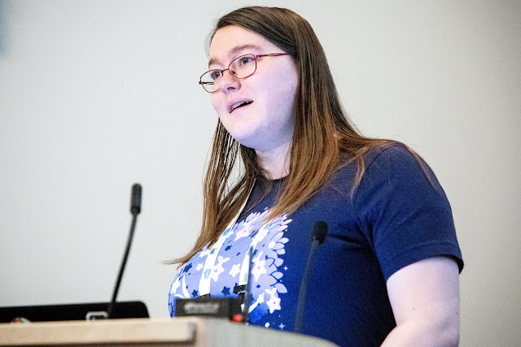
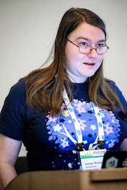

 Amber Brown of the Twisted project shared her criticisms of the Python standard library. This proved to be the day’s most controversial talk; Guido van Rossum stormed from the room during Q & A. [Read more 2019 Python Language Summit coverage](https://pyfound.blogspot.com/2019/05/the-2019-python-language-summit.html).

# Applications Need More Than The Standard Library

Python claims to ship with batteries included, but according to Brown, without external packages it is only “marginally useful.” For example, `asyncio` requires external libraries to connect to a database or to speak HTTP. Brown asserted that there were many such dependencies from the standard library to PyPI: `typing` works best with `mypy`, the `ssl` module requires a monkeypatch to connect to non-ASCII domain names, `datetime` needs `pytz`, and `six` is non-optional for writing code for Python 2 and 3. Other standard library modules are simply inferior to alternatives on PyPI. The `http.client` documentation advises readers to use Requests, and the `datetime` module is confusing compared to its competitors such as `arrow`, `dateutil`, and `moment`.

# Poor Quality, Lagging Features, And Obsolete Code

  
“Python's batteries are leaking,” said Brown. She thinks that some bugs in the standard library will never be fixed. And even when bugs are fixed, PyPI libraries like Twisted cannot assume they run on the latest Python, so they must preserve their bug workarounds forever. There are many modules that few applications use, but there is no method to install a subset of the standard library. Brown called out the XML parser and `tkinter` in particular for making the standard library larger and harder to build, burdening all programmers for the sake of a few. As Russell Keith-Magee had described earlier in the day, the size of the standard library makes it difficult for PyBee to run Python on constrained devices. Brown also noted that some standard library modules were optimized in C for Python 3, but had to be reimplemented in pure Python for PyPy to support them. Brown identified new standard library features that were “too little, too late,” leaving users to depend on backports to use those features in Python 2. For example, `socket`.`sendmsg` was added only recently, meaning Twisted must ship its own C extension to use `sendmsg` in Python 2. Although Python 2 is nearly at its end of life, this only holds for the core developers, according to Brown, and for users, Red Hat and other distributors will keep Python 2 alive “until the goddam end of time.” Brown also mentioned that some `itertools` code is shown as examples in the documentation instead of shipped as functions in the `itertools` module. Guido van Rossum, sitting at the back of the room, interrupted at this moment, “Can you keep to one topic? I'm sorry but this is just one long winding rant. What is your point?” Brown responded that her point was that there are a multitude of problems in the standard library.

# Standard Library Modules Crowd Out Innovation

  
Brown’s most controversial opinion, in her own estimation, is that adding modules to the standard library stifles innovation, by discouraging programmers from using or contributing to competing PyPI packages. Ever since `asyncio` was announced she has had to explain why Twisted is still worthwhile, and now that data classes are in the standard library Hynek Schlawack must defend his `attrs` package. Even as standard library modules crowd out other projects, they lag behind them. According to Brown, “the standard library is where code sometimes goes to die,” because it is difficult and slow to contribute code there. She acknowledged recent improvements, from Mariatta Wijaya’s efforts in particular, but Python is still harder to contribute to than PyPI packages. “So I know a lot of this is essentially a rant,” she concluded, “but it's fully intended to be.”

# Discussion

  
 Nick Coghlan interpreted Brown’s proposal as generalizing the “ensurepip” model to ensure some packages are always available but can be upgraded separately from the standard library, and he thought this was reasonable. Van Rossum was less convinced. He asked again, “Amber, what is your point?” Brown said her point was to move `asyncio` to PyPI, along with most new feature development. “We should embrace PyPI,” she exhorted. Some ecosystems such as Javascript rely too much on packages, she conceded, but there are others like Rust that have small standard libraries and high-quality package repositories. She thinks that Python should move farther in that direction. Van Rossum argued instead that if the Twisted team wants the ecosystem to evolve, they should stop supporting older Python versions and force users to upgrade. Brown acknowledged this point, but said half of Twisted users are still on Python 2 and it is difficult to abandon them. The debate at this point became personal for Van Rossum, and he left angrily. Nathaniel Smith commented, “I'm noticing some tension here.” He guessed that Brown and the core team were talking past each other because the core team had different concerns from other Python programmers. Brown went further adding that because few Python core developers are also major library maintainers, library authors’ complaints are devalued or ignored. The remaining core developers continued the technical discussion. Barry Warsaw said that the core team had discussed deprecating modules in the standard library, or creating slim distributions with a subset of it, but that it required a careful design. Others objected that slimming down the standard library risked breaking downstream code, or making work for programmers in enterprises that trust the standard library but not PyPI. Pablo Galindo Salgado was concerned that moving modules from the standard library to PyPI would create an explosion of configurations to test, but in Brown’s opinion, “We are already living that life.” Some Linux and Python distributions have selectively backported features and fixes, leading to a much more complex set of configurations than the core team realizes.
