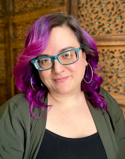

We [announced our search](https://fosstodon.org/@ThePSF/110498521981281969) for our first Community Communications Manager back in June, and after a thorough search, we are beyond excited to announce that [Marie Nordin](https://www.linkedin.com/in/mariecnordin) is the newest addition to our team! Reporting to Loren Crary, Director of Resource Development, Marie joins the PSF as a longtime contributor in Open Source, an experienced community organizer, and an enthusiastic communicator. Marie will be responsible for establishing a PSF communications calendar, including annual messaging, newsletters, and blog posts. She will also partner with our Executive Director, Deb Nicholson, and other staffers to enhance our support for the Python community with a variety of initiatives. As the first Community Communications Manager at the PSF, Marie’s work will be made up of both routine and experimental projects, as well as helping to fill some of the gaps in our tiny but mighty team.

Marie shares, “*I’m thrilled to join the PSF team to help amplify the stories and voices of the Python community. I look forward to learning, supporting, and connecting with you all!*” Marie has a background in community architecture, project/program management, Code of Conduct, and graphic design. A Visual Media graduate from the [Rochester Institute of Technology](https://www.rit.edu/), she first learned of Free and Open Source Software and culture at [Open@RIT](https://www.rit.edu/research/open). Marie went on to become an [Outreachy](https://www.outreachy.org/) intern in 2013 for the [Fedora Project](https://fedoraproject.org/) working on [Fedora Badges](https://badges.fedoraproject.org/) design. After six years of contributing to Fedora in various parts of the project, Marie joined [Red Hat’s Open Source Program Office](https://www.redhat.com/en/blog/channel/red-hat-open-source-program-office) as the [Fedora Community Action and Impact Coordinator](https://docs.fedoraproject.org/en-US/council/fca/#previous) and later on as a Code of Conduct Specialist. We hope everyone in the Python community will join us in welcoming Marie with ideas and collaboration as she settles in. We are very happy to be able to add a staff member dedicated full-time to such important aspects of our work, and we feel very fortunate to have found someone with Marie's wealth of experience and skills to take on this new role. We're excited to see what Marie can achieve together with the PSF and the Python community!
