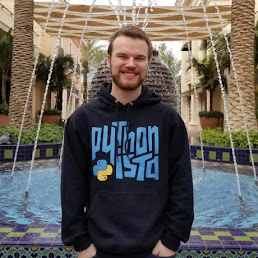

We [announced our intention](https://pyfound.blogspot.com/2023/01/the-psf-is-hiring-security-developer-in.html) to fill this role back in January, and after a thorough search, we have chosen [Seth Michael Larson](https://github.com/sethmlarson)! He joins the PSF for the next year as our first ever Security Developer-in-Residence. Seth is already well-known to the Python community – he was named a PSF Fellow last year and has already written a lot about Python and security on [his blog](https://sethmlarson.dev/blog).  

This critical role would not be possible without funding from the OpenSSF [Alpha-Omega Project](https://alpha-omega.dev/). “At Alpha-Omega, we are excited to support the Python Software Foundation as they improve the security of PyPI, and more generally the Python ecosystem as a whole.” Alpha Omega Representative - Bob Callaway, Google

  
Seth begins his work with Python and the [Python Package Index](https://pypi.org/) (PyPI) this week. He says, “The Python community is such a positive part of my life so I'm grateful for this incredible opportunity to contribute back. I'm looking forward to partnering with all of you to build a more secure Python ecosystem for everyone!” We hope that everyone in the community will welcome Seth and help him succeed in his audit and subsequent plans for key security improvements.

This role is funded by a substantial investment from the [Open Software Security Foundation](https://openssf.org/) (OpenSSF) [Alpha-Omega Project](https://openssf.org/community/alpha-omega/). The OpenSSF is a non-profit cross-industry collaboration that brings together leaders to improve the security of open source software by building a broader community, targeted initiatives, and best practices. The OpenSSF unifies many open source security initiatives under one foundation to accelerate work through cross-industry support.

The Python Software Foundation (PSF) is a non-profit whose mission is to promote, protect, and advance the Python programming language, and to support and facilitate the growth of a diverse and international community of Python programmers. The PSF supports the Python community using corporate sponsorships, grants, and donations. Are you interested in sponsoring or donating to the PSF so it can continue supporting Python and its community? Check out our [sponsorship program](https://www.python.org/sponsors/application/), [donate directly here](https://psfmember.org/civicrm/contribute/transact?reset=1&id=2), or contact our team!
