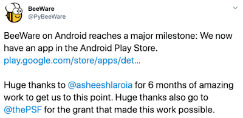

For the past 3 years, the PSF [has been working on](https://pyfound.blogspot.com/search/label/pypi) grant funded projects to improve our internal systems and platforms. This work has been done with the Packaging Working Group, and focused on our packaging ecosystem of PyPI and pip. We have been able to show that applying directed funding to open source projects has the ability to dramatically increase the speed of development, and move our community forward in a much more sustained way than relying solely on volunteer effort.  

Along with the external grant funding of PSF projects, we have also committed PSF funds in the past to improve developments of community projects. This shows that the experience of directed funding is applicable to our community projects, as well as our own. An example here is the BeeWare project that was given funding via our Education Grants last year:  

[https://twitter.com/PyBeeWare/status/1273227908136316931](https://twitter.com/PyBeeWare/status/1273227908136316931)  

Another wonderful example has been a number of scientific Python projects that have raised large amounts of grant funding, mostly through [NumFocus](https://numfocus.org/). They have [been](https://numfocus.org/blog/astropy-receives-900k-grant-from-moore-foundation) [a](https://numfocus.org/blog/chan-zuckerberg-initiative-funds-numfocus-projects) [large](https://sloan.org/grant-detail/6597) [inspiration](https://chanzuckerberg.com/eoss/proposals/matplotlib-foundation-of-scientific-visualization-in-python/) [for](https://numfocus.org/blog/numpy-receives-first-ever-funding-thanks-to-moore-foundation) our focus on grant funding as an important source of revenue for open source projects. The scientific open source community has been immeasurably improved by this funding, and we hope to expand this opportunity to the entire Python community.

## Helping the community get funding

  

The PSF has created the [Project Funding Working Group](https://wiki.python.org/psf/ProjectFundingWG) to help our community seek similar funding for their own projects. We hope to expand the amount of money going into the Python community as a whole, by providing resources and advice to projects who are interested in seeking funding from external sources.  

Our charter starts with our intended purpose:  

This Working Group researches, and advises Python community volunteers on applying for external grants and similar funding to advance the mission of the PSF, which includes, but is not limited to, things such as advancing the Python core, Python-related infrastructure, key Python projects, and Python education and awareness.

You can read the [entire charter](https://wiki.python.org/psf/ProjectFundingWG/Charter) for more information about the vision for the group that we intend to build over the medium and long term.

## Resources

In the short term, the first resource that we have put together is a [list of potential funders](https://github.com/psf/project-funding-wg/blob/master/funders.md) that are applicable to our community. It’s on GitHub, and we welcome contributions to the list if you know of additional sources of funding. The other initial resource we are able to provide is advice, so if you have any questions about funding, you can email us at [project-funding-wg@python.org](mailto:project-funding-wg@python.org), and we will do our best to help. We can advise you on picking tasks to propose, making a budget, writing a proposal, and more.

We are excited about the possibilities for the Python community when we see more funding being applied to our mission. There is a lot of amazing open source software out there being built by volunteers, and we hope that giving them additional resources will create even more impact for our mission of advancing the Python community.

\-- Eric Holscher, co-chair, Project Funding Working Group
