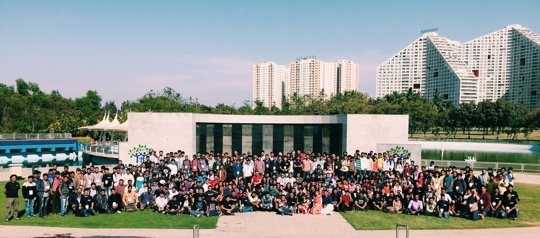
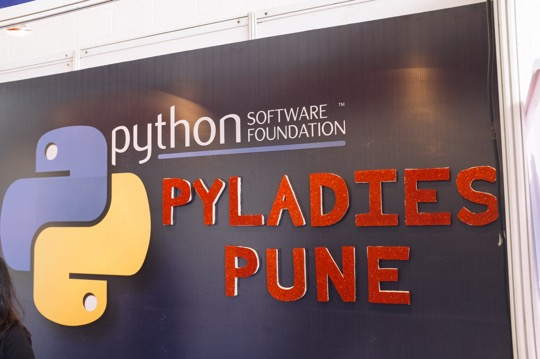
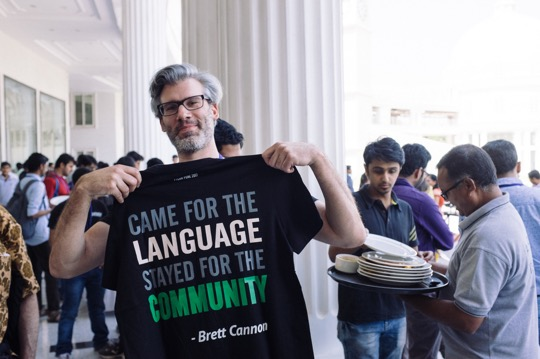
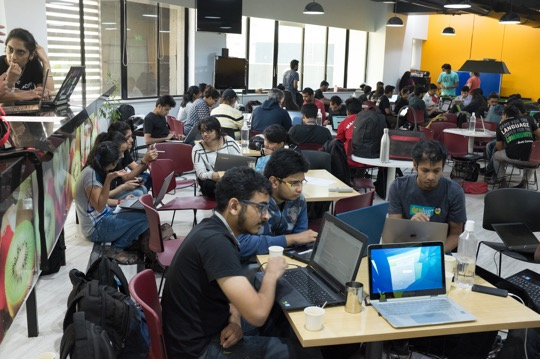

*By Anwesha Das* February 2017 marked the beginning of a new journey for a new regional Python Conference - [PyCon Pune](https://pune.pycon.org/2017/). PyCon is the meeting place for community. It gives Pythonistas an opportunity to come out of the virtual world and meet the real people behind the nicknames and the handles. It gives them an opportunity to learn new things and share their knowledge with others. Considering the vast geographical territory of India, a single PyCon event wasn’t sufficient. PyCon Pune offered the Python community another chance to interact. It was a four-day event; the main conference on the first two days and development sprints the second two. It was a single-track event, so all 550 attendees could attend all the sessions.   

## The inside story:

Pune, also known as the Oxford of the East, is amongst the fastest growing cities in the Asia Pacific region. Pune witnessed this PyCon at a hotel called Amonora, the Fern. The venue was beautiful, and we were grateful to have it: just a few weeks before the conference began, we were afraid we would have no venue at all! The event had been located at one of oldest engineering colleges in Pune, but the venue canceled two weeks prior to the conference. Not quite the kind of news any organizers would like to hear, last minute (I can vouch for that, I was one of them). Python Software Foundation then extended its hand to help. Team PyCon Pune as well as the Python community in India cannot thank the PSF enough for this. 

## PyLadies in PyCon Pune:

The PSF has always been a huge supporter of [PyLadies](http://www.pyladies.com/). This time, they offered to share their booth with us. PyLadies had a huge presence at the event. From volunteering, to management, PyLadies were there everywhere. Yes, “Python is for girls.” And if we PyLadies need support in the face of a crisis, the PSF is there to hold us.   

## United we stand:

The first ever thing that we decided for the conference was the quote to be used on the conference t-shirt.

> “Came for the language, stayed for the community”, by [Brett Cannon](https://twitter.com/brettsky)

This set the tone of the conference. The conference is a completely volunteer-driven event: the website, finance, AV and the overall management were run by volunteers, celebrating the community in the truest sense. Help poured in from pythonistas worldwide. The logo was designed by [Ryan Larch](https://twitter.com/ryanlerch) from Australia. Python communities from all over India along with Python Pune and PyLadies worked tirelessly together to make the event a success. These people keep the soul of Python (the community and language) alive. 

## Day 1 and Day 2 of the main conference:

With a welcome note by [Kushal Das](https://twitter.com/kushaldas), the chair commenced the conference. The first keynote was by [Honza Král](https://twitter.com/HonzaKral). He talked about his journey in the open source world. It was interesting to know about his hurdles and how he overcame them. It is also always inspiring to see at masters were students once too. Next, [Anand Chitipothu](https://twitter.com/anandology) taught us to write beautiful code.The post-lunch session began with the keynote by the “official Perl guy” of the Python community, [John “Warthog” Hawley](https://twitter.com/warty9), who described the path from software to hardware hacking. The day ended with an enchanting experience - a keynote by [Pravin Patil](https://twitter.com/_gnovi), a teacher who uses Python to teach Physics. Python plus Physics plus a Laser equaled magic in his presentation. [Katie Cunningham](https://twitter.com/kcunning) began Day 2, followed by the Economics Professor [Stephen Turnbull](https://twitter.com/yasegumi). He has helped to develop Ghostscript, XEmacs, Python, and GNU Mailman. He offered a word of encouragement to us saying, “You can help develop Python - and you should!” After lunch, [Nick Coghlan](https://twitter.com/ncoghlan_dev) delivered his keynote. He discussed “opportunities and challenges in open collaboration.” The last keynote talk was by [Terri Oda](https://twitter.com/terriko), about security in the open source world. This led to the end of the main conference. The mentors for the dev sprints spoke on what they were going to work on. An open feedback session marked the close of the main conference.

## Day 3 and Day 4 of the Developers Sprint

For sprints, the conference moved to the Red Hat office in Pune. A dozen projects added features and fixed bugs during the final two days of the conference. The sprints had proven to be the most popular portion of the conference: Tickets had sold out within a week. The Red Hat office looked like a hackerspace over the weekend. People were coding, learning, having fun and celebrating Python. It was the first ever dev sprint experience for more than 95% of the attendees. It took most of the people to some time to understand what is going on and how they could participate. Slowly folks started flocking around different mentors. There were good number of people gathering around Nick—many Pythonistas have a dream to become CPython core developers. More than 10 patches were submitted to the language. Web.py, ElasticSearch, Django, es-django-example, OpenCabs, Pagure and micropython held sprints as well. The actual number of patches submitted can be found [here](https://kushaldas.in/posts/pycon-pune-2017.html). I took shelter in the micropython and hardware room, where we were worked on fun bunny boards with esp8266 devices. John was there guiding us, changing our lives (my life for certain) [with blinking LEDs](https://anweshadas.in/my-bunnyuncle/). The best surprise came at the end. He gave each of us a bunny board. What a lovely souvenir to take home! The conference is intended to give people the feeling of community. The event is over but the spirit is hasn’t diminished. Please join us next year for [PyCon Pune 2018](https://pune.pycon.org/2018/), February 8 - 11.
