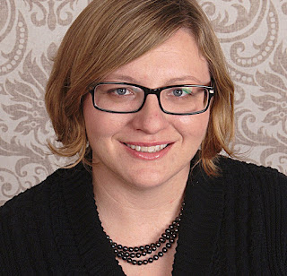

When a pair of cufflinks in the shape of the Python logo sold for $900, [Jacqueline Kazil](https://twitter.com/JackieKazil) thought, "We're on to something." The cufflinks were the most coveted item of the PyLadies Auction at PyCon in 2014. So the next year Kazil made a pair of Python socks—"2015 was the year of the sock, in fashion"—and a Python tie. The socks sold for $550. The tie sold for $600 to Jacob Kaplan-Moss, the Django contributor. He tweeted:  

> Yissss got the tie to go with my cuffs from last year. [#pycon](https://twitter.com/hashtag/pycon?src=hash) [#pyladies](https://twitter.com/hashtag/pyladies?src=hash) — jacobian (@jacobian) [April 11, 2015](https://twitter.com/jacobian/status/587033355222384640)

Kazil had begun volunteering with the auction in 2013, "at the last minute." By 2015 she stepped up to help collect items and auction them. Her fellow auction coordinator, Lynn Root, says, "She came in and just like, did shit. She was completely on the ball and accomplished what needed to be done." The thousands of dollars PyLadies raises from the annual auction is spent on scholarships to send women to PyCon. "It lowers the barrier for women to attend," says Kazil. "Not everybody has a company supporting them. I remember when I was working for the government there wasn't that money allocated for sending folks to conferences." <iframe src="https://www.youtube.com/embed/lcySLoprPMc?rel=0" width="560" height="315" frameborder="0" allowfullscreen style="max-width:100%;"></iframe>

Jackie Kazil is a [2016 recipient of the Python Software Foundation Community Service Award](https://www.python.org/community/awards/psf-awards/#march-2016). The Foundation recognizes her contribution to the PyCon PyLadies Auction, and her diligent volunteer effort as chair of the PSF Grants Work Group.

<table align="center" cellpadding="0" cellspacing="0"><tbody><tr><td></td></tr><tr><td>Jackie Kazil</td></tr></tbody></table>

  
The Grants Work Group ensures that small grant applications are processed promptly in the periods between PSF Board meetings. "We make sure that grants keep flowing," Kazil says. The group also provides diverse perspectives of applications. "Our members are from around the world, and that ensures we have input about cultural factors, costs that we wouldn't think of if we didn't have this global view." According to Lynn Root, "Jackie is a very genuine and true person who really acts on her passions." Acting on her passions has paid off in a prestigious career: She is president of the board of the [Presidential Innovation Fellows Foundation](http://presidentialinnovation.org/), wrote the [Mesa agent-based modeling framework](https://github.com/projectmesa/mesa), is a Technical Fellow at Capital One, and recently co-authored with Katharine Jarmul the O'Reilly book [Data Wrangling with Python](http://shop.oreilly.com/product/0636920032861.do). Kazil says, "Each feeds a different part of what I think is important. The book was created for data people or statisticians who want to learn how to code. The two authors and two editors and two target-audience reviewers were women which I think is kind of cool." With her Mesa project, Kazil aims to consolidate agent-based modeling techniques in a reusable Python framework. "It's a type of modeling where you have so many independent variables in the system that it would take until the end of time to solve." Mesa also enables researchers to publish browser-based visualizations of their results. "It makes the models reproducible. For example economists and sociologists come from different schools of thought, but if they can 'pip install' something they can work with the same baseline model. Once that baseline is created and accepted, they have the same starting point." In January Kazil joined Capital One as a member of the Technical Fellows program, where she mentors, teaches, and cultivates the company's engineering culture. She works with Jim Jagielski, co-founder of the Apache Software Foundation and a Distinguished Engineer in the Tech Fellows program, helping to open-source projects from the company. “There's increased focus on open source in the private sector," she says. "You might think, why would I want to go to a bank? But there's a lot of awesome things to work on here." Despite her accomplishments as a software engineer, Kazil's enthusiasm for the PyLadies auction is undiminished. "I love love love the event. There was a joke going around about how I had found my secret calling. I should be an auctioneer."
