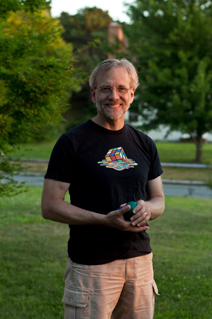

Ned Batchelder didn't mean to get himself nominated for an award. He'd simply [encouraged his Twitter followers](https://twitter.com/nedbat/status/738871623844040704) to "nominate someone who made a difference for a PSF Community Service Award." A friend who saw his tweet thought, "You know, the person who best exemplifies the community spirit and community service of Python is Ned." In the second quarter of 2016, the Python Software Foundation recognized Batchelder with a Community Service Award for his tireless work helping run the Boston Python user group, being a regular speaker at conferences, maintaining coverage.py, and being a friendly face for the community on IRC and elsewhere. **Coverage.py and ByteRun**  
Batchelder maintains [coverage.py](https://coverage.readthedocs.io/), a tool for measuring Python programs' code coverage. It monitors a program under test, to report which lines of source are executed and which are not. Coverage.py fills a vital niche in the Python ecosystem, ensuring our code is thoroughly tested, and Batchelder has developed it for well over a decade. As an offshoot of his coverage.py work, Batchelder began experimenting with a project called [ByteRun](https://github.com/nedbat/byterun) in 2013. His most prominent contributor is Allison Kaptur, who wrote a chapter on the project for [The Architecture of Open Source Applications](http://aosabook.org/en/buy.html#fh). "ByteRun is a Python interpreter written in Python," she says. "It’s not like a real one. It does now run most Python code that you throw at it, but Ned's original motivation was to explore instruction-level coverage for coverage.py. There are lots of cases where line-level coverage does not give the whole picture; he wanted to see if he could do better. That was his motivation, but I joined the project because I have an inexplicable love of byte code that I cannot justify." Kaptur loved working on a codebase with Batchelder—despite his long experience, he is patient with contributors and enthusiastic about their work. When [she reported a significant bug](https://github.com/nedbat/byterun/pull/10#issuecomment-45956985) in his implementation of stack frames and scopes in ByteRun, he celebrated the discovery. "Wow, this is amazing! I'm humbled to learn that I had the data stack wrong."  
**Boston Python User Group** When Batchelder first attended the [Boston Python User Group](http://www.meetup.com/bostonpython/) a decade ago it was already going strong. The group draws from Boston's big tech community, and it meets in Cambridge's Kendall Square, the epicenter of the tech industry there. Under Batchelder's leadership the group has grown to over 6000 members. It was for this achievement that his friend and colleague David Baumgold, when he read Batchelder's tweet, nominated him for a Community Service Award. Baumgold says, "He is very, very good at getting people to open up about what they’re working on. He calls it pulling lightning talks out of people. He says, 'If you don’t think you have a lightning talk in you, come and talk to me. In five minutes I'll find your lightning talk.'" Jessica McKellar, too, helped cultivate Boston Python for several years. Batchelder admits, "I’m not great at bringing in other organizers and giving them lots of control. But she was a big help in creating new events for the group." The workshops for women that McKellar started unlocked a pent-up demand in the area. McKellar created a follow-up event, the monthly Project Night, where workshop participants could advance further. Batchelder says, "On project nights people come and do what they want to do. When you run one of those every month, you get a consistent rhythm going and people continue to show up."  
Another reason for the group's size is Batchelder's stick–to–itiveness. Organizing events for seven years and more isn't easy. There are nights he asks himself, "Really? I’m going to Boston Python again? That’s what I’m doing tonight?" But it's worth it: helping people use computers, for Batchelder, is as fun as using computers himself. Even better is when he connects a newcomer to a project or person that provides precisely what they need. "When I can do that, I think—wow, I really nailed it. That was a good night."  
**PyCon Talks** When PyCon's call for proposals opens each year, Batchelder considers what question he's heard most often that year, and tries to come up with a "very good answer" that is the core of a PyCon talk. But how does he compose the best answer he can? "There’s all these topics that lead to each other in a dense graph, but I'm going to have to linearize it and speak one sentence after the other for 25 minutes." To trim that tree of knowledge to its trunk, Batchelder seeks the principles that lead from the question to the solution. "I try to lay bare the mechanisms that link them together." His [Unicode Sandwich talk](http://nedbatchelder.com/text/unipain.html) in 2012, for example, distilled a painfully complex question into a simple answer. Programmers can handle Unicode correctly in their apps with his three concise tips. And his [talk on looping and iteration in Python](http://nedbatchelder.com/text/iter.html) covers topics so fundamental that most Python programmers couldn't explain them much better than a mole could explain digging. David Baumgold says, "Ned is very good at avoiding the curse of knowledge. He's simultaneously very knowledgeable and also very accessible to beginners."**Juggling**  
Ewa Jodlowska, the PSF Director of Operations, says that every Python programmer she meets has a hidden talent. She was sitting at a table with Batchelder at PyCon Montréal last year when he picked up a few pieces of fruit and juggled them. Batchelder has been juggling for so long he cannot remember how he first learned; perhaps from his father. Naturally, he teaches it too. At his workplace, [Open edX](https://open.edx.org/about-open-edx), "There’s a bunch of people who learned how to juggle because they saw all the props on my desk. Whenever we have company outings there always kids that want to learn." At PyCon this year he held an Open Space for juggling. Jodlowska recalls it was so popular it spilled out of the room. Batchelder stood in the hallway juggling his pins, while the crowd surrounding him cheered him on.  

<table align="center" cellpadding="0" cellspacing="0"><tbody><tr><td></td></tr><tr><td><i>Photo by Max Batchelder</i></td></tr></tbody></table>
