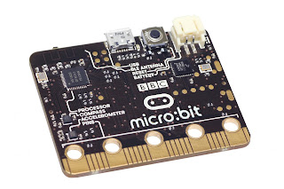

July 7, 2015 BBC Microbit Last March, I wrote about a terrific educational project taking place in the UK, with which the PSF is proud to be involved (see [PSF Blogpost](http://pyfound.blogspot.com/2015/03/bbc-launches-microbit.html)). I am very happy to report today that the BBC micro:bit project has successfully launched! The BBC micro:bit release is part of the BBC’s Make it Digital initiative, whose purpose is to prepare a generation for the challenges of a tech-driven world. The project is a collaboration of 29 partners from industry, education, and government.

> Key partners include ARM, Microsoft, Samsung, Barclays, Freescale, Element14, Lancaster University, Nordic Semiconductor, Technology Will Save Us, ScienceScope and the Wellcome Trust.

At the beginning of the school term this September, every year-7 UK student (11-12 years old) will be given a BBC micro:bit computer. Designed to inspire creativity, the BBC micro:bit is pocket-sized, versatile, and, most importantly, easy to use: 

> Something simple can be coded in seconds – like lighting up its LEDs or displaying a pattern – with no prior knowledge of computing. All that’s needed is imagination and creativity.

The idea, according to Sinead Rocks, head of BBC Learning, is to make using computers creatively as natural to children as using crayons to experiment with coloring. The micro:bit can be programmed via web-based editors capable of using several programming languages, including Python, Javascript, C++, Microsoft Touch Develop, and Blocks (a visual language). The user can then save her program, run it in a simulator, and retrieve it any time to load it onto the BBC micro:bit. In addition to internet connectivity, the device can also connect, via five I/O rings as well as Bluetooth, to other computers and devices, including Raspberry Pis, Arduinos, Kanos, robots, and motors. When connected, it can be powered off another device, or it can run on its own battery. The micro:bit also features a compass and an accelerometer. BBC Learning, along with the project’s partners, are providing educational resources and tutorials aligned with school curriculum, in an effort to ensure that teachers are ready when the micro:bits are distributed to students. With open-sourced specs and plans for a non-profit to oversee further educational use of the device, the micro:bit’s initial reach is sure to grow. Commercial development of the device is anticipated by the end of 2015. The PSF is eager to seize this opportunity to further the use of Python and to increase programming literacy. According to the BBC,

> The Python Software Foundation will be working with the BBC micro:bit to provide a code editor that will help to teach children the Python programming language. They will be working with the Python development community to produce resources and activities that children can build using Python.

I urge Python developers to volunteer for this effort and to get involved in this wonderful educational initiative. You can read more about this project at: [BBC micro:bit](http://www.bbc.co.uk/mediacentre/mediapacks/microbit) and [BBC Learning](http://www.bbc.co.uk/blogs/aboutthebbc/entries/39ad813f-9863-403f-8b7f-63ebdd5a7569). *I would love to hear from readers. Please send feedback, comments, or blog ideas to me at [msushi@gnosis.cx](mailto:msushi@gnosis.cx).*
