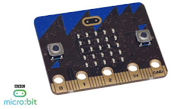

As you may recall, there have been a couple of previous posts to this blog about the [BBC’s micro:bit project](http://www.bbc.co.uk/mediacentre/mediapacks/microbit) (also see [PSF newsblog](http://pyfound.blogspot.com/2015/07/bbc-microbit-successfully-launched.html)). The micro:bit is a small, stripped-down, wearable computer (similar to a *Raspberry Pi*) and based on an nRF51 chip. The educational project, part of a larger UK program called *Make it Digital,* is designed to inspire children to become digital creators by giving away 1 million micro:bits to all 11 year-old UK schoolchildren this spring.  
  
Today I heard some exciting news about the project from our good friend, Nicholas Tollervey, which I’m happy to pass along here. According to Nicholas:

> From the beginning the BBC have said that Python would be one of the possible languages that the device can be programmed in. The PSF is one of around twenty organisations in the project partnership. Since it’s a microcontroller, and the aim is to run Python… well, there’s a pretty obvious answer when trying to combine those two things.

> We’re incredibly pleased to announce that MicroPython runs on the BBC’s micro:bit. Furthermore, all the work done so far is being open-sourced today and the repository can be found here: [https://github.com/bbcmicrobit/micropython](https://github.com/bbcmicrobit/micropython)

> Right now only the code related to the MicroPython port is released. When the device is delivered, all the resources needed to recreate the entire project are to be released under an open license. The laudable intention is to provide an unencumbered legacy so others can build upon and adapt the work of the partnership that has created this device.

> To read more details and learn the story of how MicroPython came to be on the micro:bit, check out Nicholas Tollervey’s blog post found here: [http://ntoll.org/article/story-micropython-on-microbit](http://ntoll.org/article/story-micropython-on-microbit)

> Finally, there is much to be done. The project needs help from people with skill and experience developing for such devices. Could you contribute something to a project that will touch the lives of 1 million children and leave an open legacy that anyone could re-use? If so then please read the above-linked post and head on over to the code repository.

I hope that many of you will take Nicholas up on his request to contribute to this worthwhile project. *I would love to hear from readers. Please send feedback, comments, or blog ideas to me at [msushi@gnosis.cx](mailto:msushi@gnosis.cx).*
