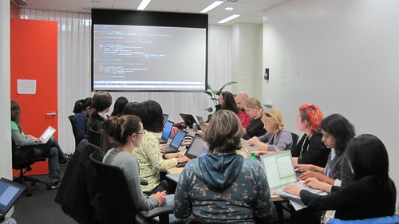

(This is a guest post by Jessica McKellar, a Boston Python User Group organizer and co-organizer of the Boston Python Workshop for women and their friends.) I am thrilled to report that the Python Software Foundation's Outreach and Education Committee awarded a $3300 grant to the [Boston Python Workshop](http://bostonpythonworkshop.com/) to support and grow the workshop over the next 8 months. We are excited to continue our successes at bringing more women into the Boston Python community and to take the show on the road!   

#### The Boston Python Workshop

The Boston Python Workshop is a free, volunteer-driven introduction to the Python programming language for women and their friends who have no or limited programming experience. We run the workshop every 2 months for between 30 and 50 women, and it has run 4 times so far. We strive to:  

-   Show new programmers and the [Boston Python](http://bostonpython.com/) community examples of smart, confident, capable programmers of all backgrounds.
-   Bring new, awesome, diverse people into the local Python community through diversity and outreach events.
-   Inspire others to run their own introductory workshops and outreach events, and to get more user groups thinking about diversity and outreach.

An important part of our philosophy is a commitment to running the workshop as part of the local user group. This Python Software Foundation grant will help us run the next three workshops in Boston and bootstrap workshops in 3 new cities. As a result of this grant:  

-   Over 200 women will learn Python fundamentals and join their local programming communities as empowered, confident beginners who are excited to continue learning.
-   3 new Python user groups will learn how to run high-quality diversity outreach events.
-   Volunteers at the workshops will get experience with public speaking and teaching technical content -- a great stepping stone to leading future PyCon talks and tutorials!
-   The Python community as a whole will continue to benefit from our shared, online, Creative Commons-licensed workshop material as we expand and refine it.

#### Results

The workshop has resulted in dramatic, lasting diversity improvements for the Boston Python User Group. Many workshop alums are now fixtures at our hack nights and lecture-style events, and the group has gone from 0-3% women at its events to consistently over 15%. Additionally, group membership has doubled since the workshops started, to over 1350 people, making it the second-largest Python user group in the US. If you do the math you'll see that we aren't just bringing women into the user group through the workshop. The secret is that running beginner-friendly outreach events for women focuses the group on being more welcoming to everyone. Our monthly hack nights grew out of the workshop and are one example of bringing beginner-friendly ideas from the workshop to the group as a whole. The Boston Python user group is now a more diverse and vibrant community full of beginners, scientists, artists, entrepreneurs, and people switching to a career in software/IT, and we're very happy that the workshop has played a significant role in this.

#### Beyond Boston

We want to help other user groups see the same kinds of successes that we've had here in Boston, and a large part of this PSF grant is dedicated to bootstrapping workshops in other cities. If you want to bring the workshop to your city, [read the full grant proposal](http://mail.python.org/pipermail/outreach-and-education/2011-October/000099.html) and [get in touch](http://bostonpythonworkshop.com/clone-it/)! All of our material is online and shared through a permissive Creative Commons license. Check out an [example curriculum](http://openhatch.org/wiki/Boston_Python_Workshop_4) and [photos](http://www.flickr.com/photos/bostonpythonworkshop/) from the workshops. Our goal of stress-free experiences for attendees makes our material a good base for other intro events; for example, we believe our cross-platform installation instructions for Python are the best we've seen. We look forward to a larger, more diverse Python community, and we want to thank the Python Software Foundation for supporting our efforts. The Outreach and Education Committee, [PSF Grants program](http://www.python.org/psf/grants/), and [PSF Sprints program](http://pythonsprints.com/) are all interested in new grant requests to push the Python world forward. Make something awesome happen in your city!
