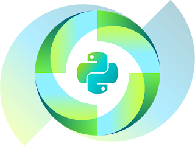

Thank you to everyone who has donated to our past fundraisers! Donations, memberships, and sponsorships support sprints, meetups, community events, Python documentation, fiscal sponsorships, software development, and community projects. We can’t do any of this without your financial contributions. We’ve just launched a [new fundraiser](https://www.python.org/psf/donations/2019-q2-drive/) for 2019! Please donate today and help us meet our goal of $60,000 by June 30th!  

#### Your donations have IMPACT!

  

-   The PSF awarded $118,543 in financial aid to 143 PyCon attendees in 2018
-   $324,000 was paid in grants in 2018 to recipients in 51 different countries
-   Donations and fundraisers resulted in $489,152 of revenue. This represents 15% of our total 2018 revenue.
-   PSF and PyCon sponsors contributed over $1,071K in revenue!

  
We understand the need for transparency and hope to help our community and stakeholders find necessary information about the PSF in a single place. We’re proud to launch our first ever [Annual Report](https://www.python.org/psf/annual-report/2019/). 2018 was a year of growth for the PSF while still focussing on sustainability for our staff and community. We’re excited to share these data points with you!  

### Something new this year - the PSF and Jet Brains!

  
  
This year we're trying something new. In addition to our regular donation drive, we're partnering with JetBrains to help raise money for the PSF. JetBrains PyCharm & the PSF is happy to announce a 30% discount with all proceeds going to the Python Software Foundation general fund! Please consider becoming a [PSF Supporting Member](https://psfmember.org/civicrm/contribute/transact?reset=1&id=26) today. Or simply make a [one-time or recurring donation.](https://psfmember.org/civicrm/contribute/transact?reset=1&id=26) If you're attending PyCon this year, you can donate at the PSF booth and get your choice of a limited edition pin or sticker set! Help spread the word about our fundraiser! Here are some suggested tweets:  
\===================

-   Donate today and help @ThePSF reach their fundraising goal! [https://www.python.org/psf/donations/2019-q2-drive/](https://www.python.org/psf/donations/2019-q2-drive/) #idonatedtothepsf
-   Your contributions help fund workshops, conferences, and pay meetup fees. The PSF can't do this without your support. Please consider donating to help us continue to do our work - [https://www.python.org/psf/donations/2019-q2-drive](https://www.python.org/psf/donations/2019-q2-drive)
-   A Supporting Membership of $99 pays for 6 months of Python meetup subscriptions. Become a member and help us continue our mission! [https://www.python.org/psf/donations/2019-q2-drive/](https://www.python.org/psf/donations/2019-q2-drive/). #idonatedtothepsf

  
\================== Thank you for your support! The PSF Team
