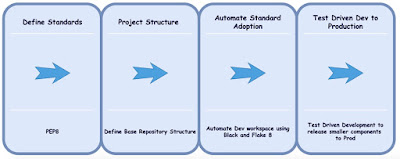
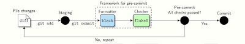

By Akshay Prabhu, Software Engineering Manager, Capital One

### Rewriting Legacy ETL Jobs in Python When You’re Not Python Devs

 So how does a team of six engineers - heavily experienced in web development in languages like ReactJS, NodeJs, and Java - go about adopting Python into their work? The application development and cloud computing technology landscape is always changing and an important part of our role as engineers is to stay up to date on those changes. Sometimes it is through solo work - such as learning a new framework or skill. But sometimes it is through team-based work - such as adopting and migrating a whole project to a new language. Like most other engineers, I’ve experienced this kind of team-based work multiple times in my career, and I recently went through it in my current role as a Software Engineering Manager at Capital One. In my role I am working on leading a team of engineers to develop highly scalable web applications, including both API and UI layers. As part of our journey to migrate applications to the cloud, we were also involved in rewriting a lot of legacy [ETL](https://en.wikipedia.org/wiki/Extract,_transform,_load) jobs originally built using licensed tools. Most of my past engineering experience before these re-write efforts for ETL was around NodeJS, Java, and Ruby on Rails; and until a year ago I had not worked with Python. The same was true with most of the engineers on my team. *In fact, our entire team consisted of experienced engineers who have delivered multiple web and distributed applications in the cloud, but none had exposure to ETL or data-driven projects.* About one month into the rewrite efforts we were hitting limitations around using Java to migrate legacy system code. We wanted to be able to achieve simple File Operations, as well as complicated queries using Spark, but with dynamically typed language and minimal bootstrap code. This was one of our reasons for considering whether it was time to switch languages.

### Why Did We Decide On Python?

For our project, we faced the huge task of re-writing multiple jobs running on a legacy ETL platform. This involved enterprise API integrations, as well as complex data analysis and refinement.  **Inflexibility of Existing Languages**Due to the nature of these jobs, none of the languages we were most experienced with were a great choice. That’s because they were:

-   Static typed languages like Java
-   Involved heavy bootstrap code
-   Lacked extensive support for data manipulation libraries such as Pandas
-   Lacked extensive external community support for Spark integrations or data analysis

**Flexibility with Python: API Integration, Data Analysis, and Others**Python seemed to be a good choice for us as it was flexible enough to support a wide array of use cases. It also fit in well as it was:

-   Dynamically typed
-   Supported re-writing Bash based or ETL jobs in fewer lines of code
-   Had a well supported REST interface
-   Had excellent support for data manipulation libraries such as Pandas and Spark

There were a few other areas that really cemented our use of Python - these were *File Operations and Community Support.* **File Operations**File Operations were key to our project as our process involved reading multiple source files in parquet format, extracting, refining, and producing new files. We needed a language that could easily integrate with [SPARK on HDFS](https://spark.apache.org/docs/latest/api/python/index.html) for complicated and larger datasets, as well as an equally powerful library for smaller datasets like [Pandas](https://pypi.org/project/pandas/). Hence, File Operations were at the center of our re-write. Python worked well in both cases, including:

-   Well suited for simple file manipulations using Pandas
-   Worked in complex scenarios using Spark Queries on HDFS
-   Needed significantly fewer lines of code to accomplish this than in Java or NodeJS
-   Could work for File Operations in memory when source files are few MBs
-   Simple enough to make API calls for various Enterprise Layers

**Community Support**As we were assessing adopting a new language, Community Support both within Capital One and without was a key for us. We wanted a language which was well supported by an active open source community that:

-   Constantly updates security enhancements
-   Resolves outstanding questions or issues
-   Actively merges new feature requests from engineers

Outside of Capital One

-   Python has a much more extensive community of engineers in the Data Analysis space as compared to Java
-   PySpark has much better support than Spark Integration with Java

**Within Capital One**

-   Capital One has a very active community of Python engineers and experts to help teams get started and maintain their Python projects
-   This internal community allowed us to seek guidance, as well as go through multiple code reviews

### How We Got Started with Python

Like any other programming language, we started by defining our source of truth for standards. We went with [PEP8](https://www.python.org/dev/peps/pep-0008/) which is the standard that defines Coding Style Guides for Python. We went through the below key stages from Planning to Production.  *Key to learning and adopting a new language was putting in time for foundational work; automating compliance with PEP8 and adopting Py Tooling like Black and Flake8.* Let’s go through some of the key elements to these stages. **Define Standards and Automating Adoption**As our team was new to Python, we spent the first initial few days defining standards on how we would code to comply with PEP8. But in addition to adoption, we needed to automate our workflow to comply with these standards.

-   Added a Pre-Commit Hook for Black which automatically formats code on local commits.
-   Black didnt catch all violations, which is where Flake8 came in.
-   Flake 8 installed as a Pre-Commit hook stopped any code commits where there were outstanding compliance errors with PEP8.

 After automating our workflow to comply with standards and a base repo, we started with the core dev work. **Logging**This was key given Python is dynamically typed; logging was our solution to better track problems.

-   As a Team we Decided on a common Logging format:

\`\`\` Code Block requestid - machine\_instanceid timestamp - YYYY-MM-DD HH:MM:SS,milliseconds loglevel - INFO, ERROR modulename - function\_name state - START/END/INPROGRESS type - SCRIPT/EXTERNAL\_API/etc. modresponse - Success/Error duration - Tracking External API calls message - custom message as needed errormessage - err message \`\`\`

-   We leveraged the [ELK](https://www.elastic.co/elastic-stack?ultron=%255BEL%255D-%255BB%255D-%255BAMER%255D-US+CA-Exact&blade=adwords-s&Device=c&thor=elk%2520stack&gclid=CjwKCAiAhc7yBRAdEiwAplGxX7QiZed0XB7pdALZx5FOKZo_IiRGXsWi48uOBUUQ12g6eRy9Y5uC0xoCLO4QAvD_BwE) stack (Elasticsearch, Logstash, and Kibana) for logging.
-   By using Kibana as the Web Application UI for our logs, we could see our execution details as well as trace down exceptions in Kibana.

**Critical takeaways**

-   Adopting a simple library called [requests](https://realpython.com/python-requests/) to handle our API calls.
-   Spark v/s Pandas: When you perform operations on a dataframe in Spark, a new dataframe/reference is created which is by design. This works well with large datasets but is a hindrance when the dataset is smaller. Hence for filtered smaller datasets under 5MB, we decided to go with Pandas for quick data frame manipulations.
-   Automation for compliance to coding standards was a huge time saver as most of our team was new to Python.
-   We quickly realized for us to test along with all the dev work, we needed a TDD approach where [pytest](https://docs.pytest.org/en/latest/) came into our workspace. This proved extremely helpful.

### Was it Worth the Effort?

*In addition to being the right choice of tool for our job, exploring and learning Python allowed the team to work more closely together and bond more than ever.* *We as a team learned something new together and solved multiple issues as we hit walls; which took our team bonding to great heights!* Given the nature of our project, Python did fit in very well. It’s dynamically typed and the libraries are feature-rich, working for both simple API calls as well as complex operations around data transformation and filtering. As engineers, we worked together as a team to “learn how to learn” and adopt a new language the right way. With the help of Capital One’s Python Gurus, we adopted all the best practices for developing a working production application and delivered this project before the committed deadline. I am lucky to be part of such an awesome team, as well as to work with Capital One Python experts like [Steven Lott](https://medium.com/capital-one-tech/search?q=steven%2520lott), which was critical for getting us across the finish line. I hope this has been helpful and would love to learn what languages you and your team have adopted recently; especially in data-driven projects like this, let me know in the comments! Resources [PySpark](https://spark.apache.org/docs/latest/api/python/index.html) [Pandas](https://pandas.pydata.org/) \*\*\* *These opinions are those of the author. Unless noted otherwise in this post, Capital One is not affiliated with, nor is it endorsed by any of the companies mentioned. All trademarks and other intellectual property used or displayed are the ownership of their respective owners. This article is © 2020 Capital One.*
