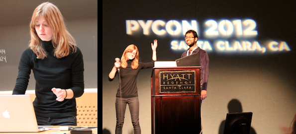

The Python Software Foundation congratulates Jessica McKellar for winning a [2013 O'Reilly Open Source Award](http://www.oscon.com/oscon2013/public/schedule/detail/29956) for her contributions to the Python community. The award was presented at OSCON in Portland, Oregon on July 26.  [Jessica](http://jesstess.com/) is an entrepreneur, software engineer, and open source developer from Cambridge, Massachusetts, USA. She is also a prolific volunteer in the Python community: She is currently a [Director](http://www.python.org/psf/members/#board-of-directors) for the Foundation and vice-chair of the PSF's [Outreach and Education Committee](http://psf-outreach.org/). She is also an organizer for the [largest Python user group in the world](http://bostonpython.com/) in Boston, Massachusetts, USA. With that group she runs the [Boston Python Workshop](http://bostonpythonworkshop.com/), an introductory programming pipeline that has brought hundreds of women into the local Python community. The group has been so successful that it is being replicated in cities across the US. She is tirelessly constructing new curricula and events that she play-tests with Boston Python and then pushes to the broader community under a permissive license to re-use and remix. Examples include an [intro to Python workshop for first-time programmers](http://pyfound.blogspot.com/2011/11/boston-python-workshop-psf-grant.html), an [intro to open source contribution workshop](https://us.pycon.org/2013/schedule/presentation/4/), a project-based [intermediate Python workshop](https://openhatch.org/blog/2012/intermediate-python-workshop-wrap-up/), and a [CPython sprint for new contributors](http://pythonsprints.com/2013/05/5/bostons-cpython-sprint-new-contributors/). In addition to being a frequent conference speaker herself, Jessica has been evangelizing Python and PyCon in her role as the [Diversity Outreach](http://us.pycon.org/2014/about/staff/) coordinator for PyCon 2014. Thank you Jessica for all your contributions to the Python community. The PSF also congratulates the [other winners of this year's award](http://www.oscon.com/oscon2013/public/schedule/detail/29956):  

-   Behdad Esfahbod of HarfBuzz
-   Limor Fried of Adafruit Industries
-   Valerie Aurora of the Ada Initiative
-   Paul Fenwick of Perl
-   Martin Michlmayr of the Debian Project
