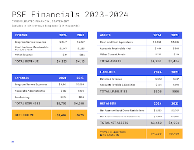

As the PSF heads into our end-of-year fundraiser, we want to share information to help “connect the dots” and show a more complete picture of the PSF’s current financial outlook. You’ve heard from us on subjects related to our financial position from several different angles recently (a list of those posts is below). We’ve prioritized proactive communications, because we believe in transparency, we have trust in our community, and we value keeping you informed— we know how invested in and impacted by our work you are. We now want to pull those threads together in order to create some shared clarity on the big picture, and, hopefully, inspire you to action to support our fundraising efforts.

## The dots

Many groups, organizers, and individuals in the Python community and beyond are experiencing the impacts of the current financial environment, including inflation, reduced sponsorship, economic pressure in the tech sector, and global/local uncertainty and conflict. Unfortunately, the PSF has felt these effects as well, in a number of ways. We’ve been doing our best to share how the current environment impacts our areas of service to the community as the PSF navigates these challenges over the past couple of years:  

-   [PSF Grants Program Changes](https://pyfound.blogspot.com/2024/12/psf-grants-program-charter-updates-tldr.html)
-   [PyCon US 2025 Financial Transparency](https://pycon.blogspot.com/2024/11/important-changes-ahead-commitment-to.html)
-   [PSF Grants Program Pause](https://pyfound.blogspot.com/2025/08/the-psf-has-paused-our-grants-program.html)
-   [Open Infrastructure is not Free Joint Statement](https://openssf.org/blog/2025/09/23/open-infrastructure-is-not-free-a-joint-statement-on-sustainable-stewardship/)
-   [Our post on the Open Infrastructure is Not Free](https://pyfound.blogspot.com/2025/10/open-infrastructure-is-not-free-pypi.html)
-   [NSF Grant Application Withdrawal](https://pyfound.blogspot.com/2025/10/NSF-funding-statement.html)

To briefly summarize, the PSF’s assets and yearly revenue have declined, and costs have increased, while the demand and need for our work has continued to multiply. Historically, PyCon US has been a source of revenue for the PSF, enabling us to fund programs like our currently paused [Grants Program](https://www.python.org/psf/grants/). A PSF-run PyCon US is also an essential program for the PSF to deliver value to our sponsors. Unfortunately, PyCon US has run at a loss for three years—and not from a lack of effort from our staff and volunteers! Everyone has been working very hard to find areas where we can trim costs, but even with those efforts, inflation continues to surge, and changing US and economic conditions have reduced our attendance. Because PyCon US is still a 2000+ person event, we must secure venue contracts for event spaces that can accommodate that number of people, years in advance. Those contracts come with a lot of requirements, such as union labor, required vendors, and many more details (iykyk) that, in the end, amount to a hefty spend. Meanwhile, Python usage has continued to surge (which is wonderful!), but rather than keep pace, corporate investment back into the language and the community has declined overall. The PSF has longstanding sponsors and partners that we are ever grateful for, but signing on new corporate sponsors has slowed. We have been seeking out alternate revenue channels to diversify our income, with some success and some challenges. [PyPI Organizations offers paid features to companies](https://docs.pypi.org/organization-accounts/pricing-and-payments/) (PyPI features are always free to community groups) and has begun bringing in monthly income. We’ve also been seeking out grant opportunities where we find good fits with our mission. We made it far along in one large U.S. Government grant process, but [ultimately decided to withdraw our application because it conflicted with our values and mission](https://pyfound.blogspot.com/2025/10/NSF-funding-statement.html). The community's supportive response to that decision has been heartening and brought in an unexpected surge of material support totaling $135K+ USD from 1400+ donors, which includes 270+ new PSF members! The PSF is astounded and deeply appreciative at the outpouring of solidarity in both words and actions. This remarkable show of support reminds the us of the community’s strength, and reinforces our resolve in the decision to withdraw from the grant process, even as the $1.5M gap from the grant remains. Our [2024 Annual Impact Report](https://www.python.org/psf/annual-report/2024/) provides a window on the current economic outlook for the PSF, with a loss in net income and a dip in the growth of assets in 2024. Because we have so few expense categories (the vast majority of our spending goes to running PyCon US, the Grants Program, and our small 13-member staff), we have limited “levers to pull” when it comes to budgeting and long-term sustainability. As you can see from the categories mentioned, each of these expense areas leads directly to the services we provide the community. Additionally, we have several sources of assets with donor restrictions (i.e. earmarked funds), meaning we can’t shift those funds to cover other areas of need.

  

## What does this mean?

Overall, the PSF is facing significant financial challenges, but we are actively monitoring the situation and taking action where we can. This post is our way of “raising the flag” early and calling in the community proactively. We currently have more than six months of runway (as opposed to our preferred 12 months+ of runway), so the PSF is not at immediate risk of having to make more dramatic changes, but we are on track to face difficult decisions if the situation doesn’t shift in the next year.

## What we’re doing

Based on all of this, the PSF has been making changes and working on multiple fronts to combat losses and work to ensure financial sustainability, in order to continue protecting and serving the community in the long term. Some of these changes and efforts include:  

-   Pursuing new sponsors, specifically in the AI industry and the security sector
-   Increasing sponsorship package pricing to match inflation
-   Making adjustments to reduce PyCon US expenses
-   Pursuing funding opportunities in the US and Europe
-   Working with other organizations to raise awareness
-   Strategic planning, to ensure we are maximizing our impact for the community while cultivating mission-aligned revenue channels

The PSF’s end-of-year fundraiser effort is usually run by staff based on their capacity, but this year we have assembled a fundraising team that includes Board members to put some more “oomph” behind the campaign. We’ll be doing our regular fundraising activities; we’ll also be creating a unique webpage, piloting temporary and VERY visible pop-ups to python.org and PyPI.org, and telling more stories from our Grants Program recipients.  

## What you can do

**So, what can you do to help us gain sponsors to ensure critical infrastructure, our community, and more can stay supported and sustainable?**  

1.  If your company is using Python to build its products and services, check to see if they already sponsor the PSF on our [Sponsors page](https://www.python.org/psf/sponsors/).
2.  If not, reach out to your organization's internal decision-makers and impress on them just how important it is for us to power the future of Python together, and send them [our sponsor prospectus](https://www.python.org/psf/prospectus2026/).
3.  Point out the various benefits they will receive from sponsoring the PSF. Mention that [PyCon US 2026](https://us.pycon.org/) is coming up next spring, where they can connect with the community, recruit, and understand the current direction of the Python language!
4.  Remind them to reach out to sponsors@python.org if they have any questions or would like a walk-through of our sponsorship program.

As the PSF prepares for our end-of-year fundraiser, we want to emphasize the importance of our community's support. Your relentless passion for Python and our community, along with your individual donations, memberships, stories, advocacy, and more, all make a huge impact and keep our tiny-but-mighty PSF team inspired. Keep your eyes on the [PSF Blog](https://pyfound.blogspot.com/), the [PSF category on Discuss](https://discuss.python.org/c/python-software-foundation/9), and [our social media accounts](https://pyfound.blogspot.com/2025/02/where-is-psf-2025-edition.html) for updates and information as we kick off the fundraiser this month. Your boosts of our posts and your personal shares of “why I support the PSF” stories will make all the difference in our end-of-year fundraiser. If this post has you all fired up to personally support the future of Python and the PSF ***right now***, we always welcome new [PSF Supporting Members](https://psfmember.org/civicrm/contribute/transact/?reset=1&id=1) and [donations](https://psfmember.org/civicrm/contribute/transact/?reset=1&id=2). If you have questions about the PSF’s current financial outlook, the steps we’re taking, or how you can get involved, we welcome you to join the [PSF Board Office Hours](https://pyfound.blogspot.com/2025/10/a-new-psf-board-another-year-of-psf.html), [join the conversation on Discuss](https://discuss.python.org/t/connecting-the-dots-a-new-blog-post-from-the-psf/104717), or email psf@python.org. As ever, we are incredibly grateful to be in community with each of you, and we’re honored to have your support.
