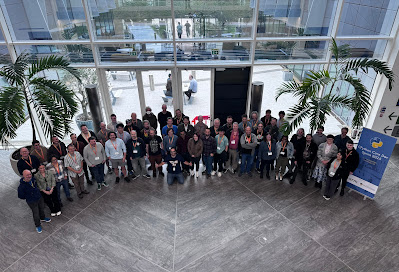
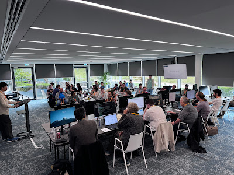
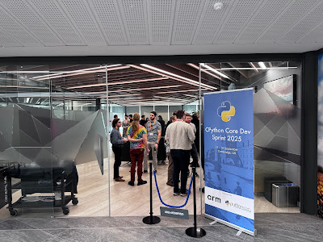
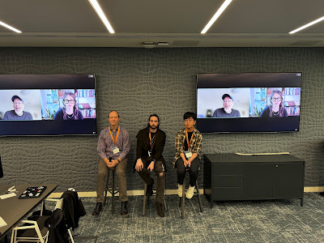
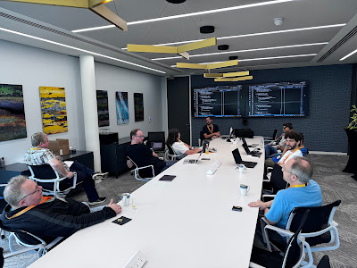
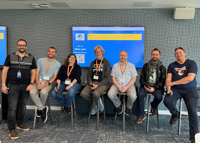
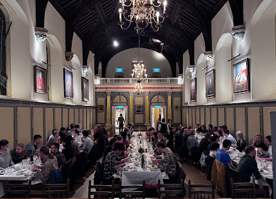
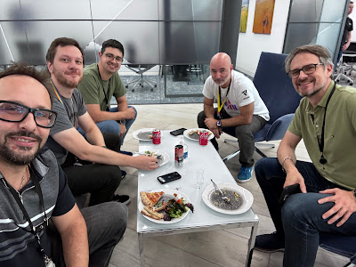
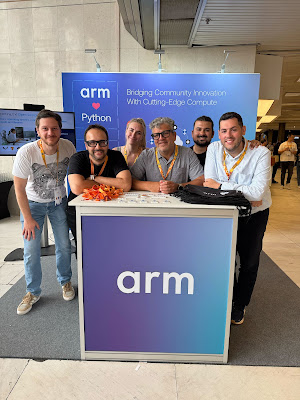
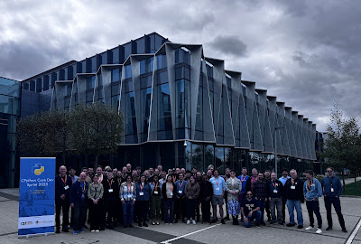

*Guest blog post authored by [Diego Russo](https://www.linkedin.com/in/diegor), Python Core Developer and Principal Software Engineer at [Arm](https://www.arm.com/).*

## Sprint overview

For one week, [Arm](https://www.arm.com/)’s Cambridge headquarters became the heart of Python development. Contributors from around the world came together for the CPython Core Developer Sprint. It was the largest gathering in the project’s history, with 35 core developers and 13 invited guests collaborating in person.  

Unlike a conference, the sprint is a working retreat. There are no spectators or formal keynotes, just space for deep technical debate, design, coding, and consensus-building.

The sprint offers a rare chance for real-time dialogue. Ideas can be sketched on whiteboards, trade-offs debated face-to-face, and tricky issues given momentum.

  

## What happened

The week included technical presentations, collaborative work, and community events. Talks and presentations were grouped around key themes:

-   JIT and performance

-   Ken Jin Ooi – Building a Community Around the JIT Compiler and demo of the new C API
-   Antonio Cuni – Tracing JITs in the Real World, highlighting challenges such as trace blockers, control flow, and async behavior

-   Packaging and distribution

-   Russell Keith-Magee – Managing Cross-Platform Wheel Builds
-   Brett Cannon – Precompiled Binaries from python.org

-   Language design and standards

-   Steering Council – PEP 793 and abi3/abi3t/abi4
-   Matthew Parkinson – Designing Deep Immutability

-   Ecosystem and infrastructure

-   Brett Cannon – WASI Update
-   Hood Chatham – Upstreaming the Pyodide FFI
-   Gregory P. Smith – Claude Code and Agents for Good in OSS

-   Lightning talks

-   Guido van Rossum – A New Python History Project
-   Ee Durbin – PSF Infrastructure Next Gen
-   Steve Dower – Python Install Manager
-   Larry Hastings – A Missing Fundamental Data Structure
-   Adam Turner – Bring Out Yer Dead (Issues)
-   Greg Smith – Async Exception Group Tracebacks

-   Arm contributions

-   James Greenhalgh – Arm Neoverse: Overview
-   Martin Weidmann – A Brief History of the Arm Architecture
-   Peter Smith – Compilers, ABI, and Optimizations

The program also included a Q&A with the Steering Council, where Barry Warsaw and Emily Morehouse joined remotely. It also featured a mentorship discussion led by Tania Allard on how to welcome and support new contributors.

Beyond presentations, the sprint fostered hands-on collaboration. Developers had advanced JIT planning, explored progress on free threading, and discussed improvements to documentation and translations. They also strengthened testing and CI across platforms, and refined governance and contributor onboarding processes.

Antonio Cuni highlighted real-world JIT pitfalls, which informed many of these discussions.

  
Finally, the sprint included community activities that helped balance the technical intensity with moments of connection. The Python Guild at Arm hosted an Ask Me Anything (AMA) session, giving local engineers the chance to interact with core developers.

  
A formal dinner at Jesus College reflected Cambridge traditions, while a punting trip on the River Cam offered a relaxed opportunity to connect outside of work.

  

## A Team Effort

The Python Software Foundation coordinated the event, making the sprint possible. We thank Phyllis Dobbs for managing the RSVP process and the travel grants that enabled many contributors to join us in Cambridge.

Hosting the CPython Sprint at Arm’s Cambridge offices shows a shared commitment and we send huge thanks to everyone at Arm who made the sprint possible. Arm shares,  

> *“Hosting the latest CPython sprint was more than providing a venue. It was an investment in strengthening one of the most influential open-source communities. Python’s reach is vast, and ensuring its modern components run smoothly on Arm platforms helps the language stay inclusive and performant across architectures. Hosting the sprint gave Arm a way to give back, reinforce bonds with the core team, and invest in Python’s future.”*

The Arm Software Communities team led the effort from start to finish, handling logistics, sponsorship, and every detail that kept things running smoothly. Their support, along with the help of Central Engineering, Facilities, Workplace, People, IT, Developer Marketing, and the Python Guild organizers, ensured a successful and well-organized week for all participants.

 Finally, a huge thank you to all the attendees who traveled from across the world to spend a week in Cambridge. Some came from nearby in the UK and neighboring countries. Many others journeyed across Europe, several crossed the Atlantic, and a few took long-haul and even ultra-long-haul flights of more than 10,000 km. That dedication and commitment to the Python community is what truly made this sprint special.

Organizing a sprint of this scale takes many hands. From sponsors to volunteers, organizers to attendees, everyone contributed in their own way. This sprint was a reminder that Python is more than a programming language. It is a community that works together, supports one another, and achieves more as a team than any individual could alone.

## Conclusion

The sprint was widely regarded as a success. Attendees described it as productive, well-organized, and an excellent community experience. Even so, some aspects could have been improved, and these are valuable lessons to take forward for future events.  
Sessions such as the Steering Council Q&A, the mentorship discussion led by Tania Allard, and the lightning talks stood out as highlights. They reinforced the value of bringing the community together in person.

Python is undergoing important technical transitions. Sprints like this accelerate evolution, resolve difficult challenges, and align the community. The concentration of expertise enabled focused, collaborative progress. The ripple effects of this sprint will shape code, discussion, and design decisions for months to come. We look forward to coming together again as a community.
