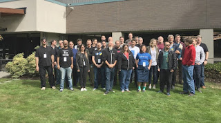
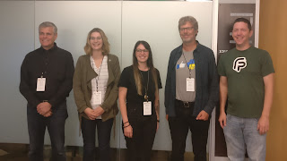

This September, twenty-nine core committers arrived at Microsoft’s main campus in Redmond, Washington, USA for the now-annual core developer sprints. These are an opportunity for the core team to have focused discussions, in-depth conversations and work free from interruption for five days. By the end of the week, thirty-one core developers went home tired but satisfied.  
  
The major sponsor of the sprints this year was the Python Software Foundation. Microsoft provided the venue and some events during the week, and Facebook, Microsoft, Google, LinkedIn, Bloomberg, and a number of small companies covered their employees’ expenses.

### Major Achievements

With over thirty people working for a week, there were many achievements and improvements made for Python 3.8 and earlier versions. Some of the highlights include:

-   The asyncio documentation was completely rewritten
-   Most of PEP 572 (assignment expressions) was implemented and tested
-   Recursive tracebacks and syntax errors in f-strings were improved to provide better feedback
-   The Automerge bot was enabled on the CPython GitHub repository, helping reduce the amount of manual work done by core committers
-   importlib\_metadata was improved, helping to standardize the way Python exposes information about installed packages
-   The zipimport module was rewritten in Python code, which will enable new development and improvements for importing modules directly from ZIP files
-   Over 45 contributions (besides our own) were reviewed and merged, and over 80 issues were closed in the CPython repository, with many others in related projects such as Buildbot, Roundup, blurb, and our GitHub bots

### Governance Discussions

With our BDFL of Python retiring earlier this year, we spent some time discussing how to approach the future of Python. More than any specific outcomes, the discussions were very fruitful and helped many of us see how similar our positions are to each other. While no decisions have been made, all current proposals intend to keep the PEP process, and limit the new leaders’ responsibilities to arbitrating controversial decisions. Final proposals are due by the end of September. See [PEP 8000](https://www.python.org/dev/peps/pep-8000/) for an overview of the process and links to related PEPs.

### New Core Developers

Those who read the first paragraph carefully will have noticed that more committers left the sprints than arrived. This happened because we appointed two new core developers during the week. Congratulations to Emily Morehouse and Lisa Roach!  
 From Raymond Hettinger’s [announcement post](https://mail.python.org/pipermail/python-committers/2018-September/006059.html):  

> Emily is the Director of Engineering at Cuttlesoft. She has previously attended two Language Summits and three core development sprints at PyCon. Since July, Emily has worked with Guido's guidance to implement PEP 572, Assignment Expressions. She has also worked with Eric Snow to dive into CPython's runtime as well as subinterpreters. This year at PyCon she gave a talk on Python's AST.  
> Lisa has a background in network engineering and supported the Cisco sale engineer team to develop high quality Python product demonstrations. Later she moved to the Facebook security team. This is her third core developer sprint. She and Guido are co-authors of PEP 526, Syntax for Variable Annotations. Last year, she worked with Eric Smith on PEP 557, Data Classes.

### Other Blogs

Other attendees have posted their own blogs describing their experiences at the sprints. (This list may be updated over time as more are published.)

-   Mariatta Wijaya: [Part 1](https://mariatta.ca/core-sprint-2018-part-1.html), [Part 2](https://mariatta.ca/core-sprint-2018-part-2.html)
-   [Neil Schemanauer](http://python.ca/nas/python/core_sprints/2018.html)

  

### Thank you!

A huge thanks to all the participants who attended, the various companies who sponsored parts of the event, and the PSF for covering the majority of travel expenses. Thanks also to those contributors who were unable to make it this year. Hopefully next year we can include even more core contributors. Attendees: Brett Cannon, Kushal Das, Ned Deily, Steve Dower, Ethan Furman, Larry Hastings, Christian Heimes, Raymond Hettinger, Łukasz Langa, Ezio Melotti, Emily Morehouse, Benjamin Peterson, Davin Potts, Lisa Roach, Pablo Galindo Salgado, Neil Schemenauer, Yury Selivanov, Eric V. Smith, Gregory P. Smith, Nathaniel Smith, Eric Snow, Victor Stinner, Andrew Svetlov, Guido van Rossum, Dino Viehland, Petr Viktorin, Zachary Ware, Barry Warsaw, Mariatta Wijaya, Carol Willing Written by: Steve Dower
