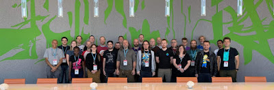
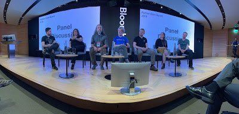
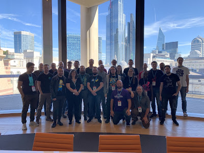

During the week of September 9th to September 13th, 34 core CPython committers gathered together in the Bloomberg London headquarters for the 2019 Python core developer sprint. The core developer sprint is an annual week-long meeting in which the CPython core team has the opportunity to meet each other in person in order to work together free from distractions. Having this many core developers in the same room allows us to work efficiently on several aspects of the Python language and CPython (the default implementation). This can include topics such as future designs and in-process PEPs (Python Enhancement Proposals), prototyping exciting changes that we may see in the future, various core development processes such as issue triaging and pull request reviewing, and much more! This is a very exhausting week for everyone, but also a very productive one, as these meetings are known for generating a much-needed boost in core development, especially close to new releases.

<table align="center" cellpadding="0" cellspacing="0"><tbody><tr><td></td></tr><tr><td>CPython Core Developers in attendance at 2019 Sprint</td></tr></tbody></table>

This year’s core developer sprint was funded thanks to the [Python Software Foundation](https://www.python.org/psf/) (PSF) and the donation of PyLondinium 2019 ticket proceeds, which were gathered specifically to support this event. This helped the PSF cover the cost of travel and accommodation for all core developers attending. Additionally, some companies covered their employees’ expenses, such as Microsoft, Facebook, Google and Red Hat. Bloomberg provided the venue, infrastructure and catering, as well as some events that happened during the week.

### **Major Achievements**

One of the main advantages of having the core developers together in the same room is how much smoother the iteration and design process is. For example, major achievements were made around the release of Python 3.8 (and older versions) in terms of stability and documentation and many exciting things were prepared for future releases. Some highlights include:  

-   More than 120 pull requests were merged in the CPython repository. We had a friendly competition in which attending core developers were ranked based on the number of pull requests merged (only those pull requests created by others were considered). In the end, the winners received a poster with all of the attendees’ names created specifically for the sprint.
-   Discussions around PEP 602: Python 3.9 release schedule, including gathering user feedback about several aspects of the PEP.
-   Work on improving the bugs.python.org interface and feature set, including updating the infrastructure to the latest roundup version and reworking the CSS to give a friendlier face to the site.
-   API design and discussion around PEP 416 -- Add a frozendict built-in type.
-   Draft design on a future PEP to implement an exception hierarchy to support TaskGroups and cancel scopes.
-   Work towards multiple interpreters: major efforts are needed before we have one GIL per interpreter. This included starting to refactor the existing global state into per-interpreter structures and developing tests that avoid new global state bleeding.
-   Work on a PEG-based parser prototype to substitute the current parser in order to improve maintenance and allow dropping the LL(1) restriction in the future.
-   Several pull requests to squash some complex bugs in multiprocessing.
-   Work on a possible implementation to introduce a Control Flow Graph (CFG) optimizer in CPython.
-   Work on the CI process. AppVeyor was dropped and replaced with Azure Pipelines.
-   Major improvements in the unittest.mock module, such as perfecting the new AsyncMock and related documentation, work on a prototype to add a WaitableMock class that can be joined (for threaded scenarios), as well as bug squashing around the module.

  
As you can imagine, with this level of activity, the buildbots were at maximum capacity and many issues were found and fixed both during and after the sprint.

### Friday Event

As part of the core dev sprint, an event was organized with the help of Bloomberg in order to let the community know about the work done during the core developer sprint, why these events are important, and the impact they have on the future of the language. The event consisted of 4 lightning talks about some of the things worked on during the sprint:

<table align="center" cellpadding="0" cellspacing="0"><tbody><tr><td></td></tr><tr><td>Moderated panel discussion at the CPython Core Developer Sprint Friday Event</td></tr></tbody></table>

  

-   Work in AsyncMock - **Lisa Roach**
-   Removing dead batteries in the standard library - **Christian Heimes**
-   Sub-Interpreters support in the standard library - **Eric Snow and Joannah Nanjekye**
-   Improving bugs.python.org - **Ezio Melotti**

  
There was also a moderated Q&A session about the core development sprint and, more generally, Python’s future direction. We hope that events like this will help communicate more transparently what the core developers do at the sprints and how much impact these events have on maintenance, processes, and the language itself.

### Mentorees

As part of the ongoing effort to improve mentoring and growing the core dev team, two mentees who have been contributing for a long period of time and have previously been awarded triaging privileges were invited to the sprint. Joannah Nanjekye was being mentored by Eric Snow, while Karthikeyan Singaravelan was being mentored by Yury Selivanov (and remotely by Andrew Svetlov). Mentoring is a very important part of core development, as it helps to grow the core dev team and allows us to have more impact and scalability in the different areas that are the responsibilities of the core dev team. As a result of this mentoring process, Joannah Nanjekye [was been promoted to a core developer](https://discuss.python.org/t/vote-to-promote-joannah-nanjekye-as-a-core-dev/2347) a few weeks after the core dev sprint!

### Other Blogs

Some of the other attendees have posted their own blogs describing their experiences at the sprints (this list may be updated over time as additional updates are published by other core devs).  

-   [PEG at the Core Developer Sprint](https://medium.com/@gvanrossum_83706/peg-at-the-core-developer-sprint-8b23677b91e6)
-   [CPython Core Developer Sprint and Outreachy at Tapia: What I did !!](https://medium.com/@Captain_Joannah/cpython-core-developer-sprint-and-outreachy-at-tapia-what-i-did-dddeca446d05)

  

### Thank you!

A huge thanks to all the participants who attended, the various companies who sponsored parts of the event, and the [PSF](https://www.python.org/psf/) for covering the majority of travel expenses. We also thank those core developers who could not attend this year.

<table align="center" cellpadding="0" cellspacing="0"><tbody><tr><td></td></tr><tr><td><table align="center" cellpadding="0" cellspacing="0"><tbody><tr><td>CPython Core Developers in attendance at 2019 Sprint</td></tr></tbody></table></td></tr></tbody></table>

  
Attendees: Christian Heimes, Ezio Melotti, Ned Deily, Benjamin Peterson, Mark Shannon, Michael Foord, Joannah Nanjekye, Karthikeyan Singaravelan, Emily Morehouse, Jason R. Coombs, Julien Palard, Stéphane Wirtel, Zachary Ware, Petr Viktorin, Łukasz Langa, Davin Potts, Yury Selivanov, Steve Holden, Stefan Behnel, Larry Hastings, Guido van Rossum, Carol Willing, Gregory P. Smith, Thomas Wouters, Dino Viehland, Mark Dickinson, Vinay Sajip, Paul Ganssle, Steve Dower, Lisa Roach, Eric Snow, Brett Cannon, Pablo Galindo Written by: Pablo Galindo
