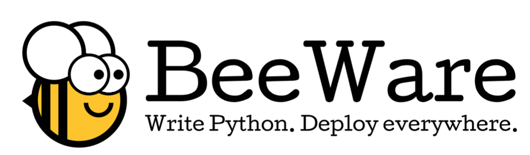

  
"We've got very big news on Android," Russell Keith-Magee told the Language Summit. "We're close to having a full set of BeeWare tools that can run on Android." The BeeWare project aims to let programmers write apps in Python for Android, iOS, and other platforms using native UI widgets. Keith-Magee reported that BeeWare has made good progress since [his Summit presentation](https://pyfound.blogspot.com/2019/05/russell-keith-magee-python-on-other.html) last year. On iOS, "Python worked well before, it works well now," and BeeWare has added Python 3.8 support. Until recently, however, Python was struggling to make inroads on Android. BeeWare's Android strategy was to compile Python to Java bytecode, but Android devices are now fast enough, and the Android kernel permissive enough, to run CPython itself. [With funding from the PSF](https://beeware.org/news/buzz/beeware-project-awarded-a-psf-education-grant/), BeeWare hired Asheesh Laroia to port CPython to Android. [Read more 2020 Python Language Summit coverage](http://pyfound.blogspot.com/2020/04/the-2020-python-language-summit.html).  

* * *

A top concern for BeeWare is distribution size. Python applications for mobile each bundle their own copy of the Python runtime, so Python must be shrunk as small as possible. There have been proposals recently for a "minimum viable Python" or "[kernel Python](https://glyph.twistedmatrix.com/2019/06/kernel-python.html)", which would ship without the standard library and let developers install the stdlib modules they need from PyPI. ([Amber Brown's 2019 Summit talk](http://pyfound.blogspot.com/2019/05/amber-brown-batteries-included-but.html) inspired some of these proposals.) Keith-Magee said a kernel Python would solve many problems for mobile. He also asked for a cross-compiling `pip` that installs packages for a target platform, instead of the platform it's running on. Senthil Kumaran observed, "BeeWare, MicroPython, Embedded Python, Kivy all seem to have a need for a kernel-only Python," and suggested they combine forces to create one.  To regular Python programmers, the mobile environment is an alien planet. There are no subprocesses; sockets, pipes and signals all behave differently than on regular Unix; and many syscalls are prohibited. TLS certificate handling on Android is particularly quirky. For the CPython test suite to pass on mobile it must skip the numerous tests that use `fork` or `spawn`, or use signals, or any other APIs that are different or absent. Adapting CPython for life on this alien planet requires changes throughout the code base. In 2015 Keith-Magee submitted a "monster patch" [enabling iOS support for CPython](https://bugs.python.org/issue23670), but the patch has languished in the years since. Now, he [maintains a fork](https://github.com/freakboy3742/cpython) with the iOS patches applied to branches for Python 3.5 through 3.8. For Android, he maintains a handful of patch files and a list of unittests to skip. Now that Android support is maturing, he said, "We're in a place where we can have a serious conversation about how we get these changes merged into CPython itself." A prerequisite for merging these changes is mobile platform testing in [CPython's continuous integration system](https://www.python.org/dev/buildbot/). Currently, Keith-Magee tests on his laptop with several phones connected to it. As he told the Summit, he's certain there is a CI service with physical phones, but he has not found it yet and hasn't invested in building one. He develops BeeWare in his spare time, and CI is not the top priority. "Funding is one thing that makes stuff happen," he said. He thanked the PSF for the grant that made Android support possible. Mobile Python suffers a chicken-and-egg problem: there is no corporate funding for Python on mobile because Python doesn't support mobile, so there is no one relying on mobile Python who is motivated to fund it. Keith-Magee asked the Summit attendees to be frank with him about bringing mobile Python into the core. He asked, "Do we want this at all?" If so, the core team would have to review *all* patches with their mobile impact in mind, as well as reviewing mobile-specific patches. "What is the appetite for patches that require non-mobile developers to care about mobile issues?" The decision would involve the whole core team and many community discussions. Guido van Rossum endorsed good mobile support long-term. So did Ned Deily, adding, "To actually do it will require money and people. Bigger than many other projects."
