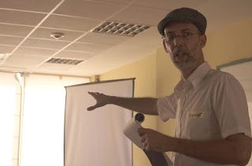
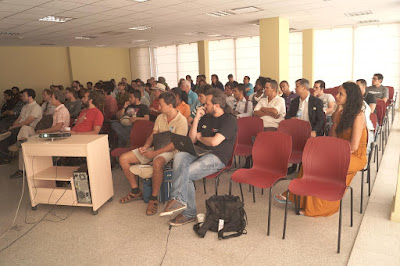
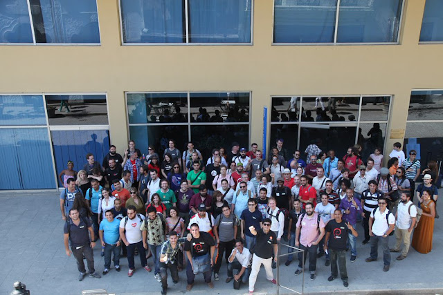

*This is the second in a series of posts on my trip in April to Havana, Cuba to attend [CubaConf](http://www.cubaconf.org/), an International Conference on Free Software.* Day one of [CubaConf](http://www.cubaconf.org/) started out with a bit of confusion. A last minute change of venue was necessary due to some bureaucratic red tape surrounding the government controlled [Palacio del Segundo Cabo](http://www.cubaheritage.org/articles.asp?lID=1&artID=306). Luckily, a short walk across the Plaza de Armas, [the Colegia San Geronimo](http://www.ohch.cu/instituciones/colegio-san-geronimo/) was available and happy to step in to provide meeting rooms for the approximately 180 speakers and attendees. And in spite of the spotty internet service that plagues the island, difficulties in communicating the change did not prevent the conference from starting smoothly and nearly on schedule. The organizers, including [Pablo Mestre](https://twitter.com/elmor3no_), a member of the PSF-Cuba workgroup, deserve much credit for their smooth handling of the situation. Preliminary announcements and welcoming remarks revealed that speakers and attendees came from 17 different countries: Argentina, Bolivia, Brazil, Canada, Columbia, Costa Rica, Cuba, France, Germany, Italy, Mexico, Peru, Spain, Turkey, Uruguay, United States, and Venezuela. [Sponsors](http://www.cubaconf.org/2016/03/11/mapbox-is-sponsoring/), including the PSF, were mentioned and thanked. The keynote by [Hamlet López García](http://temas.cult.cu/autor/84/hamlet-l%C3%B3pez-garc%C3%ADa), a social psychologist from the Cuban Institute of Cultural Research at Juan Marinello, explored the relationship between free software and Cuba’s politics and culture.

<table align="center" cellpadding="0" cellspacing="0"><tbody><tr><td></td></tr><tr><td>Hamlet López García</td></tr></tbody></table>

López' main thesis, (citing Richard Stallman), was that technologies develop as social processes and are shaped by cultural values. In this way, the general principles of the Cuban revolution can be seen to be in harmony with those of free software. The further adoption and use of free software, according to López, is leading to more democratic access to knowledge and opportunity, not just in Cuba, but globally. This opening talk was enthusiastically received and set a positive tone for the rest of the day. Once the conference broke into three tracks, I attended a talk by [Jacob Appelbaum](https://en.wikipedia.org/wiki/Jacob_Appelbaumof) on the [TOR network](https://www.torproject.org/) and the importance of anonymity. Appelbaum explained the ways in which the TOR network was designed to ensure four types of freedom: it's decentralized, encrypted, distributed, and unlike other internet networks, meta-data free (i.e., it does not collect or aggregate meta-data).   
Additional talks occurring on day one shared speakers' experiences using open source for projects such as collaborative mapping and creating an online payment system, as well as more theoretical topics such as web development and encryption. Former PSF Director, David Mertz, gave a talk on teaching Python to Data Scientists, a topic that he will reprise in Portland at PyCon's education summit at the end of this month. Talks were given in either English or Spanish, with simultaneous translation provided by one of several bilingual volunteers. Another talk worth singling out was a provocative talk by [Heather Marsh](https://en.wikipedia.org/wiki/Heather_Marsh) on the illusory nature of the power that users assume to derive from the internet. According to Marsh, such internet features as "thought bubbles" and "noise" pose obstacles to collaboration and to challenging the "Ponzi schemes of power." These ideas are more fully presented in Marsh's book, [Binding Chaos](http://www.amazon.com/Binding-Chaos-collaboration-global-scale/dp/1489527680). At the end of the day, a tired, but excited crowd posed for a group photo before walking down the block to the conference dinner of Cuban food, mojitos, and beer. (And by the way, beer costs about $1 per can/bottle--I almost didn't come home.)

<table align="center" cellpadding="0" cellspacing="0"><tbody><tr><td></td></tr><tr><td>CubaConf end of Day 1 Outside the Colegia San Geronimo</td></tr></tbody></table>

*I would love to hear from readers. Please send feedback, comments, or blog ideas to me at [msushi@gnosis.cx](mailto:msushi@gnosis.cx).*
