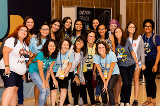
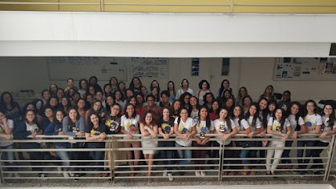
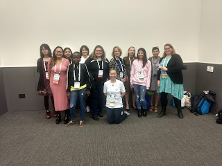
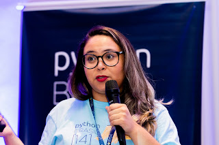

PyLadies Brazil co-founder, Débora Azevedo can encapsulate her feelings about the Python community in one word: Belonging.

Growing up in Natal, Brazil, Débora never would’ve guessed that Python would come to play such an important role in her life. “When I was first learning about programming in high school, I found it really difficult to comprehend. At that time I wrote code in a notebook, because I didn’t own a computer.”

  

Débora stumbled upon her love for programming accidentally when she was studying to be an English teacher. “I decided to pursue a computer networking course because I knew I didn’t want to code. There were four terms in the course and during the fourth term I had to learn programming,” she said. “I was convinced it just wouldn’t work for me. But when I started to learn Python, I suddenly had this empowered feeling that I could really build something.”

  

That feeling of empowerment was something that Débora felt compelled to share with others. In 2013, Débora organized the first meeting of PyLadies Brazil. “Through PyLadies, I got to meet with these amazing, smart women who helped me believe in myself. One day they encouraged me to give a talk about my experience with Python, even though I didn’t feel qualified,” Débora recalled. “From the moment I got involved with PyLadies, they always made me feel like I could do something great. Having that sense of self-worth is so important and it inspired me to help others.

  

  

  

For the past seven years, Débora has worked tirelessly to build a strong Python community in Brazil. What began as a small group of local women empowering each other through code, has grown into the largest PyLadies network in the world, with more than 30 PyLadies Brazil chapters nationwide. Débora was also the first chair of the PyLadies Brazil Conference and has since organized and spoken at countless Python Brazil conferences and events, over the past decade.

  

  

  

  

In 2019, Débora attended PyCon US for the first time. “I was able to go to PyCon because of a PyLadies grant from the Python Software Foundation. It was my first time traveling to the U.S. and it was the biggest conference I’d ever been to,” Débora remembered. “Being able to attend PyCon US and network with others in the Python community was incredible. I remember that I hosted an open space to talk about PyLadies and I got to meet people from all over the world. I never would’ve had that opportunity if it weren’t for the PSF.”

  

  

  

Today, Débora is working on her Master’s degree in Innovation in Education Technologies and is developing educational software to help people learn more efficiently. Her experience with PyLadies sparked her interest in pursuing this new path. “Learning the Python language challenged me to think about how people learn and inspired me to help others learn to code,” Débora stated. “Being part of the Python community allowed me to have a positive impact on the lives of others.”

  

When asked why she thought supporting the Python Software Foundation was important, her answer was simple, “The grants and PyCon scholarships provided by the PSF have a huge impact on thousands of people globally. I feel like I belong to the Python community and I want to see it grow.”

  

  

  

If you donate $99 or more before June 12, 2021, you will receive an exclusive Python T-shirt, not sold in stores (shipping starts at the end of June). Please note that the PSF cannot ship shirts to OFAC sanctioned countries: https://home.treasury.gov/policy-issues/financial-sanctions/sanctions-programs-and-country-information. We apologize for this inconvenience.

Blog written by Morgan Mayo, PSF's Director of Resource Development
