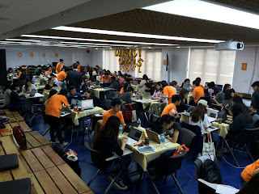
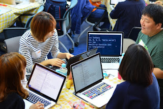
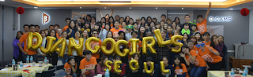
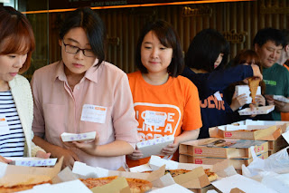

One of the greatest joys of being part of the PSF is to hear the success stories our members. Back in July, the PSF sponsored a small Django Girls workshop in Seoul, South Korea with a modest grant of $2000 USD. We’ve recently received a letter from one the organizers, Rachell Calhoun, and I’d like to share it here:

> Hello, I’ll just start by saying I knew nothing of programming or anything tech two years ago. I got inspired by a failed interview to start learning programming and I found some awesome like-minded people that were studying Python. We did so many Python MOOCs, tutorials, Raspberry Pi and even Pygame! This year we started working on web development and along came Django. The core members from this study group (codeforeveryone.co) were inspired by Django Girls to make an event in Seoul. We worked hard to make the event accessible to everyone, translating everything into both English and Korean. At first we thought it would be a small, simple event of 30 participants, but after the first day we had more than 30 applicants, so we decided to expand it to 70 participants, 26 coaches and five organizers. We tried our best to make it a casual, fun, and motivating experience for all involved. During the three months leading up to the event, we worked hard at getting sponsors. Because of the PSF sponsorship, we were able to make it a wonderful introductory experience to Python for all the participants as well as some coaches! We had 425 applicants from 11 different countries, ages ranging from 16 to 50 years old. We chose 70 of the best applications. Some of the participants in the event were able to complete their web blog applications, and some even went on to do the extended Django Girls' tutorials. We hope to harness the momentum from Django Girls Seoul participants and coaches to help create a more permanent community where we can all continue to study and teach Python and Django. We’ve started planning a follow-up event in three weeks. Our original group of organizers' philosophy is to learn by doing and master by teaching. So we’d like to continue learning and teaching together, inspiring and connecting like-minded people to create a supportive, welcoming community for all. Thank you again from everyone that participated in our event. Rachell Calhoun, Django Girls Seoul Organizer   
>   
>   
>   
> 
> <table align="center" cellpadding="0" cellspacing="0"><tbody><tr><td></td></tr><tr><td>Photos courtesy of Rachell Calhoun</td></tr></tbody></table>

  
Since this initial workshop, Rachell and the organizers have made true on their promise to keep going in building their community. They’ve recently held their follow-up event, during which about 35 women, along with 10 new coaches, worked on an extended Django Girls' tutorial. All five original organizers also participated: In addition to Rachell, these are Hassan Abid, a phone app developer, Jin Park, a full-stack developer, Sujin Lee, who works in online education, and Dayoung Park an administrative coordinator. According to Rachell, one of the great features of such a community is that the experienced coaches and organizers also learn from teaching and from each other. She believes that her own background as an EFL teacher, along with her perspective as a novice Python programmer, contribute to making these teaching events successful. Additional events planned for the future include a Django Girls Code Camp taking place every Saturday for two months, and offered free of charge to participants. The intention is to leverage the skill learned in the two months and then apply it to non-profit projects that will benefit the local community and offer the coders more real world experience. To help us learn more about these and other events planned by this group, Rachell kindly sent along the following links: [http://codeforeveryoneseoul.github.io/dgseoul-2015-review/#/](http://codeforeveryoneseoul.github.io/dgseoul-2015-review/#/) [http://www.rachellcalhoun.com/blog/](http://www.rachellcalhoun.com/blog/) I hope you’ll all join me in sending our sincere congratulations and thanks to Rachell, her team of organizers, and all the participants on a wonderful project that is enlarging and enhancing the Python community! *I would love to hear from readers. Please send feedback, comments, or blog ideas to me at [msushi@gnosis.cx](mailto:msushi@gnosis.cx).*
