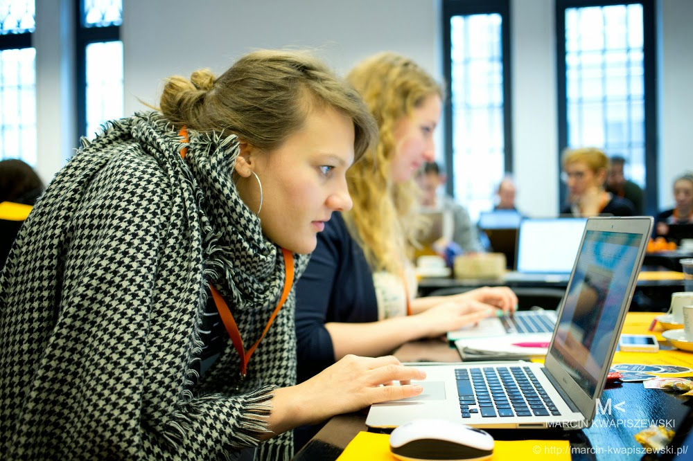
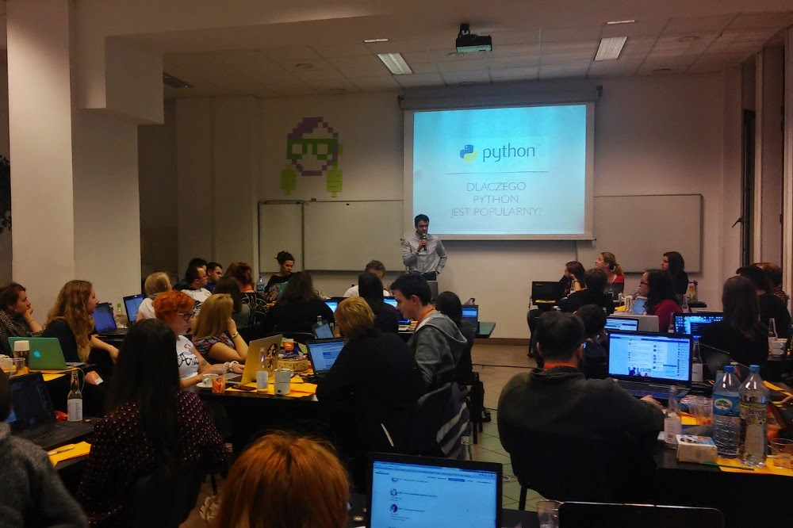

For many people, myself included, it's hard to see the way that my individual dreams and desires may be part of a bigger movement, and may, in fact, contribute to the projects and concerns of a larger community. But if you're part of the Python community, indeed you are part of something big, something special, and something that will support your efforts to use Python, as well as to educate and empower others to learn programming and to join the open source movement. One example of the way in which the PSF supports its members is in giving grants to fund workshops and events like one held in Warsaw in January. The PSF contributed $1,000 USD to the *Geek Girls Carrots Warsaw* workshop. Not a huge amount, but enough to make a big impact. According to Zuzanna Podwińska, the organizer of the event, *“With your help, we’ve managed to invite 42 students and 14 mentors, who during 2,5 days wrote on average 286 lines of code each, ate 20 kg of carrots, and drank 85 liters of coffee and tea :) Thanks to your support, we were able to provide them with warm meals and drinks during the two workshop days, and they were able to focus fully on the important part - learning Python programming.”* Zuzanna also sent some pics. **  
**  
**  
Their commitment to teaching Python extends even further. *“Since we believe that such events are just a good start of one’s programming adventure, we organize weekly free Python programming workshops called Code Carrots, which allow people to practice coding regularly. 50 awesome new attendees came to the last meeting! Watching them make progress is what really keeps us going :)”* If you're looking for inspiration to hold your own workshop or users group, there are plenty of models available and many people in the Python community to help. (See for example [http://django.carrots.pl/en/](http://django.carrots.pl/en/) for teaching materials, and go to [python.org](https://www.python.org/) to find out about funding.)
