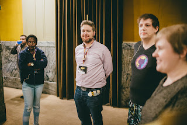

[Dr. Russell Keith-Magee](https://twitter.com/freakboy3742) known name in the Python community having developed with Python since the late 1990s starting with Python version 1.5. Russell started his career coding with Perl but was confused with it’s design philosophy of TMTOWTDI ("There’s More Than One Way To Do It”). This ultimately led Russell to Python. With its minimal use of symbols in it’s syntax - preferring keywords instead - and mandated indentation, Python was “a breath of fresh air”. Russell recalls, “I found myself wanting to use Python for more and more as time went by”. Contrasting Perl’s TMTOWTDI philosophy to Python’s “there should be one - and preferably only one - obvious way to do it” philosophy was a much welcomed change Russell was elated to discover Python’s broad range of use cases. As he describes, Python “is used for systems integration, to run websites, to statistical data analysis, to predict astronomical phenomena, it's used for educating people who are just learning to program, and it's used by experienced programmers for serious heavy lifting". Such breadth of usage gives Python its most incredible aspect -- a diverse user community. “We should always remember that we are a community. Communities depend on people being involved, and giving back when they can.”  

### Gallant Sir Russell, The Victorious Knight

  
Like Russell, we at the Python Software Foundation share the love for our Python community. We are delighted have such selfless and community minded Pythonistas in our ranks. Therefore the Python Software Foundation is honored to present the 4th Quarter Community Service Award for 2017 to Dr. Russell Keith-Magee:  

> *RESOLVED, that the Python Software Foundation award the Q4 2017 Community Service Award to Russell Keith-Magee for his contributions to Django, for his work on the BeeWare project, and for being an active international speaker at PyCons.*

### Russell’s adventures with [Django](https://www.djangoproject.com/)

  
Russell has been a core developer on the Django project since January 2006. Additionally, Russell has been a mentor in the Google Summer of Code for both the Django and BeeWare Projects since 2008. Russell became a professional Python programmer just when the concept of web frameworks was emerging. He explains, “coming from a desktop UI background, I didn’t understand the fundamental shift that web programming required, or how these frameworks mapped onto those requirements”. When Russell discovered Django, however, this technology just clicked. Within a short period of time he had conjured up a working website. “But more importantly, Django allowed me to understand why the web worked the way it does”. These were the early days of Django development and Russell rolled up the sleeves to start helping the nascent project. At first he, “dug into a couple of small issues, then some bigger ones - and before long, I’d been offered commit access.”

### [BeeWare](https://pybee.org/): The IDEs of Python

  
Russell is also the founder of the BeeWare Project - a project developing tools and libraries for cross-platform native user interfaces in Python. One of the key contributions of this work is expanding the availability of Python onto mobile and browser platforms. In his quest to build a rich, graphical debugger for Python, Russell found he needed a cross-platform, Python-enabled widget toolkit. It was then that he had a stroke of inspiration, “Why not have one code base but multiple apps?” The idea was to, “support Python natively on iOS and Android, and, at the same time, build a cross-platform UI toolkit that was Python-native.” Five years into the BeeWare Project, Russell, and his fellow BeeWare apiarists were focusing on getting the BeeWare tools to the point where they would be a viable option for user interface development. BeeWare is now a “spare time” project for Russell. He wishes to work on it full time and, so is looking for means ways of financial support. “It’s difficult to make a business case for something that is (a) Open Source, and (b) not yet ready for commercial usage.” In his words, “this highlights two existential threats for Python.” The first of these threats is the growth of mobile and browser development . This “will have a profound impact on the viability of Python as a language.” He rejects the claim that JavaScript is a better language , but admits it has a key advantage: “it’s available in the browser, the most important new platform of the last 20 years”. Russell recommends that “Python should focus more on finding ways to target these new and emerging platforms and plan for where our industry is moving”. The second threat to Python is the threat he sees to , the Python ecosystem - and the broader Open Source ecosystem. Open Source supports the existence of thousands of companies but the development and maintenance of the Python and other open source tools, critical to their existence, is massively\* underfunded. For instance, PyPI is a classic example of this second sort of problem: it has active commercial usage but limited support from commercial users. This threat will continue to exist in the “absence of ongoing source of funding”.

### Russell’s Advice for Beginner Pythonistas

  
Russell’s numerous contributions to the Python community reflect his core belief in service to the bigger project. For beginning Pythonistas, Russell advices to give back to the community. “As someone coming into the community, you may not think you have a lot to offer, but you do “. He thinks there are many “activities around the language like user groups, meetups and conferences, that need people to help organize.” These are as essential as coding, for the development of a language, language community. So no specific skill is required to jump in, so come one, come all.

<table align="center" cellpadding="0" cellspacing="0"><tbody><tr><td></td></tr><tr><td>Dr. Russell Keith-Magee, <a href="https://www.flickr.com/photos/140681500@N07/33997838552/in/album-72157679637516153/">DjangoCon 2017</a></td></tr></tbody></table>

  
These words are an inspiration to us all no matter if we’re beginners or experienced Pythonistas. In short, thank you Russell for your years of service and contributions to the Python community and for those yet to come.
