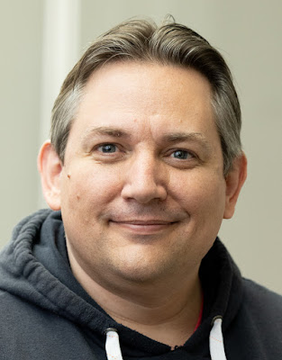

Thomas Wouters, a longtime member of the PSF Board, has been recognized with the PSF’s Distinguished Service Award. Over the last 25 years, Thomas has been a steady, welcoming presence in the Python community, serving in countless critical roles—often behind the scenes.

Thomas has served three separate terms on the PSF Board (2001–2004, 2017–2019, and 2020–2023), including his final year as Board Chair. He even stepped in as General Manager for six months, leading our staff during the search for a new Executive Director. On top of that, he served five years on the Steering Council, helping guide key technical decisions for Python itself, and is the Release Manager for both Python 3.12 and 3.13.

The PSF’s Distinguished Service Award ([DSA](https://www.python.org/community/awards/psf-distinguished-awards/)) is granted to individuals who make sustained exemplary contributions to the Python community. Each award is voted on by the PSF Board and they are looking for people whose impact has positively and significantly shaped the Python world. Thomas’ work with the Python community very much exemplifies the ethos of “build the community you want to see.”

  
After receiving the award Thomas shared, "I'm incredibly proud of what we, as a community, have created and continue to create in the PSF: a caring, diverse, inclusive and considerate environment, and a stable foundation for everyone everywhere in the Python community to thrive and prosper."

Whether it was keeping meetings running smoothly, handling critical admin tasks, stepping up wherever needed, or acting as a historian of the PSF and Python’s evolution, Thomas has done it all—and with unmatched dedication.

Curious about previous recipients of the DSA or wondering how to nominate someone? Check out the [PSF’s Distinguished Service Awards page](https://www.python.org/community/awards/psf-distinguished-awards/). The PSF also bestows Community Service Awards to recognize outstanding community members– if you’d like to learn more about CSAs and how they differ from DSAs, check out our [Service Awards given by the PSF: what are they and how they differ blog post](https://pyfound.blogspot.com/2024/09/service-awards-given-by-psf-what-are.html).
