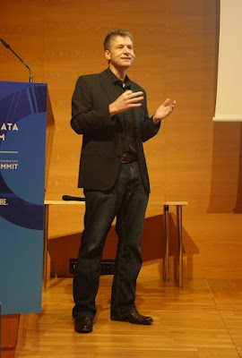

Van Lindberg, a longtime member of the PSF Board, has been recognized with the PSF’s Distinguished Service Award. Van was the co-chair and then Chair of PyCon from 2008-2012, served on the PSF Board for over a decade (2012–2023), including four years as Chair (2012–2016) and seven years as PSF General Counsel from 2016-2023. Throughout his time with us, Van was our go-to expert for all things legal, bringing invaluable insights from the broader open-source world to help the PSF grow and stay ahead of the curve. During his time on the board, Van was instrumental in establishing the PSF as a professional organization able to support the worldwide Python community.

The PSF’s Distinguished Service Award ([DSA](https://www.python.org/community/awards/psf-distinguished-awards/)) is granted to individuals who make sustained exemplary contributions to the Python community. Each award is voted on by the PSF Board and they are looking for people whose impact has positively and significantly shaped the Python world. Van’s work with the Python community very much exemplifies the ethos of “build the community you want to see.”

  
After receiving the award, Van shared, “I am deeply honored to receive the DSA. The kindness and support of this community are truly exceptional, and I am grateful for every moment I've been able to spend contributing alongside so many excellent people.”

From licensing and hiring to fundraising, Van was there every step of the way as the PSF experienced phenomenal growth. His deep understanding of open-source communities—paired with his legal expertise—helped the Foundation navigate challenges and embrace opportunities to better serve the global Python community.

Curious about previous recipients of the DSA or wondering how to nominate someone? Check out the [PSF’s Distinguished Service Awards page](https://www.python.org/community/awards/psf-distinguished-awards/). The PSF also bestows Community Service Awards to recognize outstanding community members– if you’d like to learn more about CSAs and how they differ from DSAs, check out our [Service Awards given by the PSF: what are they and how they differ blog post](https://pyfound.blogspot.com/2024/09/service-awards-given-by-psf-what-are.html).
