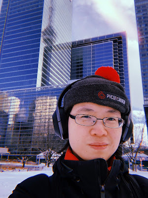

[Elaine Wong](https://twitter.com/elthenerd) organizer PyCon Canada, PyLadies Toronto and CSV Conference, has been awarded the Python Software Foundation 2020 Q3 Community Service Award.

> RESOLVED, that the Python Software Foundation award the 2020 Q3 Community Service Award to Elaine Wong for her community work. Elaine is an organizer for PyCon CA, PyLadies Toronto, and CSV Conference, a conference speaker, she co-hosts a monthly virtual Conference Organizer meetup, and Elaine helps with video at community events.

We interviewed Elaine to learn more about her inspiration and work with the Python community. We also asked several of Elaine's close associates -- including John Chodacki, Lorena Mesa, and Tom Meagher -- who have had the opportunity of working with Elaine within CSV conference, PyLadies and PyCAR - a yearly bootcamp for journalists learning Python.  

### Elaine Wong's Origin Story

  

Can you tell us about your origin story?

  

My dad showed me how to program his DOS computer when I was 5 years old and I was hooked on tech after that. The only downside was he tried to show me how to write a start-up script and I ended up overriding his and he couldn’t start his computer up anymore. So that put a pause in my programming career until I was older and could read English.

  

I’ve really been a tech nerd all my life, in high school I joined the computer science and robotics club and I always wanted to try the latest tech in my Radio and Television Arts classes when I was in undergrad.

I tried to code an iOS app when Apple released its iPhone SDK to some pretty hilariously bad results because I had no idea what I was doing.

  

What was your earliest involvement with the Python developers community?

  
After graduation, I started working in the newsroom as a journalist. After taking a Python class at NICAR, which is a conference for Computer Assisted Reporting, I wanted to continue learning how to use Python so I went to my local user group meet-up in hopes of finding support. It was pretty intimidating—there were probably 100 people there, mostly seasoned developers and I didn’t know how to say, as a beginner, “hey, anyone want to pair program? I have this code problem and I’m stuck”. A friend recommended going to PyLadies Toronto, so I started going to these meet-ups and met a great group of people who helped me along with my coding journey, answering my questions and offering to help me troubleshoot my Flask app. It was lovely to have a community willing to give up their free time to help me. In the end, it allowed me to level up my skills.

### Paying it Forward - the driving force behind community volunteering

  
What drives and inspires you into volunteering your time and resources into the Python Community - organizing PyCon CA, PyLadies Toronto, CSV Conference and all?  

Coming from a non-traditional coding industry like journalism, it was hard to find mentors and I am forever grateful to those folks I’ve met at Pyladies and PyCon Canada for taking the time to help me. I wanted to pay it forward, so I continued volunteering so that other people would get this opportunity too.

  

Interdisciplinary conferences such as csv,conf, were and still are a great excuse for folks from various countries and industries working on similar data problems to chat with each other. And, it is always so great to see new forms of collaboration happening among people who normally might not interact with one another.

  

Being able to help provide a platform to help facilitate these types of discussions has been rewarding.

  

I really want to echo what [Rami](https://pyfound.blogspot.com/2020/11/rami-chowdhury-awarded-psf-community.html) said about the Python community:

> Some of the most intelligent, empathetic, thoughtful and inspirational people I've met have been through the Python community.

I wholeheartedly agree with that statement, and it has been really inspiring to continue to learn and grow as part of the Python community because of its strong and positive spirit.  

How has your involvement within the Python community helped your career?

  

My involvement with the Python community has really helped build my confidence, and I have also learned a lot about the importance of teamwork.

Years of organizing conferences and meet-ups have helped me become less shy, more willing to ask for help and more understanding about how to lead a team, especially one made up of volunteers.

  

What are your thoughts about women's participation in the dev community and how can more women be encouraged to be active in the community?

  
I recently found this quote that really sums up my thoughts on women’s participation in the dev community, as Karen Sparck Jones, who was one of the pioneers in information retrieval (IR) and natural language processing (NLP) said,

> Computing is too important to be left to men.

  

As for encouraging more women to be active in the community, I think it’s important to support those women who are currently active to show that the community wants more women to be active and to thrive. It is the responsibility of everyone in the community to build an inclusive community that has everyone willing to listen to one another, respecting each other’s opinions and create a positive culture.

As [Débora Azevedo](https://pyfound.blogspot.com/2020/03/debora-azevedo-awarded-psf-community.html) said,

> Together with the PyLadies, the wider Python community can collaborate, working as partners with one goal in common. Having women become active participants and leaders in the Python community is important. It shouldn't be just one group's fight. By joining forces we can go a lot further. Being part of PyLadies Brazil and Django Girls Natal is the way I found to do my little good in the IT world. Teaching, advising and helping more women to believe in themselves and feel like it is possible for them and to feel like they can do it.

### Elaine Wong's Impact Story

Tom Meagher speaks on Elaine’s contribution to [PyCAR](https://github.com/ireapps/pycar) - a bootcamp focused on introducing data journalists who are comfortable with spreadsheets to the basic elements—and power—of programming, using Python.

> For the past several years, Elaine has been an integral part of the teaching team for PyCAR, a two-day workshop at the annual Investigative Reporters and Editors Computer Assisted Reporting Conferences.
> 
>   
> 
> Elaine has helped lead the first lessons in the curriculum, and her calm, self-effacing tone has helped scores of journalists, who tend to be a technophobic lot, recognize that programming is something they can do. She eases them over their initial fears and with gentle humor gets them started taking their first steps as programmers.
> 
>   
> 
> She is very effective at teaching, and by kicking off the lessons, she helps to create a space that is inclusive and welcoming for journalists from a wide array of backgrounds.
> 
>   
> 
> We've been lucky to have her as part of the effort, and she's been a great supporter of the mission of PyCAR, to help investigative journalists see that programming is something they're perfectly capable of learning and that it can revolutionize the way they do their jobs.

Lorena Mesa, Director and Chair, Python Software Foundation speaks on Elaine’s impact on PyLadies Toronto and the Python Community

> Elaine is a selfless person whose volunteerism is second to none. Always a joy to work with, Elaine has contributed her videography and broadcasting skills to help such Python conferences as PyCascades - a regional conference in the Cascades region - as well as several user groups events like the PuPPy's (Puget Sound Python Programming Group) [first annual gala featuring Guido Van Rossum](http://pyfound.blogspot.com/2019/03/puppy-presents-its-1st-annual-benefit_27.html).
> 
>   
> 
> Elaine was the chair of PyCon Canada in 2018 and co-chair in 2019. I have only heard the best things from anyone who works with Elaine. She has helped offer her technical expertise to several organizers this past year as everyone has moved their conferences online. As a frequent participant in the monthly Python conference organizer meetup, she is always keen to help.
> 
>   
> 
> For PyLadies, Elaine throughout 2019 and 2020 helped us build PyLadies Global.
> 
>   
> 
> PyLadies Global, started from a PyCon PyLadies "Future of Us" workshop in 2018, is the ongoing effort to build global PyLadies volunteer teams where PyLadies members can contribute to various efforts - such as our technical team and our community outreach teams - as you would an open source project.
> 
>   
> 
> These project teams all report to the newly formed PyLadies Global Council team, which Elaine was instrumental in helping us form. Hours of time spent managing our online presence such as our Slack and our repositories, as well as outreach and various other administrative tasks were instrumental in getting the word out about this effort.
> 
>   
> 
> Elaine took on the bulk of the administrative tasks, as an example she has helped build processes around how we approve new chapters. Much of the work of PyLadies Global is the type of work that many don't find "glorious", it is the small daily tasks which need to be done to help build a strong foundation for a community. Elaine has never shied from that work. It is an honor to consider her a colleague and friend.

John Chodacki on Elaine Wong impact on CSV conference

> Community-led events are hard to pull off. You need committed people who both own the success and be willing to put in the hard work. It takes passion for community and the cause to get it right. From the moment Elaine joined the organizing committee, she brought her passion. She put her heart and soul into CSVconf.
> 
>   
> 
> As a result, the entire organizing team and CSVconf community looks to her for support and for guidance. Everyone involved would agree: CSV conference is successful because of the service and leadership of Elaine Wong.
> 
>   
> 
> CSVconf is a global community of data makers and hackers. We have attendees and presenters from tons of different places and communities. It is great how Elaine has helped bridge our event with the Python community, in Canada and globally. If you have worked with her, you will know that Elaine’s approach to collaboration is inclusive and welcoming. She brings everyone to the table and that allows for no drama cross-pollination of ideas and approaches. It's been a privilege to learn from her approach: taking action and expanding the sense of community along the way.

  
We at the Python Software Foundation wish to once again congratulate and celebrate Elaine Wong for her amazing contributions to PyLadies and the wider Python community.
