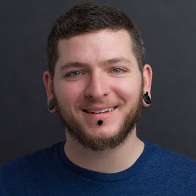

The day was October 23, 2015, Friday afternoon. The PSF and PyCon organizers were busy pulling together sponsors for the upcoming PyCon conference when suddenly, the ancient mail server 'albatross' suffered a hard disk crash. Email was down, grant requests would not go through, and PyCon planning was at a stand still. To make matters worse, most of the volunteers who had helped set up the initial mail server were away. Something had to be done, and fast. Ee Durbin, a volunteer systems admin, took the call. With no documentation on how to fix the existing mail server, they worked diligently through the weekend to rebuild it. Thanks to Ee's hard work and dedication, the PSF and PyCon US were able to resume operations before the following Monday.  

For their enthusiasm and years of volunteering, the Python Software Foundation awards the 4th Quarter 2016 Community Service Award to Ee Durbin:  

RESOLVED, that the Python Software Foundation award the 4th Quarter 2016 Community Service Award to Ernest W. Durbin III. Ernest has been a dedicated volunteer of the PSF for several years. Countless times he has triaged PSF infrastructure. Beyond that, Ernest has been a key person in creating structure for our infrastructure. Not only does that include internal infrastructure such as [mail.python.org](http://mail.python.org/), that also includes external infrastructure such as PyPI. Recently, Ernest has also accepted the position of PyCon 2017 US co-chair and PyCon 2018/19 conference chair.  

Durbin’s involvement in PSF began in 2012. They recalls, “A friend of mine submitted a proposal and we were selected for the task.” After a few months of doing paid work for the PSF, they realized that they would be more comfortable volunteering their time, and has been doing so ever since. “Ee has been a huge help with the growth of PSF's infrastructure,” says Ewa Jodlowska, Director of Operations at PSF. “\[They\] ensure that we are keeping best practices and that the knowledge of proper processes is passed on. I am grateful that they have been able to lend their expertise in such a way.”  

In addition to providing volunteer technical support for the PSF, Durbin has also become a Python community organizer. They will serve as co-chair of PyCon 2017 and has taken on the responsibilities of full conference chair for PyCon 2018 and 2019. They are also an organizer for their local Python meetup group.  

When asked about why Durbin chooses to promote Python and the PSF Durbin responded, “Python has been my language of choice for most of my career,” adding that they “have always appreciated the great breadth and depth of experience in the Python community as represented by the available packages on PyPI. It is such a testament to the community's collective knowledge and generosity when nine times out of ten you can find something that fulfills your need.”  

As for the email server incident, Durbin simply brushes off the stress explaining “it was a great way to meet new folks in the Python community and work with them towards a common goal.”

<table align="center" cellpadding="0" cellspacing="0"><tbody><tr><td></td></tr><tr><td>Ee Durbin, CSA Winner 2016 Q4</td></tr></tbody></table>

When not programming, you can find Durbin out in their garage working on his 1960’s era SAABs or hosting Taco Tuesdays for large groups of friends.

  

Note: Edited 2022-05-23 to reflect Ee's chosen name
