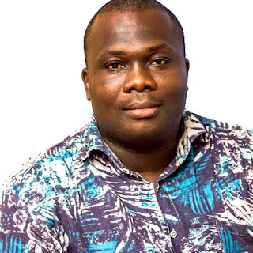

p.p1 {margin: 0.0px 0.0px 0.0px 0.0px; font: 12.0px 'Helvetica Neue'; color: #454545} p.p2 {margin: 0.0px 0.0px 0.0px 0.0px; font: 12.0px 'Helvetica Neue'; color: #454545; min-height: 14.0px} span.s1 {text-decoration: underline ; color: #e4af0a} span.Apple-tab-span {white-space:pre}  
Chukwudi, or Chux as he is often referred to in more familiar circles, is the president of [Python Nigeria](https://pycon.ng/) (@PythonNigeria) and has served as part of the PSF’s Grants Working Group for several years. Some of the work he has done with the grants working group involves dealing with very delicate situations, as grant requests need to be authenticated and require due diligence to properly understand the local context for preparing and awarding a grant. According to Nicholas H. Tollervey, a fellow Grants Working Group member, Chux regularly contacts, researches and (where possible) visits in-person many of the requesters so the Grants Work Group has the context needed to be able to make an informed decision. All of this detail oriented work requires a great deal of interpersonal skill and effort, which Chux exerts freely as a credit to our larger Python community. It is for this demonstrated passion and devotion to the Python community that in [July 2018](https://www.python.org/psf/records/board/minutes/2018-07-24/#id4) the Python Software Foundation unanimously voted to award Chukwudi Nwachukwu with a [Q2 2018 Community Award](https://www.python.org/community/awards/psf-awards/#id4): RESOLVED, that the Python Software Foundation award the Q3 2018 Community Service Award to Chukwudi Nwachukwu for all of the support he provides the PSF's Grants Work Group by researching regional grant requests and for all of his contributions to the Python Nigeria community. **Python in Nigeria** The Python community in Nigeria has grown exponentially in the last few years. Chux has done an incredible job of guiding this growth along with Aisha Bello, the Vice President of [Pycon Nigeria](https://www.python.org/events/python-events/733/) (@Pythonnigeria). PyCon Nigeria launched for the first time in August 2017, and was the fourth PyCon to have been hosted on the African continent. Aisha Bello share her thoughts on Chux winning the award, saying: *“I have known and worked with Chunks for over 2 years now and he is family. His passion for the python community as a whole and his significant contributions, continuous sacrifices and dedication has gone a long way in shaping the collective growth and successes we have had. He definitely deserved the award"* As a new Director for the PSF, I was able to attend the conference and witness first hand Chux’s thoughtful leadership and strong organizational skills. He attended the event with his wife and new baby, happily commenting how he wanted to make sure his family became plugged into the Python community as early as possible. He tried his best to navigate through the room, making sure that everyone present felt comfortable and informed.  Chux is an integral part of the Nigerian and global Python community. According to Tosin Damilare James Animashaun, a member of the local Python community in Lagos, Chux is one of the reasons he joined: “*Many, like myself, owe our entrance and involvement with the community to Chukwudi,* *who is very dedicated to advancing the cause of the community. This is aside \[from\]* *him being a great programmer, as I have worked with him well enough to know this. He is a great influence. I have no doubt that Chuk’s passion is definitely Python. In his words, "Python is something I code and breathe."* **PyCon Africa: The continued growth of Python in Africa** Chukwudi has done and continues to work tirelessly to forward the mission of the PSF by supporting its sustainable growth in Africa. He is also involved in planning the upcoming PyCon Africa, where he has offered to share his knowledge in regards to running a conference. He is well known in the region, interacting daily with African Pythonistas. He is consistently looking for ways to connect, support and grow the Python community and for that, he is truly deserving of this award. From all of us at the PSF we say a hearty thank you for all your hard work Chukwudi!
