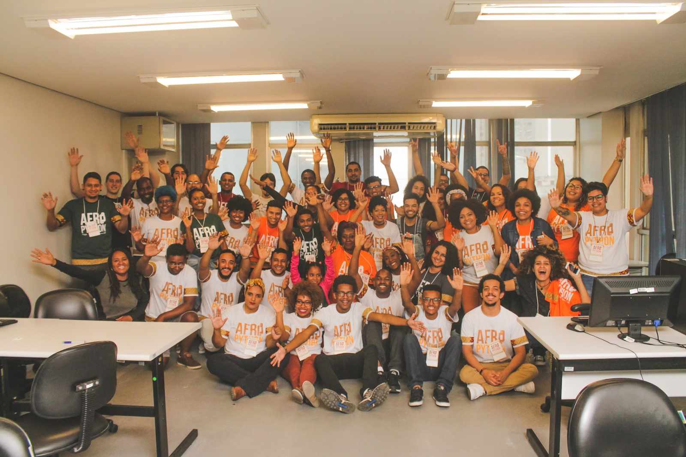
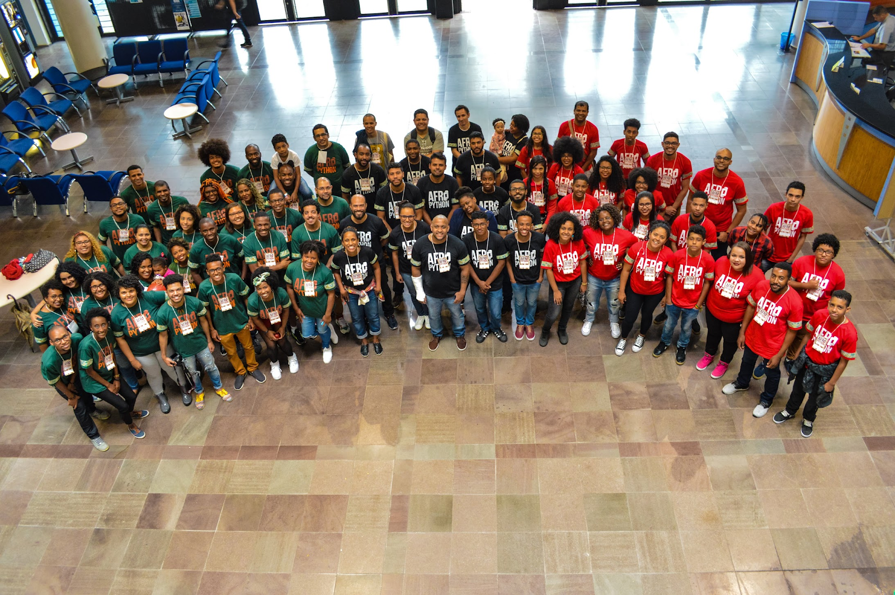
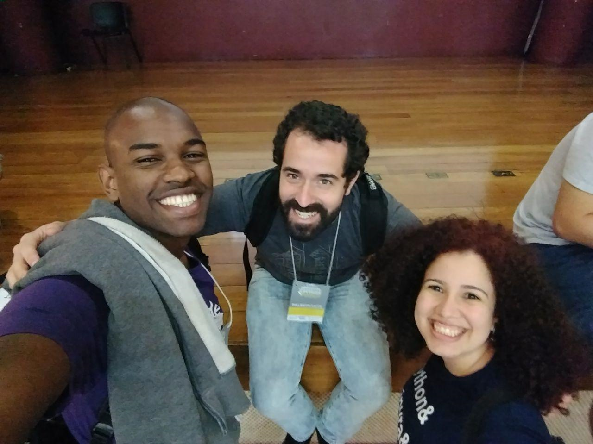

Pythonistas everywhere benefit when our community reflects the many backgrounds and experiences of Python’s users. However it can be challenging to participate in the community when there are no local user groups or harder yet if groups do exist but you do not feel represented in them. After learning that a friend was experiencing gender descrimination at work, [Felipe de Morais](https://twitter.com/felipedemorais_) of Porto Alegre, Brazil, decided to start [Django Girls Porto Alegre](https://djangogirls.org/portoalegre/). By starting this group, women like his friend who were facing similar challenges could have a community to call their own. Since Django Girls Porto Alegre took off in 2015, it has become one of the most active Django Girls groups in the world. Inspired by Django Girls and PyLadies, Felipe also started [AfroPython](https://afropython.org/), an initiative to empower Black people through technology. Additionally, Felipe contributes to [Operação Serenata de Amor](https://serenata.ai/), an open source project that monitors public spending by politicians. For this work the PSF is pleased to award Felipe de Morais with the Q2 2019 Community Service Award:

> **RESOLVED, that the Python Software Foundation award the Q2 2019 Community Service Award to Felipe de Morais for his work towards facilitating the growth of the Python Brazilian community by organizing workshops, contributing to open source code that benefits the Brazilian people and for setting an example for all community organizers.**

  
Felipe grew up in Rio De Janeiro where he earned a graduate degree in Computer Science and later moved to Porto Alegre in southern Brazil. With a strong desire to be part of a community, Felipe traveled to IT-related Meetup groups but longed for more accessible means to network and teach. Python was his go-to language for its simplicity and ease, and he loved to teach the language to help other people along in their careers. It is no surprise that the groups he’s started have both a Python and inclusivity focus. When asked about his motivation for starting Python groups, Felipe says that that he simply gets great joy out of helping people. “I've seen people starting their work life because the workshop unlocked this career path for them,'' he says. “The most important part of it is the relationships made along the way, which make a great support system for a lot of people making positive life changes.”

<table align="center" cellpadding="0" cellspacing="0"><tbody><tr><td></td></tr><tr><td><b>AfroPython 2017</b></td></tr></tbody></table>

[Renata D'Avila](https://twitter.com/rsip22), a Django Girls Porto Alegre organizer, met Felipe 2016 at a Hackerspace event and the two have kept in touch ever since. “He is one of the people behind one of the biggest Django Girls workshop ever organized.” she recalls, “Django Girls Porto Alegre 2017 had about 180 people involved, among participants, mentors, and organizers.” However the event, as most events do, encountered some bumps in the road. As lunchtime rolled around and the planned caterers never showed up, Felipe raced across campus and resolved the issue, returning to the event with enough food for everyone. “That was one of the greatest achievements of that huge workshop,” says Renata, “that everyone could eat and that the schedule for the workshop was kept without people even knowing about how much effort it took to make it work.”  

<table align="center" cellpadding="0" cellspacing="0"><tbody><tr><td></td></tr><tr><td><b>AfroPython 2018</b></td></tr></tbody></table>

[Amanda Vieira](https://twitter.com/amandasv__) met Felipe at Django Girls Porto Alegre and later worked with him to create AfroPython. She says of his work in these groups, “He has always helped both in the organization of events and as a coach, encouraging more and more women to get started in the area \[of tech\].” He has even developed a nickname, she quips “In his workplace and with friends, he is known as Felipython for all his involvement with language and the community.” In May of 2017 when Felipe was attending [Python Sudeste](https://2019.pythonsudeste.org/), a regional Python event in southeastern Brazil, he met [Jessica Temporal](https://twitter.com/jesstemporal). Jessica had been working as a data scientist on a large political open-source project, Operação Serenata de Amor. Serenata analyzes open data from the Brazilian government and flags expenses made by elected politicians that might be unlawful. Jessica was organizing a sprint at the conference and Felipe jumped in to help. In addition to working on some important refactoring and code readability issues, “Felipe was significant in making the project more friendly to newcomers,'' she says. He continues to contribute to the project today.

<table align="center" cellpadding="0" cellspacing="0"><tbody><tr><td></td></tr><tr><td><b>Felipe (left) with Seranata founder Eduardo Cuducos (middle) and Seranata data scientist Jessica Temporal (right)</b></td></tr></tbody></table>

Though Django Girls Porto Alegre and AfroPython have taken off, Felipe has no plans to slow down. In addition to continuing to work on open source projects, he is on the organizing team for the first ever [AfroPythonConf](http://afropythonconf.org/) later this year, and will be a keynote speaker at [Python Brazil 2019](https://2019.pythonbrasil.org.br/).

<table align="center" cellpadding="0" cellspacing="0"><tbody><tr><td></td></tr><tr><td><b>CSA Award Winner Felipe de Morais</b></td></tr></tbody></table>

In his free time, Felipe enjoys Brazilian Jiu Jitsu, playing video games that remind him of his childhood, watching anime, and helping friends with finances and investments.
