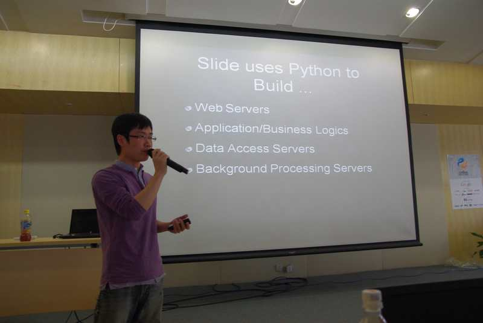

The first annual [PyCon China](http://cn.pycon.org/2011/) recently wrapped up an excellent event in Shanghai, with the December 3 and 4 conference serving over 450 attendees and just under 500 viewers of their live webcast. The new conference drew so much interest that over 100 people were put on a waiting list to get in.

The conference schedule included 25 topics with 13 of them being 45+ minute presentations. After a keynote speech by Sting Chen titled "Python Enriches the World", the conference went on to cover [Tornado](http://www.tornadoweb.org/), the [Xunlei](http://www.xunlei.com/) download manager, [OpenStack](http://openstack.org/), and others. They also included a lightning talk series with twelve 10-15 minute sessions. As with many other PyCons around the world, video of each talk is available [online](http://topgeek.org/?p=335).

After the conference, attendees reported about the event [here](http://blog.csdn.net/jasonblog/article/details/7040420) and [here](http://blog.csdn.net/cloudaice/article/details/7038101). Tech news sites [InfoQ](http://www.infoq.com/cn/news/2011/11/hadoop-pycon) and [ITEye](http://www.iteye.com/news/23077-PyCon2011China) also posted coverage of the conference.

The PSF applauds the PyCon China organizers and [their sponsors](http://cn.pycon.org/2011/sponsors) for making a great conference, and we hope to hear about PyCon China in 2012!
