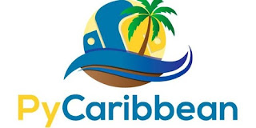
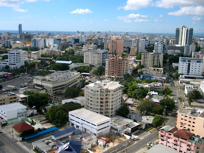

At the October 28th meeting of the Board of Directors of the PSF, the following resolution was passed:

> 

> "RESOLVED, that the Python Software Foundation sponsor PyCaribbean on February 20-21, 2016 in Santo Domingo, Dominican Republic, in the amount of $3000 USD."

This will be the first-ever PyCaribbean, and the PSF is proud to be a Platinum-level sponsor. The venue will be the headquarters of the Fundación Global Democracia y Desarrollo (FUNGLODE) located at Calle Capitán Eugenio de Marchena 26, Santo Domingo, Dominican Republic. According to organizer, Leonardo Jiminez, they are expecting approximately 300 - 350 people from all over the Americas and the Caribbean. This is a great size for a conference, allowing for both intimacy and breadth of content. As Leonardo puts it:

> "I think we have the spirit you can find in PyCon but in a more concentrated way and with better weather."

<table align="center" cellpadding="0" cellspacing="0"><tbody><tr><td></td></tr><tr><td>Better weather and gorgeous beaches! Photo Credit: CC License</td></tr></tbody></table>

Based on proposals received so far, it appears that the talks will be quite diverse. Along with such expected topics as strategies for improving data analysis, Leonardo particularly mentioned a talk about the adventures of someone teaching Python in Latin America in his car. Of course, that adventurer is none other than Manuel Kaufmann! Some of you may recall that last year the PSF funded his project, and it was featured in a couple of posts to this blog: [Python in Argentina](http://pyfound.blogspot.com/2015/03/manuel-kaufmann-and-python-in-argentina.html) and [Highly Contagious](http://pyfound.blogspot.com/2015/04/highly-contagious-python-spreads.html). And in addition to what is sure to be a fascinating talk by Manuel Kaufmann, there will also be a keynote by the PSF’s very own Brandon Rhodes, who is also the organizer of the upcoming PyCon 2016 in Portland. I asked Leonardo to tell us a little about his local Python community. Here’s what he said:

> <table cellpadding="0" cellspacing="0"><tbody><tr><td></td></tr><tr><td>Santa Domingo Photo Credit: CC License</td></tr></tbody></table>
>
> "The Python Dominicana Usergroup was the first usergroup formed in Santo Domingo and after that a lot of progress happened. We have more than three years meeting consistently every month. The experience has been really transformative for the city. We have done road trips, hackathons, and a lot of events to promote the language. . .\[This work\] is paying off with all the growth we see in Software Development locally."

And when I asked about his own interest in Python, he gave a great answer:

> "I fell in love with Python in High School while reading *How to Think Like a Computer Scientist* in Spanish. I really enjoy being part of this community, which I think is the killer feature of Python."

I have to agree that the community is our killer feature, so I’m hoping that some of you will be able to participate in PyCaribbean by giving a talk or by attending. You have until November 20th to [submit a proposal](http://proposals@pycaribbean.com/), so please give it some thought. Of course, if you don’t have a talk prepared, the organizers would still love to see you there. And could there be any better vacation than to visit the Dominican Republic in February? In fact, this conference looks so good to me that I may see you there myself! For further information, you can contact the organizers (at [leonardo@pycaribbean.com](mailto:leonardo@pycaribbean.com) or [vivian@pycaribbean.com](mailto:vivian@pycaribbean.com)). Also you can follow them on Twitter (at [https://twitter.com/pycaribbean](https://twitter.com/pycaribbean)). *I would love to hear from readers. Please send feedback, comments, or blog ideas to me at [msushi@gnosis.cx](mailto:msushi@gnosis.cx).*
