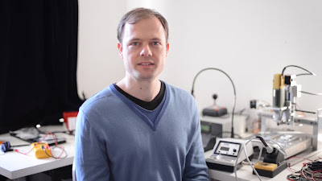
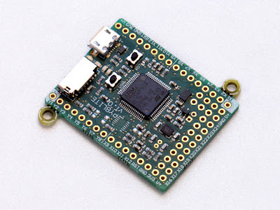
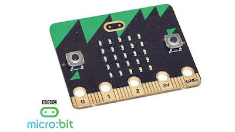

"We wouldn't have Python on the micro:bit if he hadn't made it work, to put it simply," Nicholas Tollervey says. He's talking about Damien George, the physicist and engineer behind [MicroPython](http://micropython.org/), the Python interpreter for microcontrollers. George began his project to build a Python interpreter for microcontrollers in 2013. "I started writing MicroPython to see if it's possible," he says. "Could I shrink Python down small enough to run on these tiny chips?" From scratch, he made a Python compiler so skinny it could squeeze into 128 kilobytes of RAM, and then wrote the runtime and built-in functions. "After about 6 months I realized it was possible, and I had a proof of concept."

<table align="center" cellpadding="0" cellspacing="0"><tbody><tr><td></td></tr><tr><td>Damien George, PSF Community Service Award recipient</td></tr></tbody></table>

Surprisingly, MicroPython is based not on the CPython code, but on the documentation. "I tried to look as little as possible at CPython's implementation," he says. "I'd say 95% of the Python language is specified in the docs, maybe even more." George launched the [MicroPython campaign on Kickstarter](https://www.kickstarter.com/projects/214379695/micro-python-python-for-microcontrollers/) at the end of 2013, and raised nearly £100,000. With the support of donors and the efforts of volunteers, he released MicroPython along with a small computer, the [PyBoard](https://micropython.org/store/), which packs a processor, RAM, LEDs, and an accelerometer into a package less than two inches square.

<table align="center" cellpadding="0" cellspacing="0"><tbody><tr><td></td></tr><tr><td>The MicroPython PyBoard</td></tr></tbody></table>

The BBC, meanwhile, wanted to port Python to its own little computer, the [micro:bit](https://www.microbit.co.uk/). They partnered with the Python Software Foundation and worked with Tollervey, a PSF fellow, to obtain a Python interpreter for their secret project. That effort fell through in April 2015, leaving Tollervey anxious that Python would be left out of the micro:bit launch. Young coders can program the micro:bit with another tool, Microsoft's TouchDevelop, but Tollervey says that Python on the micro:bit provides a special opportunity: "The important thing about Python is continuity. Kids can pick up Python because it's easy to learn, and it's also the same language you use at the workplace. These are skills they can use in the future." By chance, in [a discussion over tea with an engineer from ARM](http://ntoll.org/article/story-micropython-on-microbit), Tollervey realized MicroPython might work on the micro:bit. He sent a prototype of the board to George with a note stuck to it: "I want this back, Damien," and a smiley face. Within a week of getting the prototype, George had MicroPython running on it. Tollervey says, "When we had that I knew we were on to a goer." He did eventually get his board back. The Python Software Foundation [awarded Damien George a Community Service Award in 2016](https://www.python.org/community/awards/psf-awards/#march-2016). In addition to his extensive volunteer work on the BBC micro:bit and MicroPython, George spent time answering questions, helping users, and reviewing code from the wider MicroPython and micro:bit communities. Tollervey adds, "He's a very good mentor, and just a genuinely nice chap." Now that the micro:bit is launched, MicroPython is gaining a far wider audience. Last Tuesday [the BBC began delivering micro:bits to a million school children](http://www.bbc.com/news/technology-31834927). George says, "It's a relief that it's finally out there, and very exciting to see this new era of kids using Python on these little devices."

<table align="center" cellpadding="0" cellspacing="0"><tbody><tr><td></td></tr><tr><td>The BBC micro:bit</td></tr></tbody></table>
