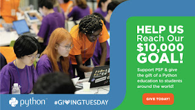

For the first time the PSF is participating in Giving Tuesday! This event is held annually the Tuesday after Thanksgiving - this year on December 3rd, 2019. The global celebration runs for 24 hours and begins at midnight local time.

### Please [donate](https://www.python.org/psf/donations/2019-giving-tuesday-drive/) on December 3rd and help us meet our goal of $10,000!

  
Donations support sprints, meetups, community events, Python documentation, fiscal sponsorships, software development, and community projects. Your contributions help fund the critical tools you use every day.

#### **What if everyone around the world, gave together, on one day? Please consider supporting the PSF on Giving Tuesday, December 3rd, 2019.**

#### Your donations have IMPACT

#### \----------------------------------------

Our [Annual Report](https://www.python.org/psf/annual-report/2019/) will show just a few ways your support has made a difference, thanks to the generous support from our partners and friends. Some highlights are below:

-   Over $137,200 was awarded in financial aid to 143 PyCon attendees in 2019.
-   $324,000 was paid in grants to recipients in 51 different countries.
-   Donations and fundraisers resulted in $489,152 of revenue. This represents 15% of our total 2018 revenue. PSF and PyCon sponsors contributed over $1,071K in revenue!

#### How your donation dollars are spent:

-   $99 pays for 6 months of Python meetup subscriptions
-   $60 a month ($2.00 a day) pays for one workshop, impacting over 250 people
-   $.50 a day ($15 a month) pays for a meetup.com subscription for one Python group
-   $1 a day ($30 a month) supports a regional workshop, impacting over 200 people.
-   The PSF meetup.com network currently supports 68 groups with 89,000 members in 16 countries. It costs $.60 per member per month to support these worldwide meetups.

#### Comments from grant recipients:

"The PSF Fiscal Sponsorship allows us to focus on building community, while they handle our non-profit status, accounting, and back office." - Eric Holscher, PyCascades Conference Organizer "The PSF was North Bay Python's first sponsor. Their early financial support for our mission helped kickstart what has become one of the most well-regarded regional conferences in our community." - Christopher Neugebauer, Conference Organizer "Without the support of the PSF, our events would not have been possible. Many of our attendees are now working or interning as Python or Django Developers." - Jeel Mehta, Django Girls Bhavnagar, India Conference Volunteer "The PSF grant allowed us to run an all day workshop for women. More organizations should apply for a PSF grant so they can enable and motivate more people, especially minorities, to start their great journey into programming." - Women in Technology, Peru  
From the team at the PSF!  \_\_\_\_\_\_\_\_\_\_\_\_\_\_\_\_\_\_\_\_\_\_\_\_\_\_\_\_\_\_
