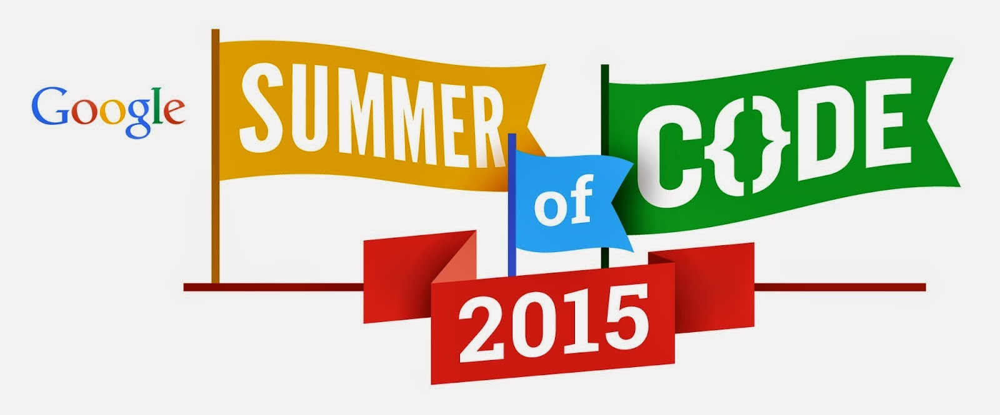

[Google Summer of Code](https://www.google-melange.com/gsoc/homepage/google/gsoc2015) is a program for post-secondary students who want to work on open source projects as a means of summer employment, and the Python Software Foundation is serving as an umbrella-organization to a large number of Python-based open source projects this year!

Whether you want to write code to help with manned missions on Mars, help manage online content, do machine learning, enhance medicine, study complex networks, do faster mathematics, create innovative user interfaces or... well, we'd say the sky's the limit, but with folk like AstroPy on our sub-org list, our sights go pretty far into the sky!

Check out the full list of participating sub-orgs here:

[https://wiki.python.org/moin/SummerOfCode/2015](https://wiki.python.org/moin/SummerOfCode/2015)

We know it can be overwhelming, so here's 7 things you can do to get yourself started:

1\. Choose an organization to work with.

2\. Start communicating with the developers.

3\. Set up your own development environment.

4\. Find some beginner-friendly bugs and try to fix them.

5\. Even if you don’t have time to fix them right away, report them.

6\. Help write and edit documentation.

7\. Help others!

... and get started on writing your application!  
Make sure to get those applications in by the deadline, 27 March at 19:00 UTC.
