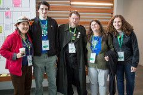

At the latest PSF Board of Directors' meeting, it was decided that a 4th quarter [Community Service Award](https://www.python.org/community/awards/psf-awards/#december-2015) will go to Terri Oda for her work as the Python Coordinator for Google Summer of Code.

<table align="center" cellpadding="0" cellspacing="0"><tbody><tr><td></td></tr><tr><td>Terri Oda</td></tr></tbody></table>

For those of you unfamiliar with GSoC, it is a program that began in 2005 that allows students to be paid to work on open source projects over the summer. Their motto is Flip bits, not burgers. The students must apply to the program and are then matched up with a mentor from one of the many sponsoring organizations. The PSF has been proud to be a sponsoring organization since 2005. Thus far, there have been over 8,500 students from over 100 countries and over 8,300 mentors from over 109 countries who have participated in GSoC. According to their website, the program, in addition to the $5,500 USD stipend, offers students

> exposure to real-world software development scenarios and the opportunity for employment in areas related to their academic pursuits. In turn, the participating projects are able to more easily identify and bring in new developers. Best of all, more source code is created and released for the use and benefit of all.

In fact, the program has so far produced more than 50 million lines of open source code! Prior to becoming the PSF's administrator, Terri had worked as a mentor for [Mailman](http://list.org/), the GNU mailing list manager written in Python, and for [Systers](http://systers.org/), an email forum for women in computing. Nonetheless, when she took over GSoC in 2013, she found the ramp-up to such a huge responsibility to be terrifying. That year, the Python umbrella organization included 19 sub-orgs, 87 mentors, and 36 students selected from over 100 applicants. For this year, the summer of 2015, there were more than 70 students who worked on Python projects with the help of over 100 Python mentors. Fortunately Terri is not alone:

> … my co-admin Meflin \[James Lopeman\] takes on a huge amount of work when it comes to getting ideas pages set up, and my \[other\] co-admins \[including Florian Fuchs, Kushal Das, and Stephen Turnbull\] help out where they can too. (And we're always looking for more help!)

<table align="center" cellpadding="0" cellspacing="0"><tbody><tr><td></td></tr><tr><td>Terri and some of the Python Mentors</td></tr></tbody></table>

  
I asked Terri if she could tell us about any of her students.

> “I’ve had some amazing students over the years, but there’s one who really stands out for me right now: Abhilash Raj. Not only did he do interesting work during his GSoC summer, but he also has become a hugely valuable community member for Mailman, working on continuous integration, contributions, and mentoring. We convinced him to let us fly him from India to Montreal so that he could attend the PyCon sprints last year, and it was really awesome to finally meet him in person! He’s been a real catalyst to keep Mailman development moving over the past two years, and it’s a real treat to have him as part of the Mailman team!”

Although Terri laments the fact that, as administrator, she has less time to work one-on-one with the students, she is able to keep informed via the student blog posts. One of Terri’s favorite posts

> was from the bravest student I’ve ever seen: she talked about how, upon getting commit access to her project’s repo, she did the thing that everyone fears: she accidentally trashed it. Most students wouldn’t even want to admit that, let alone write a blog post about it, but she was great and wrote a post not only about making the mistake, but about how she learned to fix it. Every time I think that I’ve made an embarrassing commit, I think about her bravery and honesty as inspiration for how to recover gracefully.

Terri loves the fact that the GSoC gives students a way into open source, but she likes to point out that it’s not the only way. She herself got involved in open source as a teenager, then with the help of a friend, she was able to find a rewarding job as a security researcher for Intel’s Open Source Technology Center. So she advises her students that there are numerous paths to take.

> My very first contribution to Mailman was actually a tiny image, not code at all! GSoC is a great program, but you don’t have to wait for the well-known path to be open; you can always blaze your own. Or sneak in the back. ;)

To read more about Google Summer of Code and the many terrific student projects, see: [Google Summer of Code](http://www.google-melange.com/gsoc/homepage/google/gsoc2015) [PSF and GSoC](https://wiki.python.org/moin/SummerOfCode) [Python GSoC](https://wiki.python.org/moin/TerriOda) [Student Blogs](http://terri.toybox.ca/python-soc/) [Terri's Blog](https://terriko.dreamwidth.org/134054.html) [Terri's pics](https://www.flickr.com/photos/terrio/albums/72157662058309502) The PSF wishes to thank and congratulate Terri, the other PSF admins, and all those who make GSoC such a terrific program. We also urge participation – if you’d like to become a mentor, or have project ideas, please contact Terri (terri on Freenode IRC, terrioda at gmail.com). *I would love to hear from readers. Please send feedback, comments, or blog ideas to me at [msushi@gnosis.cx](mailto:msushi@gnosis.cx).*
