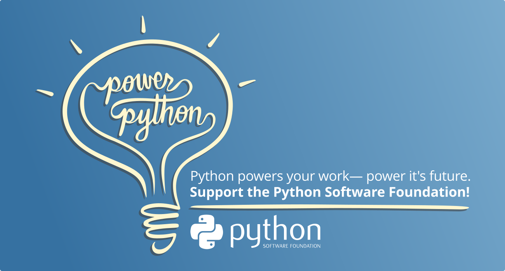

 The [Python Software Foundation](http://python.org/psf) (PSF) is the charitable organization behind Python, dedicated to advancing, supporting, and protecting the Python programming language and the community that sustains it. That mission and cause are more than just words we believe in. Our tiny but mighty team works hard to deliver the projects and services that allow Python to be the thriving, independent, community-driven language it is today. Some of what the PSF does includes producing [PyCon US](https://us.pycon.org), hosting the [Python Packaging Index](http://pypi.org) (PyPI), [awarding grants](https://www.python.org/psf/grants/) to Python initiatives worldwide, [maintaining critical community infrastructure](https://www.python.org/psf/about/), and more. To build the future of Python and sustain the thriving community that its users deserve, we need your help. By backing the PSF, you’re investing in Python’s growth and health, and your contributions directly impact the language's future. **Is your community, work, or hobby powered by Python? Join this year’s drive and power Python’s future with us by donating or becoming a Supporting Member today.**  

  

**There are two ways to join in:**

-   **[Donate to the PSF!](https://psfmember.org/civicrm/contribute/transact/?reset=1&id=52)** Your donation is a direct way to support and power the future of the Python programming language and community you love. Every dollar makes a difference.
-   [**Become a Supporting member!**](https://www.python.org/psf/membership/supporting/) When you sign up as a Supporting Member of the PSF, you become a part of the PSF, are eligible to vote in PSF elections and help us sustain what we do with your annual support. You can [sign up as a Supporting Member](https://psfmember.org/python-software-foundation-supporting-member-2/) at the usual annual rate($99 USD), or you can take advantage of [our sliding scale option](https://psfmember.org/civicrm/contribute/transact/?reset=1&id=39) (starting at $25 USD)! We don't want cost to be a barrier to you being a part of the PSF or to your voice helping direct our future. Every PSF member makes the Python community stronger!
  

**Your donations:**

-   Keep Python thriving
-   Support CPython and PyPI progress
-   Increase security across the Python ecosystem
-   Bring the global Python community together
-   Make our community more diverse and robust every year

  

**Highlights from 2024:**

-   **A record-making PyCon US** - We produced the [21st PyCon US](https://us.pycon.org/2024/), in Pittsburgh, US, and online, and it was a huge success! For the first time post-2020, PyCon US 2024 sold out with over 2,500 in-person attendees.
-   **Advances in our Grants Program** - 2024 has been a year of change and reflection for the Grants Program, starting with the addition of Marie Nordin to the grants administration team who has supported the PSF in launching several new grants initiatives. We set up [Grants Program Office Hours](https://pyfound.blogspot.com/2024/02/introducing-psf-grants-office-hours.html), published a [Grants Program Transparency Report](https://pyfound.blogspot.com/2024/05/psf-grants-program-2022-2023.html) for 2022 and 2024, invested in a [third-party retrospective](https://pyfound.blogspot.com/2024/03/djangocon-africa-grant-process.html), [launched a major refresh](https://pyfound.blogspot.com/2024/07/psf-board-update-on-improvements-to-psf.html) of all areas of our Grants program and [updated our Grants Workgroup Charter](https://pyfound.blogspot.com/2024/11/psf-grants-program-updates-part2.html). With more changes to come, we are thrilled to share that we awarded a record-breaking amount of grant funds in 2024!
-   **Empowering the Python community through Fiscal Sponsorship** - We are proud to continue supporting our 20 fiscal sponsoree organizations with their initiatives and events all year round. The PSF provides 501(c)(3) tax-exempt status to fiscal sponsorees such as PyLadies and Pallets, and provides back office support so they can focus on their missions. Consider [donating to your favorite PSF Fiscal Sponsoree](https://linktr.ee/thepsf) and check out our [Fiscal Sponsorees page](https://www.python.org/psf/fiscal-sponsorees/) to learn more about what each of these awesome organizations is all about!
-   **Connecting directly through Office Hours** - The current PSF Board has decided to invest more in connecting and serving the global Python community by establishing a forum to have regular conversations. The [board members of the PSF](https://www.python.org/psf/board/) with the support of [PSF staff](https://www.python.org/psf/records/staff/) are now holding monthly [PSF Board Office Hours](https://pyfound.blogspot.com/2024/08/ask-questions-or-tell-us-what-you-think.html) on the [PSF Discord](https://discord.gg/4Hm36PPgpG). The Office Hours are sessions where folks from the community can share with us how we can help your regional community, express perspectives, and provide feedback for the PSF.
-   **Paying more engineers to work directly on Python, PyPI, and security** - We welcomed [Petr Viktorin, Deputy Developer in Residence (DiR), and Serhiy Storchaka, Supporting DiR](https://pyfound.blogspot.com/2024/01/announcing-deputy-developer-in.html). It’s been exciting to begin to realize the full vision of the DiR program, with special thanks to [Bloomberg](https://www.bloomberg.com/company/) for making it possible for us to bring Petr on board. The DiR team is taking an active role in shaping the development of the language, and with three people on the team each DiR can now also spend a percentage of their time on feature work aligned with their interests.
-   **Continuing to enhance Python’s security through Developers-in-Residence** - Seth Larson, PSF Security Developer in Residence (DiR) had a busy year thanks to continued support from [Alpha-Omega](https://alpha-omega.dev). Seth worked on a variety of projects including the creation of SBOMs for Source and Windows CPython artifacts, implementing build reproducibility for CPython source artifacts, and auditing and migrating Sigstore, to name just a few. Check out [Seth's blog](https://sethmlarson.dev/blog) to keep up to date with his work. Mike Fiedler, PyPI Safety & Security Engineer, also worked on a variety of projects such as two-factor authentication for all users on PyPI, an audit of PyPI, made significant progress on malware response and reporting, collaborated on the PSF’s submission for the Cybersecurity and Infrastructure Security Agency (CISA)’s Request for Information (RFI), and more! Thanks to [AWS](https://aws.amazon.com/opensource/) and [Georgetown](https://www.georgetown.edu/) for making Mike’s PyPI security accomplishments possible. Stay up to date with Mike's work on the [PyPI blog](https://blog.pypi.org/).
-   **New PSF Staff dedicated to critical infrastructure** - We established the [PyPI Support Specialist role, filled by Maria Ashna](https://pyfound.blogspot.com/2024/07/announcing-our-new-pypi-support.html). Over the past ***23 years***, PyPI has seen essentially exponential growth in traffic and users, relying for the most part on volunteers to support it. The load far outstretched volunteers and prior staff capacity, so we are very excited to have Maria on board. We also filled our [Infrastructure Engineer role, welcoming Jacob Coffee](https://pyfound.blogspot.com/2024/07/announcing-our-new-infrastructure.html) to the team, to ensure PSF-maintained systems and services are running smoothly.

**Our thanks!**

Every dollar you contribute to the PSF helps power Python, makes an impact, and tells us you value Python and the work we do. Python and the PSF are built on the amazing generosity and energy of all our amazing community members out there who step up and give back.

We appreciate you and we’re so excited to see where we can go together in the year to come!
