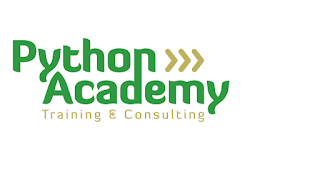
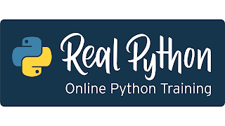
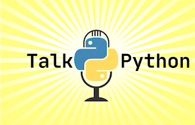
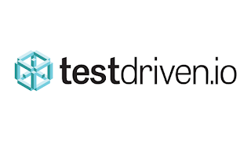

### Help us raise $60,000 USD by December 31st!

Python continues to be a popular and accessible language in the education sector. More and more institutions around the world are introducing students to the opportunities that Python presents. Your support can spread that reach even further.

The theme of our [fundraiser](https://www.python.org/psf/donations/2020-q42020-drive/) this year is geared toward education. We're excited to collaborate with authors, trainers, and companies that offer their services all over the world to raise money for the PSF. In addition, it will help grow a diverse and international community of Python programmers.

Pythonistas can get discounted offers on products and services to level up their Python knowledge, and help the PSF raise funds at the same time! Visit the fundraiser [home page](https://www.python.org/psf/donations/2020-q42020-drive/) to see more details or click on the logos below to see individual offers.

### **Participating Companies**

    
  
  

No purchase is necessary to participate in the fundraiser. [You can donate directly here](https://psfmember.org/civicrm/contribute/transact?reset=1&id=31) so that 100% of your donation goes to the PSF.

### Financial Impacts of 2020 and 2021

COVID-19 has changed all aspects of our lives and is reshaping our future. PyCon US typically generates over 65% of the PSF’s revenue. With PyCon US 2020 and 2021 happening virtually, the PSF may lose $1.2 million USD of expected revenue for those two years.

In 2019, the strategic plan for the PSF shifted towards supporting CPython sustainability with plans to hire three full time Pythonistas to address maintenance, R&D, and education. With lower expected income from PyCon US for two years, we need sponsorship support to make these plans a reality. Other 2020 plans put on hold include improving pypi.org support and continuing more grants program funding.

The PSF is researching ways we can diversify our revenue streams, but cannot replace the near-term loss of $1.2 million USD. Your support is more important than ever! Read more about what the PSF has been up to [here](https://www.python.org/psf/sponsorship/prospectus/2021/).
