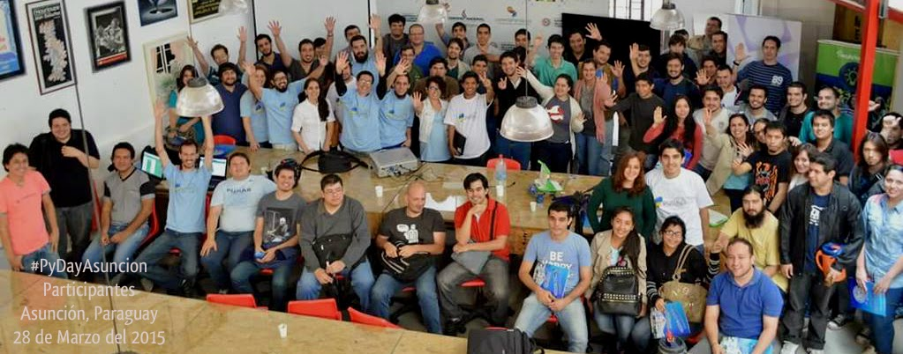

As you may recall, I previously posted about a wonderful project in South America that has been funded in part by the PSF. That first blog post described the Python events that Manuel Kaufmann had organized in Argentina and his plans to move on to Paraguay and then Bolivia. Please check it out at [Python in Argentina](http://pyfound.blogspot.com/2015/03/manuel-kaufmann-and-python-in-argentina.html). I’m very happy to report that Manuel Kaufmann has continued to be busy bringing Python events and knowledge to more and more people, as he left Argentina for Paraguay. He recently reached out to us to tell about his experiences. Here's a recap: First of all, PyDay Asunción took place as scheduled on March 28th. This event was the culmination of Manuel’s efforts in creating the brand new Python Paraguay community. His Paraguayan adventure began by meeting with people from different Software Libre groups (PHP, OpenStreetMap, Sugar, Google Code In, etc) in an attempt to merge them into a new community focussed on Python. Their first meeting had 13 attendees who immediately began organizing for PyDay Asunción. This first PyDay (or mini-conference) in Paraguay was a great success. Over 100 people with varying levels of programming and Python skill attended. Manuel was pleased to report that among the presenters were a 17 year old boy and a young woman–clearly the diversity of our community is growing demographically as well as geographically. In addition, the importance of this event was marked by the Paraguayan government, who declared PyDay Asunción an official Technology and Cultural Event. Congratulations to Manuel and everyone who worked to make this a reality.You can read more about the day (in Spanish) at [Manuel’s own blog post](http://elblogdehumitos.com.ar/posts/pydayasuncion-un-exito-arrollador/).  PyDay Asunción Of course, as before, the momentum didn’t stop at one event. With a new community formed, new events were bound to occur. It always amazes me the way hard work and a good idea will grow. In fact, Manuel reported that some of the attendees of last month’s PyDay Formosa, Argentina were so enthused that they travelled 400 km to attend and help out at PyDay Paraguay. That kind of passion and commitment says a lot about the quality of these events and the desire for more. Perhaps Python is contagious! Similarly, Manuel tells us that a talk at PyDay Paraguay gave rise to another event: HACKÁra Asuka Guaraní: an event to translate the Sugar platform to Guaraní. This event was organized by Ricardo Saucedo and Martín Abente (one of the members of Python Paraguay). In fact, the idea of this event came out of Martin’s talk at PyDay Asunción. There were around 15 teenagers including 6 girls and a teacher who helped with the translation into their native language. According to Manuel, this potentially could lead to many people who don't speak Spanish being able to learn programming. Manuel has no intention of slowing down. Although his original plan was to spend three months on the project, he hasn’t yet made it to Bolivia, so he’s going to extend his time commitment. One problem he’s having is with his car. Apparently it needs quite a bit of TLC to keep it going. If you’d like to help with that, Manuel is accepting donations at [Manuel’s Project](http://elblogdehumitos.com.ar/pages/argentina-en-python/donaciones/misiones/). Since a little goes a long way to keep a car running, I hope you'll join me in giving him the cost of a latte or two. In any case, his project appears unstoppable, with many future events either completely set to go or in the planning stages. The following events are already scheduled for May:

-   [PyDay at Apóstoles Misiones, Argentina on 7 May](http://pydayapostoles.info/)
-   20-22 May - Educational Track for secondary students at SciPy LA 2015, Posadas, Misiones, Argentina ([http://scipyla.org/conf/2015/](http://scipyla.org/conf/2015/))
-   PyDay at Encarnación, Misiones, Paraguay on 30 May.

In addition, Manuel has some exciting ideas for future projects, such as creating a Robot Course for kids, and bringing Facundo Batista (one of the best Argentinian Python hackers) to Asunción, Paraguay to develop a 3-days course. These are in the early planning stages, but if I know Manuel, I think we can look forward to hearing about their successful completion in the future.  
If you’d like to follow Manuel’s travel plans, or provide some support, please visit his [website](http://elblogdehumitos.com.ar/pages/argentina-en-python/donde-esta-humitos/). *I would love to hear from readers. Please send feedback, comments, or blog ideas to me at [msushi@gnosis.cx](mailto:msushi@gnosis.cx).*
