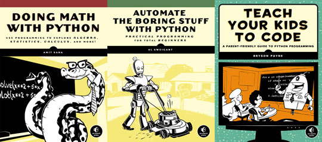
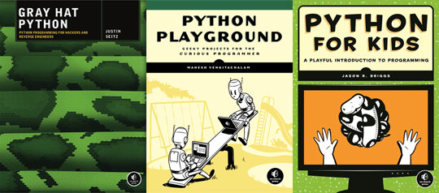
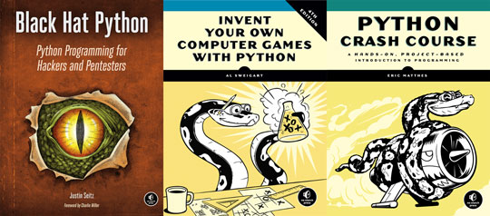

Pay what you want for a stack of Python ebooks from No Starch Press, and decide what portion goes to the PSF. This deal is presented by [Humble Bundle](https://humblebundle.com/), which sells ebooks and games to raise money for nonprofits. When you buy a bundle you choose how much to pay, and how the money is divided among the creators, Humble Bundle, Inc., and the nonprofit organization. The [Humble Book Bundle: Python](https://www.humblebundle.com/books/python-book-bundle) is available now through April 19th. Pay a dollar or more for these three books:  If you choose to pay $8 or more, you also receive:  If you pay more than $15 you get all of the above, plus:  To help the PSF and get a stack of fun and useful Python books at a price you decide, buy the bundle before April 19th! **[Humble Book Bundle: Python](https://www.humblebundle.com/books/python-book-bundle)**
