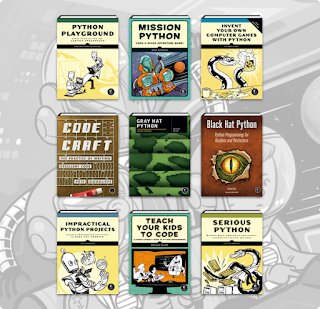

We are super excited to announce that the [Python Software Foundation](https://www.python.org/psf/) is featured as a charity in a [Humble Bundle by No Starch Press](https://www.humblebundle.com/books/python-programming-no-starch-books) this month.  This bundle features books such as Python Playground, Mission Python, Invent your own Computer Games with Python, and so much more. Click [here](https://www.humblebundle.com/books/python-programming-no-starch-books) to see all the books being featured and [GET THE BUNDLE](https://www.humblebundle.com/books/python-programming-no-starch-books) before it closes! The bundle will run from August 19th to September 2nd (11am Pacific). Proceeds received help charities such as the Python Software Foundation (PSF). Once you click to get your bundle, you can also choose where your money goes if you'd like to customize the split of proceeds.  Humble Bundle sells games, ebooks, software, and other digital content. Their mission is to support charity while providing awesome content to customers at great prices. Thanks to past Humble Bundles that the PSF has been a part of, this program has helped the PSF raise more than $300,000 since 2017! The PSF and the Python community thank Humble Bundle and all of the featured products that have selected the PSF as one of their charities. This funding has had a positive impact for Pythonistas all around the world. No Starch is a long time community contributor supporting the PSF in various Bundles and supporting Young Coder classes that happen at PyCon US. “As one of the leading publishers of Python books worldwide, No StarchPress is very excited to support the organization at the core of the Python programming language” said No Starch Press Founder Bill Pollock. “Python is at the core of so much technical work today and very much at the core of our publishing program.” The PSF staff and board of directors send a big "*Thank You!*" to everyone involved.
