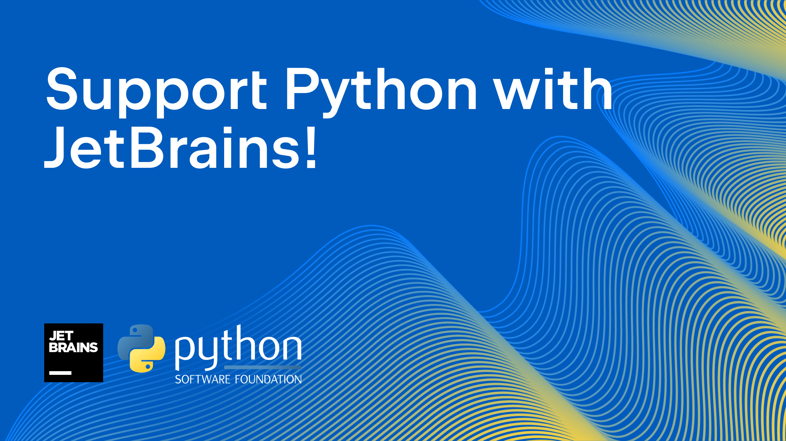

### Support Python in 2022!  

###   

For the fourth year in a row, the PSF is partnering with JetBrains on our end-of-year fundraiser. Over that time, the partnership has raised a total of over $75,000. Wow! Thank you, JetBrains, for all your support.

#### There are three ways to join in the drive this year:

-   **[Save on PyCharm + get DataSpell *free*](https://jb.gg/support-python-with-jetbrains)!** JetBrains is once again supporting the PSF by providing a 30% discount on PyCharm and all proceeds will go to the PSF! But wait–there’s more! JetBrains has released DataSpell, a new IDE specifically for Data Scientists. When you buy your discounted PyCharm license, you will also get a bonus DataSpell license, free!  
    You can take advantage of this discount by [clicking the button on](https://jb.gg/support-python-with-jetbrains) [the page linked here](https://jb.gg/support-python-with-jetbrains), and the discount will be automatically applied when you check out. The promotion will only be available through November 22nd, so go grab the deal today!
-   [**Donate**](https://psfmember.org/civicrm/contribute/transact/?reset=1&id=40) [**directly to the PSF**](https://psfmember.org/civicrm/contribute/transact/?reset=1&id=40)! Every dollar makes a difference. (Does every dollar also make a kitten somewhere purr? We make no promises, but maybe you should try, just in case?😻)
-   [**Become a member**](https://psfmember.org/)! Sign up as a Supporting member of the PSF. Be a part of the PSF, and help us sustain what we do with your annual support.

Or, heck, why not do all three? 🥳

*Your donations:*

-   *keep Python going*
-   *invest directly in CPython and PyPI progress*
-   *bring the global Python community together*
-   *make that community more diverse and thriving every year*

#### Let’s also take this time to look back at 2022.

**Highlights from 2022:**  

-   **PyCon US** - Our first hybrid PyCon US, in Salt Lake City and online, was a roaring success! It was great to be back in person, and we’re grateful to all the speakers, volunteers, attendees, and sponsors who make it such a special event.
-   **CPython Developer in Residence** - Łukasz Langa completed his first year as our inaugural developer in residence. This role has been a longtime dream for the community, and it’s been great to see Łukasz hitting important milestones: driving down the PR backlog, completing the migration of bugs.python.org to GitHub, and more.
-   **Welcome, Deb!** Executive Director Deb Nicholson took the helm of the PSF, bringing with her a wealth of experience in Open Source and Python communities and nonprofit leadership.
-   **Investing in infrastructure** - We doubled the size of our infrastructure team this year with the hire of Chloe Gerhardson as Infrastructure Engineer, joining Director of Infrastructure Ee Durbin. Their work makes sure the infrastructure behind Python. PyPI, and the PSF is stable and scales with the growth of the Python ecosystem.  
    

#### Thank you for being a part of this drive and of the Python community!  

Keep an eye on this space and on our social media in the coming weeks for updates on the drive and the PSF 👀

  
Your support means the world to us. We’re incredibly grateful to be in community with you!
