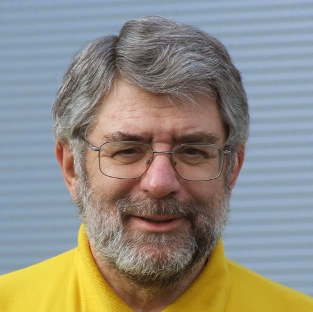

I am very sad to report that John Pinner has passed away. The Python Community has lost a great friend. John received a PSF Community Service Award in 2010 for his many contributions. He was a PSF fellow and an organizer of PyCon UK from 2007 to 2014 and of EuroPython from 2004 to 2011. He was also a frequent speaker at PyCons, and at workshops and users' groups, as well as an enthusiastic and effective advocate of Python and Open Source.  John was an original contributor to *Free and Libre Open Source Software UK (FLOSS)*, which started out as the *UK Unix Users Group (UKUUG)*. After working 21 years as Principal Engineer for *The Rover Company Limited*, he decided to found his own company, *Clockwork Software Systems*. His dedication to and interest in Python are best expressed in his own words: *Thanks to Linux Journal I 'discovered' Python in 2000 and have been using it ever since; together with an occasional regression to C, it covers all my programming needs. I find that it gets in the way least of all the languages I have used, and brings back the joy to programming. I am proud to be an elected member of the Python Software Foundation, and am something of a Python evangelist, through running training courses and promoting such events such as PyCon UK.* I had the great honor and pleasure of meeting and spending time with John at PyCon UK in 2013. He was a delightful host, full of energy, knowledge about the locale (history, good beers and the best pubs, landmarks, neighborhoods, cathedrals), and enthusiastic good will. To give a sense of his warm-hearted and jovial personality to those who didn't know him, his intermediate-level Python tutorial included such topics as *WTF is Pythonic* and *it's not C, C++ or Java, don't try and make it so.* Heartfelt condolences to his family and to all whose lives he touched. He will be sorely missed.
