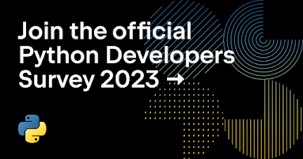

td {border: 1px solid #cccccc;}br {mso-data-placement:same-cell;}

This year we are conducting the seventh iteration of the official Python Developers Survey. The goal is to capture the current state of the language and the ecosystem around it. By comparing the results with last year’s, we can identify and share with everyone the hottest trends in the Python community and the key insights into it.  

We encourage you to contribute to our community’s knowledge by sharing your experience and perspective. Your participation is valued! The survey should only take you about 10-15 minutes to complete.

  

**[Contribute to the Python Developers Survey 2023!  
](https://survey.alchemer.com/s3/7554174/python-developers-survey-2023)**

The survey is organized in partnership between the [Python Software Foundation](https://www.python.org/psf-landing/) and [JetBrains](https://www.jetbrains.com/). After the survey is over, we will publish the aggregated results and randomly choose 20 winners (among those who complete the survey in its entirety), who will each receive a $100 Amazon Gift Card or a local equivalent.
