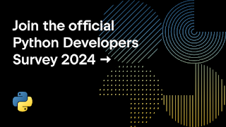

This year we are conducting the eighth iteration of the official Python Developers Survey. The goal is to capture the current state of the language and the ecosystem around it. By comparing the results with last year’s, we can identify and share with everyone the hottest trends in the Python community and the key insights into it. We encourage you to contribute to our community’s knowledge by sharing your experience and perspective. Your participation is valued! The survey should only take you about 10-15 minutes to complete.

**[Contribute to the Python Developers Survey 2024!](https://survey.alchemer.com/s3/8009809/python-developers-survey-2024)**  

  
This year we aim to reach even more of our community and ensure accurate global representation by highlighting our localization efforts:  

-   The survey is translated into Spanish, Portuguese, Chinese, Korean, Japanese, German, French and Russian. It has been translated in years past, as well, but we plan to be louder about the translations available this year!
-   To assist individuals in promoting the survey and encouraging their local communities and professional networks we have created a [Promotion Kit](https://docs.google.com/document/d/1dS_rkmWI5sB9kh21AIRNCYmIZs8d1kphdmaUxdMBbs4/edit?usp=sharing) with images and social media posts translated into a variety of languages. We hope this promotion kit empowers folks to spread the invitation to respond to the survey within their local communities.

-   We’d love it if you’d share one or more of the posts below to your social media or any community accounts you manage, as well as share the information in discords, mailing lists, or chats you participate in.
-   If you would like to help out with translations you see are missing, please request edit access to the doc and share what language you will be translating to. Translation into languages the survey may not be translated to is also welcome.

-   If you have ideas about what else we can do to get the word out and encourage a diversity of responses, please comment on the [corresponding Discuss thread](https://discuss.python.org/t/python-developers-survey-2024-is-now-open-respond-and-share/67049).  
    

  
The survey is organized in partnership between the [Python Software Foundation](https://www.python.org/psf-landing/) and [JetBrains](https://www.jetbrains.com/). After the survey is over, we will publish the aggregated results and randomly choose 20 winners (among those who complete the survey in its entirety), who will each receive a $100 Amazon Gift Card or a local equivalent.
