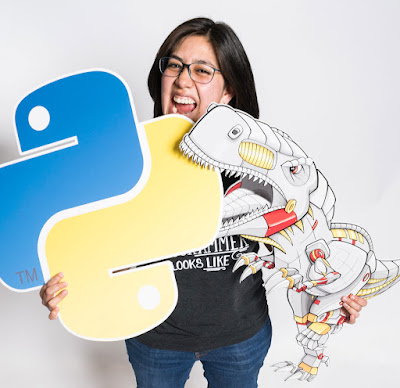

  

[Katia Lira](https://twitter.com/lakatialira), Software Engineer from Mexico city, has been awarded the Python Software Foundation 2020 Q2 Community Service Award.

  

> RESOLVED, that the Python Software Foundation award the Q2 2020 Community Service Award to Katia Lira for her contributions to PyCon LatAm as conference chair, which held its inaugural conference in 2019. Additionally, Katia is the [DEFNA](https://www.defna.org/) (Django Events Foundation North America) President and has collaborated in crafting the vision of PyLadies Global. She hosts and produces multiple Python/tech/community podcasts like El Dev Show in Spanish. She's a PyCon speaker and is well respected in the community.

  

We interviewed Katia to learn more about her inspiration and work with the Python community. We also asked two of Katia's associates - Valery Calderon and Cristian Maureira-Fredes to share more light about Katia's impact on the community.

**What was your earliest memory of how you got into tech?**

Growing up, I wanted to be an Architect. I loved doing the blueprints in AutoCAD. Then I switched to study web design but quickly found it easier to code than to do the UI. It felt effortless to use code to make a button send a form or trigger an animation, so I never looked back.

**What was your earlier involvement with the Python community?**

One of my best friends invited me to PyCon US in 2016. At the time, I was still learning Python and Django and was unaware of communities and conferences like that.

**What inspires you to volunteer your time and resources in the Python Community?**

It's always the conversations with people that make me want to continue volunteering and organizing spaces for sharing knowledge and building community, prioritizing Spanish as the language to share and engage.

**How has your involvement in the Python community supported your career?**

The most important thing is inspiration. Being involved in the community has widened my views on opportunities available to me and also the possibilities for growth. I discovered open source projects that push you to explore new tools and grow skills outside of day-to-day work.

Another thing is just being aware of the conversations around hiring and work. Especially when people are open about how to prepare for a technical interview and how they struggle with growing into a more senior role.

**How has Covid affected your work with the Python community and what steps are you taking to push the community forward during these trying times?**

I think we all tried to compensate with remote by joining as many virtual spaces as possible and it has been taxing on many of us.

For the two conferences, I volunteer at - PyCon LatAm and DjangoCon US, we took 2020 off from having any events. That helped with not burning out our volunteers and organizers. And it made us ready for 2021 which has been easier because we had fewer uncertainties, we jumped in, knowing it was going to be fully remote and that the community members missed each other.

### Katia Lira's Impact on the Python community

[Cristián Maureira-Fredes](https://maureira.xyz/), Software Engineer and R & D manager, speaks on Katia's contributions to the PyCon LatAm community and the larger Python community:

> Katia has been a fundamental person in the whole PyCon LatAm initiative, being able to unify the many Latin American Python communities under the same umbrella. Hosting a LatAm conference seemed quite impossible if you ask me, but together with a wonderful team, they proved me wrong. The enthusiasm and motivation I felt as a South American made me push forward the Python groups in my own country, from where we decided to organize our first small conference to a PyDay event. I asked Katia to be a keynote speaker and she agreed without any hesitation. Thanks to her talk, many people felt that being from LatAm was not a barrier to push for global communities and that people were responsible to make initiatives like PyLadies and PyCon LatAm as successful as they are. Katia's keynote also motivated a lot of people from Chile. And this has led to an increase in community activities, beginning with new initiatives like the first PyLadies chapter - PyLadies Santiago. And Katia's impact span beyond the LatAm region, to the global Spanish-speaking community.

Valery Calderon, Data Engineer speaks also on Katia's impact on the LatAm community:

> Katia spear-headed the PyCon LatAm initiative. She is always open to helping people in the community by mentoring, giving talks, volunteering, and helping to organize events. She has also been of tremendous support to the past and present initiatives of creating room for diverse people within the Latin American community in the PSF. Katia specifically helped me to propose my candidacy for the PyLadies Global Council. In Latin America, there is a big gap in the culture of communities. And to make it better and inclusive, there's a lot of work that has been done and still needs to be done. Katia is helping to bridge this gap, which is a huge impact on the LatAm Python community.

We at the Python Software Foundation wish to once again congratulate and celebrate Katia Lira for her tremendous impact in the Python LatAm community, PyCon LatAm, and the wider Python community.
