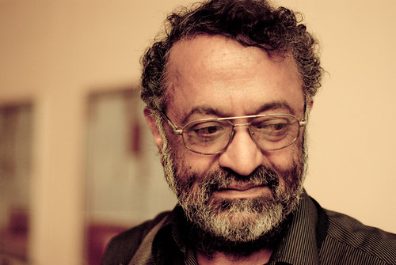

**The Python Software Foundation, represented by director David Mertz, posthumously awarded [Kenneth Gonsalves](http://ilugcbe.org.in/index.php?title=Kenneth_Gonsalves) with the foundation’s [Community Service Award](http://www.python.org/community/awards/psf-awards/) for the third quarter. The award was presented to his daughter last weekend at [PyCon India](http://in.pycon.org/2012/). Kenneth passed away on August 3, 2012 at the age of 59. After finding the open source world in 1995, he was drawn to the Python community in 2003 and has since taught over 50 seminars on Python and Django in his area. He was also a major contributor to many mailing lists, generously helping as many people as he could. Kenneth was known for founding and leading the [Indian Python Software Society](http://mail.python.org/mailman/listinfo/ipss), and is credited with helping to shape the Python community all across India. He was also a well known member of the Django community, where his presence and action will surely be missed. Outside of software, Kenneth took interest in golf, even becoming a referee and earning international certification. Throughout his time as an official he was assigned to several national tournaments. In addition to the Community Service Award, the foundation presented a grant of $3500 USD (~190K Rs) to the IPSS to seed an award in Kenneth’s name. The award is planned to be given annually to a community member who goes above and beyond to evangelize, innovate, and mentor other members of the Python community. As much of Kenneth’s work was focused on students, the IPSS wants to see further efforts in growing their community and educating the membership.**  
  
  
**Kenneth Gonsalves -- 1952-2012** ***Photo by Kushal Das***
